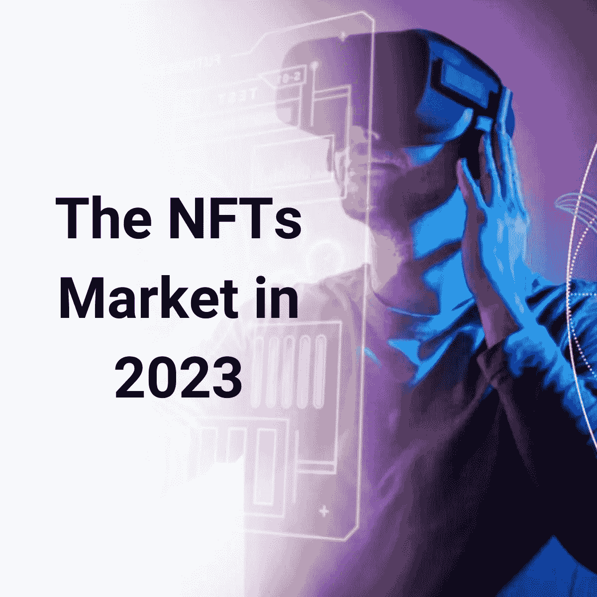
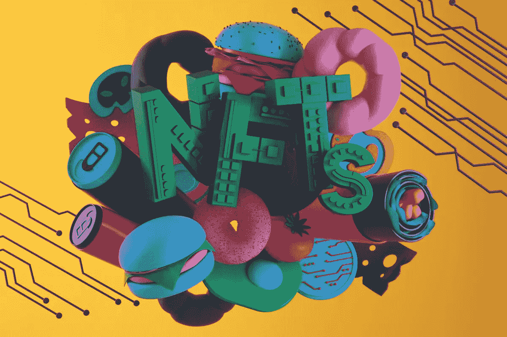

# 2023 年的 NFT 市场会发生什么？

> 原文：<https://medium.com/coinmonks/what-will-happen-in-the-nft-market-in-2023-38fa1382a772?source=collection_archive---------3----------------------->

密码市场今年经历了一场真正的混乱。许多灾难性的崩溃和行业内许多大牌的破产引发了人们对加密货币未来的担忧和担忧。

密码市场中的恶棍现在似乎是一种趋势。恶名昭彰的人物如权斗、露娜的创始人、山姆·班克曼-弗里德(SBF)——FTX 等。他们可能会在某些方面恶化整个市场，特别是萨姆·班克曼-弗里德和 FTX·法洛斯对加密货币的信任体系进行了真正的攻击。

NFT 是新的部分，但是它们增强了市场并在社区内引起了许多争议。虽然加密市场混乱，但非功能性加密技术无法置身事外。然而，仍有许多个人和组织试图加强监管，为广大加密用户，特别是 NFT 投资者重建一个透明和值得信赖的社区。

前一篇文章报道了[NFT 市场遭遇的](/@libraryoftrader/the-forecasts-of-nfts-2023-a-look-back-for-a-look-forward-9399e36fafed)下跌问题，并提到了 2023 年 DeFi 增长的预测。这篇文章简要地向你介绍了一些对 2023 年 NFTs 的预测。因此，你可以更好地理解 2023 年我们应该从 NFTs 中期待什么的实际见解。

 [## NFTs 2023 预测:展望未来的回顾

### 支持 NFTs 的著名企业家 Gary Vaynerchuck 提到了一些严重影响 NFT 市场的因素…

medium.com](/@libraryoftrader/the-forecasts-of-nfts-2023-a-look-back-for-a-look-forward-9399e36fafed) 

# 大量 ZK 收养

*The Zero Knowledge Technology — Source: CoinMarketCap*

近年来，隐私一直是加密用户关注的问题，因此[零知识(ZK)技术](https://ethereum.org/en/zero-knowledge-proofs/)赢得了今年的关注。ZK 技术使用一个证明者、一个验证者和算法来验证某些东西，而不泄露关于证明的重要信息。ZK 应用程序使更多的互动以一种私密的方式在链上发生。它将在明年获得普及，因为 ZK 证明是轻量级的，并且易于链上交互，具有可伸缩性和高效性。

简洁实验室、Risczero 和 Espresso 系统项目使用 ZK 证明、虚拟机和汇总进行验证。ZK 技术具有特别有益的应用，用于在不泄露敏感数据的情况下识别加密垂直市场。

以太坊的联合创始人 Vitalik Buterin 注意到 ZK 技术在解决链上信息问题方面的巨大作用，但其类别可能并不清楚。

ZK 技术在桥梁上做了出色的工作，通过简洁的证明传输消息和令牌，保证了安全性和正确性。TradFi 系统已经将 ZK 技术应用于信用评分和税收。

# 金融资产令牌化

*The Tokenization of Financial Assets Will be a Trend — Source: Medium*

真实世界资产(RWA)是显示对基础资产的要求权并经常为该资产产生收益的金融基础。到目前为止，该类别的扩展已经释放了大量的流动性和效用，2023 年可以以一种可访问的方式在链上显示更多的资产。

Stablecoins 被认为是 RWA 在市场上最受欢迎的应用，该类别在资本化的前七个令牌中占了三个。Circle 的和 Maker 的戴一直是顶级稳定股，在整个熊市中几乎都没有出现剧烈的趋势。

 [## 无聊的猿 NFT:为什么它很贵？

### 无聊猿 NFT 是最著名的 NFT 符号之一，吸引了许多有影响力的艺术家交易或显示所有权…

medium.com](/coinmonks/bored-ape-nft-why-is-it-expensive-61598dc65185) 

链上社区表现出对 RWA 的需求，如 MakerDAO 将价值 5 亿美元的 DAI 投资于美国国债和公司债券。Goldfinch 是一家提供离线抵押贷款的公司，其活跃贷款价值接近 1 亿美元。贾允许企业主获得区块链的贷款，并为拥有 RWA 和业务的流动性提供者带来可观的收益率。

因此，2023 年将见证令牌化 RWA 的增长，如快速贷款和房地产。此外，越来越多的初创公司专注于以合规的方式帮助 TradFI 机构。

# 利用区块链数据

*Blockchain Data is a Real Gem — Source: Health IT Analytics*

丰富的开源数据是区块链最优越的特性之一。因为它能够对链上活动进行深入分析。有效地、负责任地利用这些数据有助于扩展[区块链 dapp](https://www.investopedia.com/terms/d/decentralized-applications-dapps.asp)(分散式应用)及其用例。数据揭示了大量关于如何应用区块链，热门趋势，用户行为，以及链上资金的流动等。

区块链分析平台 Nansen 一直致力于通过钱包活动获得更多关于链上分析的见解。像 NXYZ 这样的公司提供无限制的数据 API 来处理区块链索引。2022 年，Definitive 出现，旨在推动用户获取工具和对链上和链下活动的洞察。然而，该部门的重大发展仍未得到利用。会在 2023 年。

 [## 如何评价一个 NFT 的价值？

### NFT 是一个新的领域，最近引起了公众的极大关注。因此，测量 NFTs 的价值是…

medium.com](/coinmonks/how-to-evaluate-the-value-of-an-nft-d4078f1a98ba) 

# 开发人员工具堆栈的持续增长

用户总是更喜欢能带来更多好处但流程最简单的东西。因此，开发人员工具有一个成长和创新的空间，为部署 [Web3](https://web3.foundation/) 项目提供卓越的设计和特性。该堆栈可以帮助消除工作中许多重复和繁琐的部分，并激励工程师在链上试验协议。这个领域的关键人物是炼金术和温柔。

不管熊市如何，Alchemy 工程师对链上平台进行的实验比以往任何时候都多。该公司最近的声明是，自今年年初以来，使用其平台的工程师人数飙升了三倍。2022 年 9 月，月度验证智能合同同比增长 2.6 倍。此外，2022 年，36%的智能合同也得到了部署和验证。

 [## 如何评价一个 NFT 的价值？

### NFT 是一个新的领域，最近引起了公众的极大关注。因此，测量 NFTs 的价值是…

medium.com](/coinmonks/how-to-evaluate-the-value-of-an-nft-d4078f1a98ba) 

随着许多 Web3 开发人员参与到生态系统中，在他们开始构建时，为他们提供可靠的工具是必不可少的。跨链工具尤其重要，因为它提供了可组合的软件，简化了多个链上项目的启动。通过为许多加密项目提供支持，随着更多加密用例的增加以及许多工程师期待进入该行业，开发工具将在 2023 年使该过程变得更加顺畅。

# 是时候让不可替代的代币开花了

*Non-Fungible Tokens to Expand — Source: Los Angeles Times*

2023 年，任何为持有者提供价值的非功能性金融工具和密码都将会增长。游戏内 NFT、身份令牌、令牌门控社区、软件和活动预计将在 2023 年扩展。这一年见证了一个部门以技术和创新方式发展的开端。然而，这个空间还没有被主流接受。与此同时，数字纯艺术行业无疑是一个巨大的垂直行业，NFTs 的应用允许特定的特权来扰乱许多现有的行业。

近年来，这些想法有一些令人兴奋的应用和发展。Proof Collective 使其 NFT 持有者能够访问未来的 Proof drops 和 Proof 社区活动，如现场活动和私人纠纷。以太坊的联合创始人 Vitalik Buterin 也发表了一篇关于灵魂绑定令牌的成型论文，这些令牌持有已经被采用的链上身份信息。2022 年，游戏交易也出现恶化，一度占据区块链全部交易的一半以上。此外，NFTs 可能会涉足娱乐领域，吸引粉丝参与。

 [## 2022 年的密码英雄:那些给密码行业带来清晰的人

### 看起来今年的加密市场不景气。在余波中有许多戏剧…

medium.com](/coinmonks/the-crypto-heros-in-2022-those-who-bring-clarity-to-the-crypto-industry-de76c5b54277) 

传统公司以越来越快的速度探索非功能性技术的应用。一些采用受到了关注，包括蒂芙尼为隐朋克持有者设计的吊坠系列，Instagram 将 NFTs 纳入其平台，以及耐克收购元宇宙时装公司 RTFKT。此外，像克里斯蒂亚诺罗纳尔多(Cristiano Ronaldo)这样的体育运动员已经出版了 NFT 作品集，以吸引他的粉丝，并有可能获得未来的额外津贴。

# 在你走之前

随着 FTX 的崩溃，2022 年见证了痛苦的黑客和 CeFi 崩溃。然而，有一些辉煌的部分，使整个市场保持在最佳状态。对明年有一些很好的预测。做功课研究加密市场仍然是至关重要的有价值的洞察市场和势头模式。这里的结论是，仍然有希望创造一个金融透明、可靠和自治的秘密市场。

 [## 2022 年的密码英雄:那些活跃了密码行业的人

### 继 2022 年的加密英雄名单之后，本文新增了三位对加密市场做出贡献的人物…

medium.com](/coinmonks/the-crypto-heroes-in-2022-those-who-have-livened-up-the-crypto-industry-a5deb8bc4cb1) 

**你也可以找到我们👇**

*   [交易者库](http://bit.ly/3GQsIiY)
*   [脸书](http://bit.ly/3XyoeTY)
*   [推特](http://bit.ly/3XHQRhK)
*   [领英](http://bit.ly/3ihv3cu)
*   [Reddit](http://bit.ly/3imq76f)
*   [Quora](http://bit.ly/3VcaEUK)
*   [Tiktok](http://bit.ly/3VibUpx)

> 交易新手？尝试[加密交易机器人](/coinmonks/crypto-trading-bot-c2ffce8acb2a)或[复制交易](/coinmonks/top-10-crypto-copy-trading-platforms-for-beginners-d0c37c7d698c)