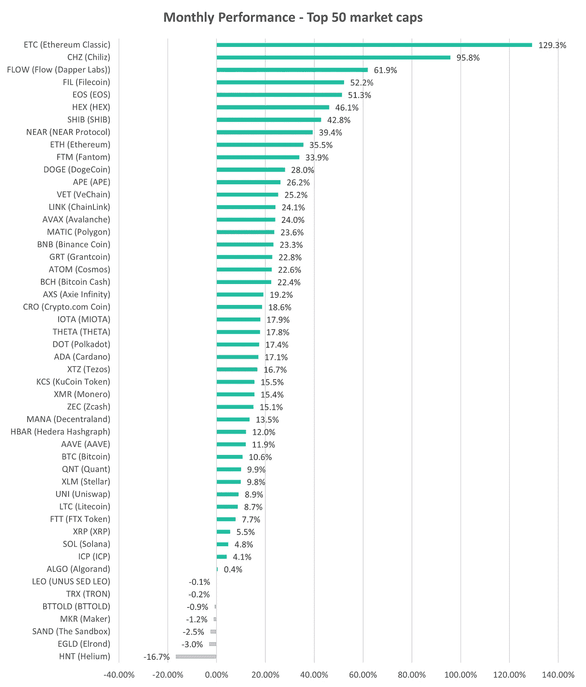

# 合并后 ETH 价格会有什么变化？

> 原文：<https://medium.com/coinmonks/what-will-happen-to-eth-price-after-the-merge-b0810a61b047?source=collection_archive---------1----------------------->

最近，我们[电报频道](https://t.me/altfinsofficialchat)的交易员一直在问**“合并后 ETH 价格会有什么变化”。**

并购炒作会在事后不了了之吗？会不会是典型的“买谣言，卖新闻”？

很棒的问题！

过去 30 天，ETH 价格上涨了 36%，自 6 月份的低点(882 美元)以来上涨了 114%。这是前 50 名中表现最好的代用币之一。

Source: altfins.com

其中一部分是由于通货膨胀速度放缓引起的总体市场趋势逆转([见博客](https://altfins.com/crypto-market-update-2/))，但很大程度上的优异表现与即将到来的合并有关。

关于合并的细节，请点击阅读我们的综合报道[。](https://altfins.com/the-big-merge-from-eth-to-eth2/)

在这篇简短的文章中，我将列出一些论点，说明为什么我个人认为合并后 ETH 的价格会上涨。

首先让我提一下，如果你关心对可能是 5-10 倍的硬币的深入基础研究，请查看 altFINS [研究中心](https://platform.altfins.com/research)，我们的团队在那里发布了关于他们最喜欢的硬币选择的报告。自从我们发布研究报告以来，我们最近选择的股票上涨了 120%(利多)，57%(联邦理工)，12% (Uniswap)，11% (StepN)和 3% (Aave)。

所以对于 ETH 来说，它归结为这一点。

不利的一面是，在合并(从工作证明转移到股权证明)之后，迄今为止持有的约 1330 万份 ETH 将开始解禁，这给了它们的所有者一个出售的机会。这大约是总乙烯醚供应量的 11%。但在接下来的 12 个月里，解锁将是渐进的。尽管如此，这可能会给那些希望获利或有其他迫切理由筹集资本和出售所持 ETH 股份的人带来一些抛售压力。

然而，我的观点是，很少有人会出售，因为 1)大多数投资于更高的 ETH 价格水平，因此处于水下，将会亏本出售 2) ETH 赌注回报应该翻倍至约 8%的 APY，这是非常有吸引力的，3)很大一部分赌注 ETH 来自大型验证者，他们是为了收益率而不是价格收益。

这让我想到了合并事件积极的一面:

1)更高的赌注收益率(~8%)应该会吸引新的 ETH 买家、大量机构投资者，

2)它将减少新的 ETH 生成，且由于 ETH 燃烧，事实上可能变成通货紧缩(减少供应),

3)更多“绿色”方面可以吸引一些有环境意识的机构投资者，

4)以太坊网络更高的可扩展性将刺激 ETH 协议的新活动(defi、web 3.0、NFT…)，最终推动对 ETH 的需求。

总之，任何资产的价格都是由供求关系决定的。合并后，我的观点是，需求将超过卖方暂时增加的供应。这可能发生在近期(几周)，但更有可能发生在合并后的长期(几个月)。

参考资料:

1.  ETH staking 仪表板:[https://dune.com/arch1111/eth-staking-dashboard](https://dune.com/arch1111/eth-staking-dashboard)

2.从 ETH 到 ETH2 的大合并:【https://altfins.com/the-big-merge-from-eth-to-eth2/ 

3.加密市场更新:【https://altfins.com/crypto-market-update-2/ 

> 交易新手？尝试[加密交易机器人](/coinmonks/crypto-trading-bot-c2ffce8acb2a)或[复制交易](/coinmonks/top-10-crypto-copy-trading-platforms-for-beginners-d0c37c7d698c)