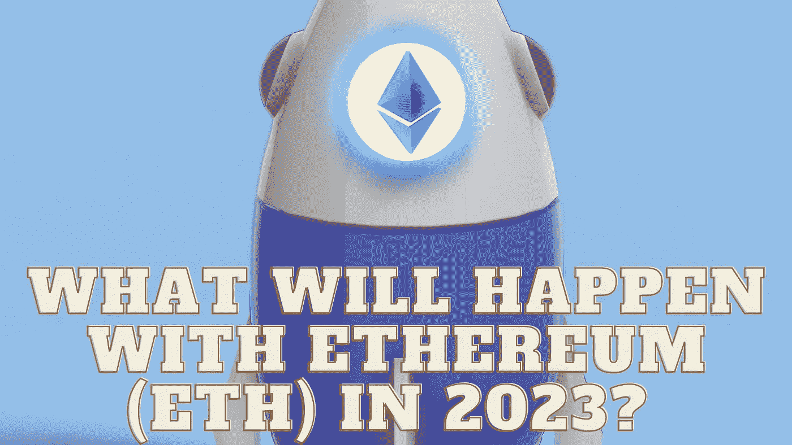

# 2023 年以太坊(ETH)会怎么样？

> 原文：<https://medium.com/coinmonks/what-will-happen-with-ethereum-eth-in-2023-36dbb7f4c1f6?source=collection_archive---------26----------------------->

Source photo Unsplash.com

在做加密货币预测时，通常会提到以太坊(ETH-USD)。这是流通中的第二大数字货币。然而，它的价值在最近几个月暴跌。更糟糕的是，投资者正在做出草率的判断。因为目前的下跌与以太坊的底层价值无关，所以才会出现这种情况。相反，以太坊的开发者只能做这么多来减轻…