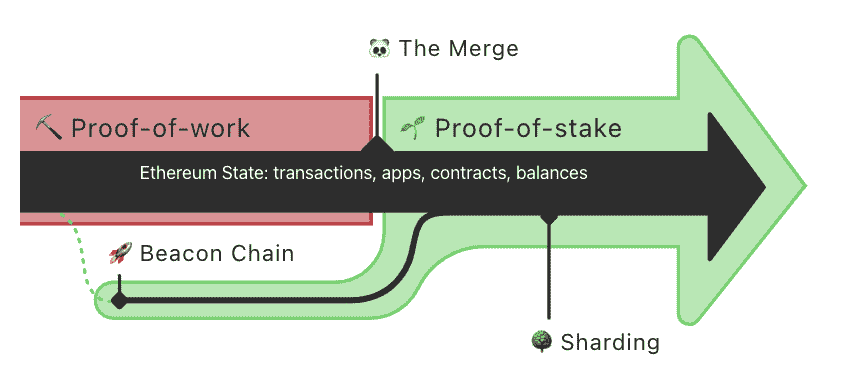
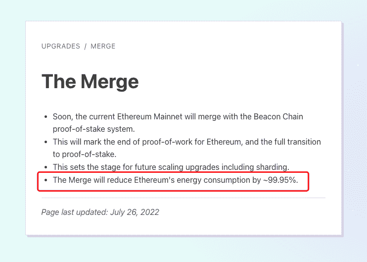

# 合并会带来什么？|合并如何影响 ETH 供应？

> 原文：<https://medium.com/coinmonks/what-will-the-merge-bring-how-the-merge-impacts-eth-supply-41fa18908ea6?source=collection_archive---------13----------------------->

> 合并会降低汽油费并加快交易吗？合并如何影响 ETH 供应？让我们来了解一下！

**👉在 Twitter | Medium 上关注我，让自己得到提升！**

**聚焦#NFT 研究员&#网路搜寻家**

**每日分享# web 3 # Crypto # NFT #比特币的真实素材**

T 何合并来了。市值排名第 2、生态系统最大的以太坊最复杂、最大规模的升级，必将成为加密货币史上的里程碑，成为 2022 年整个加密圈最值得关注的事件。

# 一、什么是合并？

以太坊网络的共识机制从 PoW 到 PoS 的过渡有两个要点，信标链和合并。

*   **信标链**

信标链是管理和协调利益相关者网络的账户分类账，它通过保证至少 32 个 ETH 令牌来支持用户成为网络的验证者。

2020 年 12 月 1 日正式上线，已经稳定运行了 20 多个月。

在合并之前，信标链作为共识层运行，但实际上并未被采用，执行层的状态仍由 POW 挖掘节点维护。

*   **合并**

合并代表了以太坊(我们今天使用的 Mainnet)的现有执行层与其新的利害关系证明共识层(Beacon Chain)的结合。它消除了对能源密集型采矿的需求，而是使用 staked ETH 来保护网络。实现以太坊愿景的真正激动人心的一步——更高的可扩展性、安全性和可持续性。

*来源于:*[*https://ethereum.org/en/upgrades/merge/*](https://ethereum.org/en/upgrades/merge/)

为了理解合并的难度和复杂性，官方给出了一个很好的比喻。把以太坊想象成一艘宇宙飞船，把信标链想象成一个新引擎，是时候把这个新引擎合并到这艘宇宙飞船里了。

但是飞船处于高速飞行状态，不可能让它暂停更换发动机，只能在它高速运行过程中更换，所以合并面临很大困难，一再推迟。

*注:你可以在这个网站查看合并时间表:【https://wenmerge.com/】*

*目前，它已经完成了对窑，Ropsten 和 Sepolia 的合并。而 Goerli 和 Mainnet 的预计时间分别是 8 月 11 日和 9 月 9 日，可能还会延迟一段时间。*

# *二。合并会带来什么影响？*

*首先，让我们弄清楚一些关于合并的事情。*

***合并不会:***

*   *降低天然气费用(即交易成本)*
*   *加快交易速度。*

*气费关系到整个网络的需求和容量。合并只是共识机制的切换，从 POW 到 POS，没有扩张，所以气费不会降低。*

*关于交易速度，POW 上的一个新块大约需要 13.3 秒，POS 上需要 12 秒，这不是一个显著的变化。*

***然而合并将:***

*   *降低以太币的发行率*
*   *将 ETH 转换为 APY 为 10%的有息资产*
*   *降低能耗 99.95%*

1.  ***降低以太币的发行利率***

*据官方统计:[https://ether eum . org/en/upgrades/merge/issuation/# how-the-merge-impacts-ETH-supply](https://ethereum.org/en/upgrades/merge/issuance/#how-the-merge-impacts-ETH-supply)*

*合并前，采矿报酬约为 13，000 ETH/天*

*合并前的赌注奖励约为 1，600 ETH/天*

*合并后，每天将只剩下约 1，600 个 ETH，新 ETH 发行总量将下降约 90%*

***2。将 ETH 转换为 APY 为 10%的有息资产***

*验证者奖励包括发行，小费和 MEV 估计。发行是新的块奖励，tip 是用户支付的交易小费，MEV 是交易排序收获的额外利润。*

*根据 https://ultrasound.money/的数据，*

*我们可以了解到，APY 约为 9%，如果数据与以太坊承诺的数量和以太坊网络交易的活跃程度动态相关，未来有可能达到 10%。*

**

***3。减少 99.95%的能源消耗***

*power 本质上是算术能力的竞争，对机器和功率的要求越来越高。根据剑桥大学之前的数据，比特币网络每年消耗约 1213.6 亿千瓦时的电力，超过阿根廷、荷兰和阿联酋一整年的消耗量。*

*外界对加密货币的许多批评之一也是它的能耗，这被认为是对环境不友好的。*

**

*官方声称合并将使以太坊的能耗降低约 99.95%。*

**

> *最近一两个月以太坊的价格波动比较大，源于市场资金对预期的炒作。投资市场的价格是不可预测的，加密市场的特点是高波动性和高风险。*
> 
> *本文只是从科普的角度介绍一下 Merge，无意提供任何投资建议。*

****关注我让自己升职！****

****聚焦#NFT 研究员&#蛛网****

****每日分享关于# web 3 # Crypto # NFT #比特币的真实素材****

*[***碎碎念***](https://twitter.com/TheCryptoKK)***|***[***中等***](/@TheCryptoKK)*

**欢迎关注我，并随时询问任何事情**