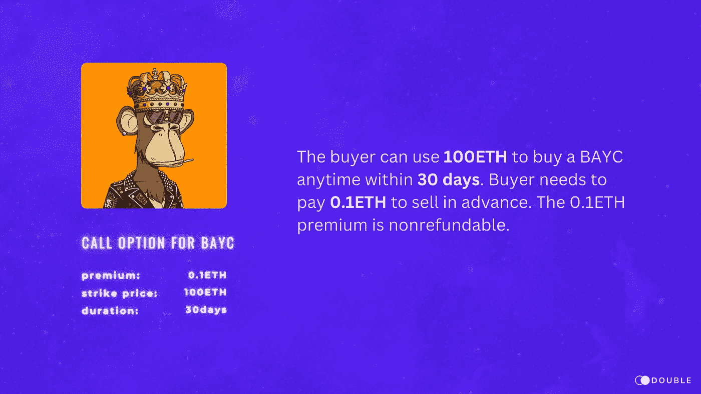
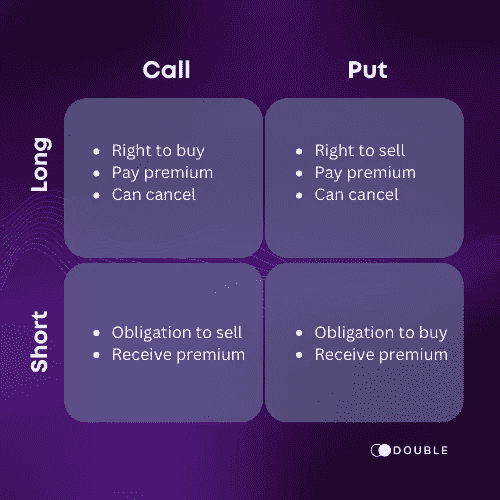
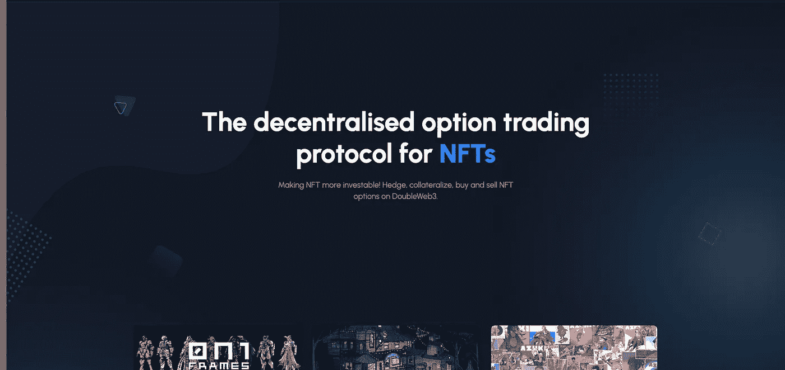

# 在价格飙升期间，你可以用 DoubleWeb3 NFT 期权做什么

> 原文：<https://medium.com/coinmonks/what-you-can-do-with-doubleweb3-nft-option-during-the-0n1force-price-spike-3bfba4724497?source=collection_archive---------22----------------------->

0n1 Force 受收购消息影响，价格短时间暴涨。一天之内迅速从 0.2ETH 攀升至 0.9ETH，之后又迅速回落。目前价格稳定在 0.5ETH 左右，如果你能准确捕捉到这波涨跌，相信能赚不少钱，然而，大多数人都没有办法预测未来。这时，你可以尝试利用 NFT 期权来获利。

# 什么是 NFT 期权？

期权一词指的是基于基础 NFT 价值的金融工具。期权合约为买方提供了买卖标的资产的机会。与期货不同，持有者不需要购买或出售资产，如果他们决定反对的话。

期权是多用途的金融产品。这些合同涉及买方和卖方，买方为合同授予的权利支付溢价。

向持有者转让以特定价格购买的权利的期权被称为**看涨期权**，而转让以特定价格出售的权利的期权被称为**看跌期权**。

看涨期权通常只有在执行价格低于标的资产的市场价值时才会被行使。相比之下，看跌期权通常只有在执行价格高于市场价值时才会被行使。

[DoubleWeb3](https://doubleweb3.com/) 分散式 NFT 期权交易平台提供美式期权；它可以在购买日和到期日之间的任何时候行使。

Doubleweb3 NFT 期权合约有三个主要部分:

> **溢价** 买方为获得购买或出售 NFT 的权利而向卖方支付的费用。
> 
> **执行价格** 它是一个固定的价格，期权的拥有者可以在这个价格上买入(在看涨的情况下)或卖出(在看跌的情况下)基础 NFT。
> 
> **期限** 行使期权合约的时间范围。我们提供 3 天、7 天和 30 天的合同。

下图显示了买卖双方的条款:

# NFT 期权如何在价格剧烈波动期间帮助投资者和持有者。

1.  买入看涨期权防止提前卖出(多头看涨)
    当市场价格大幅上涨时，投资者往往会陷入两难境地，不知道是应该获利了结，还是放任自流。使用 NFT 期权，你可以做的是卖出 NFT，同时买入 NFT 看涨期权。如果你卖出 NFT 后价格暴涨，你随时可以通过行使看涨期权回购它。相反，如果价格回落，你的损失不会超过溢价。
2.  购买 NFT 看涨期权规避 FOMO (long call)
    当 NFT 价格短时间内大幅上涨时，投资者非常容易因为 FOMO 而高价买入 NFT，结果一旦价格下跌就可能造成严重损失。你可以考虑购买 NFT 看涨期权，而不是购买 NFT。万一价格回落，你只损失保费，不会遭受更大的损失。
3.  购买杠杆交易的 NFT 看涨期权(long call)
    因为溢价通常只有 NFT 价值的十分之一(如果不是更少的话)。你可以通过购买看涨期权来平衡你的交易。以 0n1Force 为例，假设市价为 0.6ETH，一个行权价为 0.9ETH 的看涨期权的溢价为 0.05ETH，当市价上涨到 1.2ETH 时，现货 NFT 交易的收益率为 100% [(1.2 ETH-0.6ETH) / 0.6ETH]，而看涨期权交易的收益率为 500%[(1.2 ETH-0.9 ETH-0.05 ETH)/0.05 ETH]。
4.  卖出 NFT 看涨期权获取额外利润
    有时，当价格飙升时，投资者不想以市场价卖出 NFT，而是希望通过下达卖出订单来卖出。如果这也是你的情况，你应该考虑卖出看涨期权来赚取额外的利润。
    假设当前的地板价为 0.8ETH，而不是在 0.9ETH 下卖单，你可以选择卖出一个执行价为 0.9ETH 的看涨期权，并将溢价设为 0.05。这样，当价格超过 0.9 时，可以获得 0.95ETH 的利润；当价格不超过 0.9ETH 时，还可以从溢价中获得 0.05ETH 的利润。这是一个比简单的卖单更好的策略。

# 结论

NFT 期权是一种非常灵活的投资工具。通过引入 NFT 期权，投资者可以根据不同的市场环境选择合适的策略，使非功能性交易更具可投资性。

> 交易新手？试试[密码交易机器人](/coinmonks/crypto-trading-bot-c2ffce8acb2a)或[复制交易](/coinmonks/top-10-crypto-copy-trading-platforms-for-beginners-d0c37c7d698c)