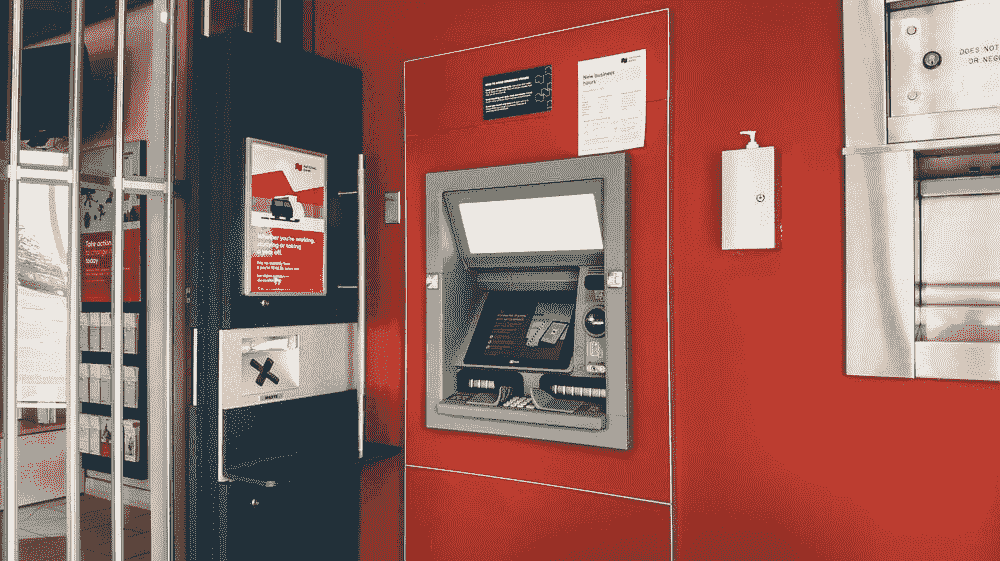

# 关于加纳的比特币自动取款机，你需要知道什么

> 原文：<https://medium.com/coinmonks/what-you-need-to-know-about-bitcoin-atms-in-ghana-46b1c49b0fa6?source=collection_archive---------21----------------------->

## 加密货币是一个不断增长的行业，不仅限于发达国家。非洲参与了这一增长。非洲国家正在看到新的人群和企业涌入加密货币世界，这有助于该行业的发展。此外，还有大量投资流入非洲区块链公司。随着越来越多的人意识到加密货币及其潜在好处，这种增长可能会持续下去。

随着比特币自动提款机在世界范围内继续激增，非洲似乎也获得了公平的份额。非洲的比特币自动取款机数量相当可观，南非有七台，加纳有两台，尼日利亚、肯尼亚、津巴布韦、博茨瓦纳、乌干达和吉布提各有一台。

## 什么是比特币自动取款机？

就像传统的自动取款机一样，比特币自动取款机是分发比特币的机器。这并不意味着实际意义上的配药，他们基本上处理的是比特币。在这些机器上，你可以购买比特币，也可以将比特币换成现金出售。加密货币领域的这一进步使得使用机器提取(出售)或存入(购买)比特币成为可能。这使得加密交易超级快速和无障碍；你几乎可以走到任何一台比特币 ATM 机前提取比特币，就像提取当地货币一样。在加纳，这些 ATM 机由一家名为 Thunder solutions 的 IT 公司运营。

> 交易新手？试试[加密交易机器人](/coinmonks/crypto-trading-bot-c2ffce8acb2a)或者[复制交易](/coinmonks/top-10-crypto-copy-trading-platforms-for-beginners-d0c37c7d698c)

在你使用比特币 ATM 机之前，有一定的要求；

*   你必须有一个加密钱包。
*   请提供有效的电话号码进行验证。

如果你想从比特币 ATM 机提取现金，这个过程很简单，尽管很漫长。首先，使用在线地图找到比特币 ATM 的位置。在大多数情况下，找到任何一台比特币 ATM 机，你都会发现上面印着一个二维码，指引你下载该 ATM 机支持的特定加密钱包。执行此操作并继续:

*   选择您想要提取的硬币，在这种情况下，选择比特币作为您想要提取的硬币。
*   选择你想出售的产品系列。
*   输入您想要提取的比特币金额。
*   隐私政策将显示，通读并点击“接受”按钮继续。
*   输入您的电话号码以接收验证码。
*   在机器上输入此验证码。
*   比特币钱包旁边会显示一个二维码。
*   使用您的比特币钱包应用程序扫描此代码。
*   确认你这边的付款，然后等机器。您将在经过验证的电话号码上获得一个 pin。
*   在将显示的下一个屏幕上使用此 pin 授权取款。

如果你在加纳，想要找到任何自动取款机的位置，你可以通过网站 [Coinatmradar](http://www.coinatmradar.com) 轻松找到。该网站旨在帮助定位您附近的任何比特币 ATM 机。但是，根据您所在的国家/地区，机器的操作会有所不同。您可以购买的最低和最高金额可能会有所不同，您可能需要完成 KYC 程序。如果你想在比特币自动取款机上出售你的加密资产，这可能不是最好的主意。这些机器经常收取过高的费用，这会侵蚀你的利润。另外，与其他选择相比，你的硬币的价格可能不是很好。
在加纳有多种方式出售比特币。最受欢迎的选择可能是通过[达特非洲](http://dartafrica.io)，因为他们提供更好的价格。他们在快速支付和客户服务方面也有着良好的声誉，这使他们成为那些希望在加纳出售比特币的人的首选。