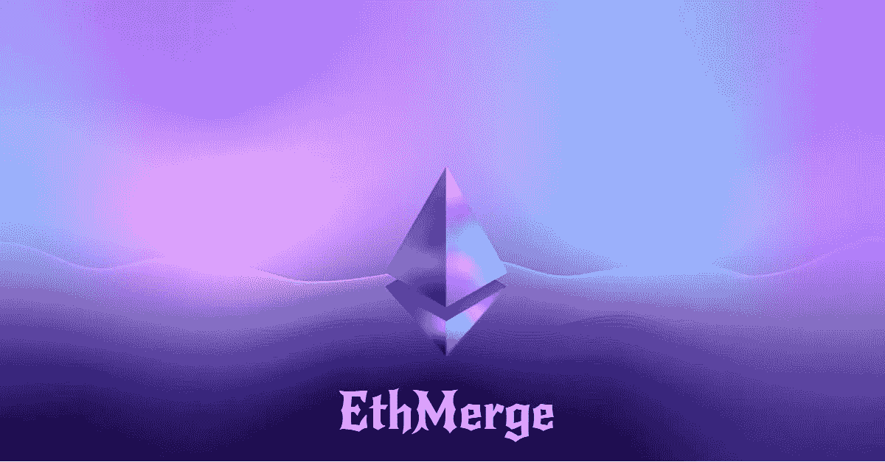
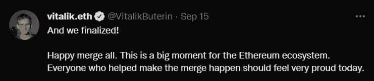

# 你需要知道的关于 ETHMERGE 的事情——流言、炒作和它的意义

> 原文：<https://medium.com/coinmonks/what-you-need-to-know-about-ethmerge-the-buzz-the-hype-and-what-it-means-745e18d301a6?source=collection_archive---------25----------------------->

最后，它发生了，Vitalik 在 9 月 15 日的推文中总结了以太坊世界中每个人一直在等待的事情。

在过去的几周里，Twitter 和密码世界充斥着与以太坊合并的新闻和趋势——从其 mainnet 转移到其 Beacon Chain Consensus 平台。

用来推测这种情况的流行术语是“Ethmerge”。

从本质上说，合并意味着以太坊已经完全从一个工作证明网络转变为一个利益证明平台。

**功率对位置:简而言之**

简而言之，工作证明(PoW)是一种分散的共识机制，需要通过使用计算机解决密码难题来进行适当的加密货币挖掘。这意味着努力工作，以获得在区块链网络上验证或确认交易的能力。它是从比特币加密货币的早期发展而来的。

另一方面，利益证明(PoS)是一种共识机制，认为区块链网络使用投资者或拥有其生态系统一部分的人作为交易的验证者。这些验证者用他们的加密资产来换取在他们所属的区块链网络上验证新交易的机会。

**合并:Mainnet 和 Beacon 链**

正如 ethereum.org 上解释的那样，合并的历史如下:

*工作证明安全以太坊主网从创建到合并。这使得我们都习惯的以太坊区块链在 2015 年 7 月出现，并拥有所有熟悉的功能——交易、智能合约、账户等。*

纵观以太坊的历史，开发者为最终从工作证明到利益证明的转变做好了准备。2020 年 12 月 1 日，信标链被创建为独立于 Mainnet 的区块链，并行运行。

*信标链最初不处理 Mainnet 事务。相反，它正在就自己的状态达成共识，就活动验证器及其帐户余额达成一致。经过广泛的测试后，信标链就现实世界的数据达成共识的时候到了。合并后，信标链成为所有网络数据的共识引擎，包括执行层事务和帐户余额。*

*合并代表着正式转向使用信标链作为批量生产的引擎。采矿不再是生产有效区块的手段。相反，利害关系证明验证者已经承担了这个角色，现在负责处理所有交易的有效性并提出阻止。*

*在合并中没有丢失任何历史记录。随着 Mainnet 与信标链合并，它也合并了以太坊的整个交易历史。*

**合并意味着什么**

从字面上看，以太坊现在是一个网络——一个单链。

此次合并标志着以太坊验证工作的结束，开启了一个更可持续、更环保的区块链网络时代。以太坊的能耗估计下降了 99.95%，使网络成为绿色区块链。

这是以太坊向 2.0 的进化，就心智采用而言是安全的。实际上，没有必要区分两个以太网；只有以太坊。

这是与以太坊网站的区别:

为了避免混淆，社区更新了这些术语:

*-‘et h1’现在是‘执行层’，处理事务和执行。*

*--“eth 2”现在是“共识层”，处理利害关系共识的证明。*

代表 PoS 机制的信标链是原始 Mainnet 执行层的新共识层。根据工作证明通过采矿进行区块生产不再有效。相反，参与协商一致的权利现在取决于参与者在网络中的利益。

**对于用户和搬运工**

你应该是安全的。

合并没有改变任何事情。这只是将两个网络整合为一体。由于合并，用户、非运营节点所有者和所有者不需要对他们的数字资产做任何事情。

正如 ethereum.org 解释的那样:

*ETH 就是 ETH。没有“旧 ETH”/“新 ETH”或“et h1”/“ETH 2”这样的东西，合并后钱包的工作方式和以前完全一样——告诉你其他情况的人很可能是骗子*。

尽管交换了工作证明，以太坊自创世以来的整个历史保持完整，没有因为过渡到利害关系证明而改变。合并前您钱包中的任何资金在合并后仍然可以使用。您不需要进行任何升级操作。

**燃气费怎么样？**

不，它们没有减少。

合并并不是为了扩大网络容量和降低天然气费用。它实现了将以太坊置于一个平台下的意图，即灯塔链。

*大概就是这样。如有任何问题，请发邮件至*[*alkaliamana1@gmail.com*](mailto:alkaliamana1@gmail.com)*或在 LinkedIn*[【www.linkedin.com/in/amana-alkali】T21](http://www.linkedin.com/in/amana-alkali)*上给我发消息。*

把这个分享给你需要的朋友和网络。

回头见！

> 交易新手？尝试[加密交易机器人](/coinmonks/crypto-trading-bot-c2ffce8acb2a)或[复制交易](/coinmonks/top-10-crypto-copy-trading-platforms-for-beginners-d0c37c7d698c)