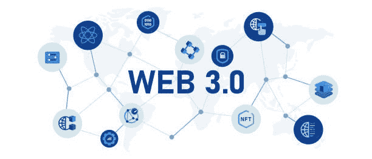

# 关于 Web 3.0 你需要知道什么

> 原文：<https://medium.com/coinmonks/what-you-need-to-know-about-web-3-0-c2520638fe89?source=collection_archive---------23----------------------->

目录:

什么是 Web 3.0？

Web 3.0 为什么重要？

Web3.0 和 Web 2.0 有什么区别

Web 3.0 的未来

结束语

自从万维网的发明者蒂姆·伯纳斯·李的时代以来，互联网经历了巨大的变化。Web 1.0 出现在 20 世纪 90 年代中期，开创了从服务器检索静态网页的时代。Web 1.0 的迷人之处在于收发电子邮件和实时新闻检索。

Web 1.0 用户无法访问交互式应用程序，这一缺点促使互联网演变为 Web 2.0，即当前版本的互联网。Web 2.0 是高度交互式的，这是一个允许用户生成内容并几乎即时提供给数百万用户的特性。

尽管极大地扰乱了世界，但 Web 2.0 也有其缺点。最显著的缺点是集中化，即一小群公司——大型科技公司——控制数据和内容。这类公司的例子包括 Alphabet(谷歌)、亚马逊、苹果、Meta(原脸书)和微软等等。

为了解决 Web 2.0 的缺点，Web 3.0 运行在区块链技术上，并集成了去中心化和基于令牌的经济学等概念。

# 什么是 Web 3.0？

Web 3.0 是万维网的下一个版本。加文·伍德是[波尔卡多](https://www.kucoin.com/price/DOT)的创始人和[以太坊](https://www.kucoin.com/price/ETH)的联合创始人，他在 2014 年提出了 Web 3.0 的概念。Wood 认为，Web 2.0 需要太多的信任，因为用户依赖于几家公司来为他们的最大利益服务。

尽管 Web 3.0 的概念已经存在了将近十年，但是它的组成并没有一个固定的定义。然而，Web 3.0 是建立在去中心化、无许可、无信任和本地支付等基础之上的。

去中心化指的是将互联网的所有权分配给其建设者和用户。另一方面，无信任意味着 Web 3.0 将整合激励机制，让用户运行整个生态系统，而不是依赖第三方。Web 3.0 的无权限特性意味着用户将有平等的机会参与其中。

Web 3.0 还将以[加密货币令牌](https://www.kucoin.com/markets)的形式提供本地支付。这种整合将消除对遗留银行系统的依赖，遗留银行系统不具包容性且收费高。

通过这些原则，Web 3.0 试图将互联网的控制权从少数几家强大的公司手中夺走，交给用户。

# Web 3.0 为什么重要？

与 Web 2.0 中集中的组织控制所有权不同，Web 3.0 分散了互联网的所有权。通过可替代和不可替代的令牌，用户可以拥有部分互联网服务。不可替代代币(NFT)允许用户拥有各种物品，包括元宇宙的虚拟财产、游戏中的物品、艺术、音乐等等。

为了更好地理解在线所有权，以游戏行业为例。Web 2.0 游戏开发者可以删除用户的账户，导致用户收集的所有物品丢失。如果玩家停止游戏，他们会失去游戏中的物品。

然而，在 Web 3.0 中，所有权是分散的。为此，甚至一个平台的开发者都不能关闭用户账户。此外，一旦用户停止玩游戏，他们可以在公开市场上出售或交易游戏中的物品。

Web 3.0 也改变了我们对组织的看法。通过分散自治组织(Dao)，许多人可以作为一个集体拥有一个组织。该组织发行代币，类似于公司发行股票。令牌持有者可以对关于运行 DAO 及其未来的决策进行投票。

此外，Web 3.0 简化了用户的在线身份。一切都在区块链上运行，用户只需要管理一个在线身份。相比之下，Web 2.0 用户每次注册新平台时都需要更新身份信息。

# Web3.0 和 Web 2.0 有什么区别

Web 3.0 是去中心化的、无信任的、无权限的、可扩展的。这些特性源于区块链，它使用分布式分类账来确保可追溯性、透明性和不变性。这些功能有助于将 Web 3.0 支付与传统金融系统区分开来。

分散化有助于消除对加密信任的需求。例如，比特币供应的控制权掌握在许多人手里。这有助于确保网络按照其社区的愿望运行。

相比之下，遗留下来的传统金融体系依靠政府发行的法定货币运行。然而，政府是中央集权的，可以轻易地印更多的钱，导致货币贬值和通货膨胀。

在 Web 2.0 中，银行作为受信任的实体来验证在线交易。然而，在 Web 3.0 中，事务是不可信的。加密货币网络利用公钥加密和共识机制来验证交易，从而将检查发送者是否可信以及货币是否有效的过程分配给许多人。

公共区块链的无许可性质允许 Web 3.0 用户在没有中央机构许可的情况下访问金融服务。这一特点有助于简化金融服务的获取，特别是在没有银行账户和服务不足的人群中。

# Web 3.0 的未来

尽管 Web 3.0 这个术语可以追溯到 2014 年，但这个概念仍处于初始发展阶段。许多 Web 3.0 的想法对大多数人来说仍然是未知的。然而，这并没有阻止开发者全速前进。

Web 3.0 可以带来更加个性化的类似人类的机器体验，简化用户的日常生活。新闻、电子和快速消费品 Web 3.0 等行业的公司可以引入更高层次的与目标客户的互动。

# 结束语

尽管 Web 3.0 仅处于初始发展阶段，但它颠覆世界的潜力是巨大的。通过增强 Web 2.0 的优势并消除其缺点，Web 3.0 承诺给用户带来力量，使他们能够从他们创建的内容中获利。

> 加入 Coinmonks [电报频道](https://t.me/coincodecap)和 [Youtube 频道](https://www.youtube.com/c/coinmonks/videos)了解加密交易和投资

# 另外，阅读

*   [麻雀交换评论](https://coincodecap.com/sparrow-exchange-review) | [纳什交换评论](https://coincodecap.com/nash-exchange-review)
*   [美国最佳加密交易机器人](https://coincodecap.com/crypto-trading-bots-in-the-us) | [不断回顾](https://coincodecap.com/changelly-review)
*   [在印度利用加密套利赚取被动收入](https://coincodecap.com/crypto-arbitrage-in-india)
*   [Godex.io 审核](/coinmonks/godex-io-review-7366086519fb) | [邀请审核](/coinmonks/invity-review-70f3030c0502) | [BitForex 审核](https://coincodecap.com/bitforex-review)
*   [5 款最佳免费加密货币制图工具](https://coincodecap.com/crypto-charting-tools)