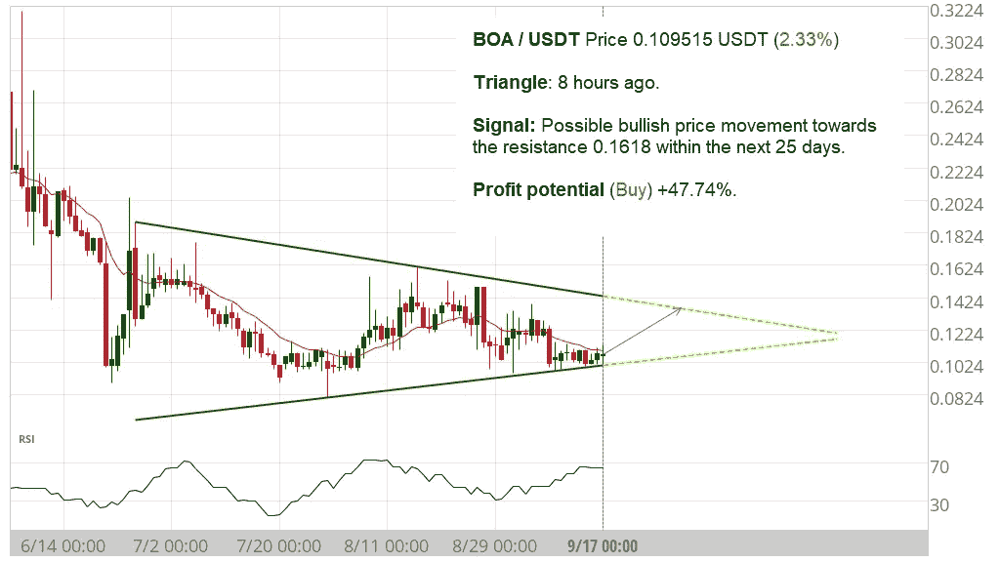
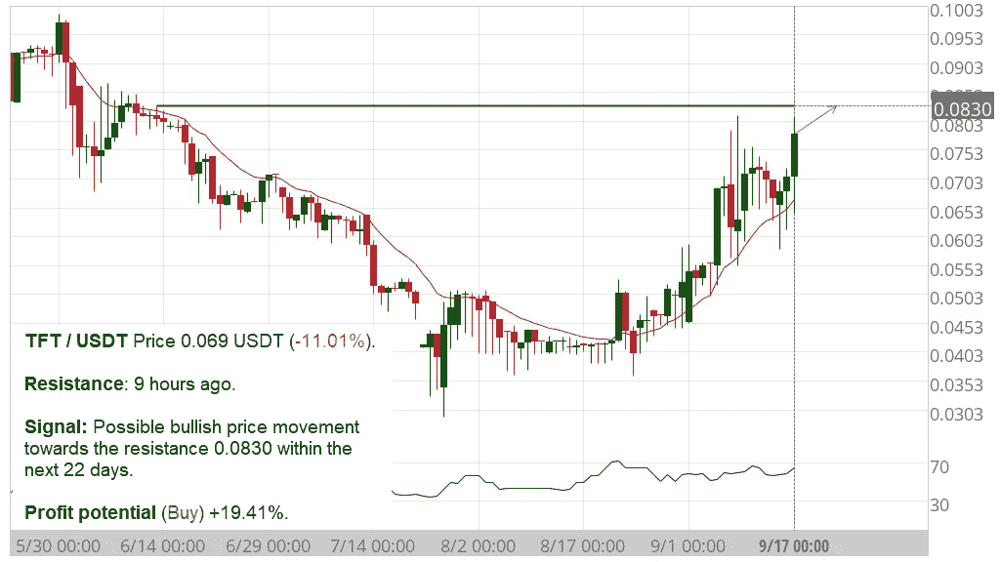

# 什么是加密图表模式？

> 原文：<https://medium.com/coinmonks/whate-are-crypto-chart-patterns-9e04d2799a41?source=collection_archive---------13----------------------->

**altFINS’**[**自动图表模式识别引擎**](https://platform.altfins.com/tpatterns) **识别多个时间间隔(15 分钟、1 小时、4 小时、1 天)的 27 种交易模式，为交易者节省了大量时间，包括:**

1.  [上升](https://altfins.com/knowledge-base/chart-patterns/#link1) / [下降三角形](https://altfins.com/knowledge-base/chart-patterns/#link2)
2.  [头肩](https://altfins.com/knowledge-base/chart-patterns/#link3)、[逆头肩](https://altfins.com/knowledge-base/chart-patterns/#link4)
3.  [频道上移](https://altfins.com/knowledge-base/chart-patterns/#link5) / [下移](https://altfins.com/knowledge-base/chart-patterns/#link5)
4.  [下降](https://altfins.com/knowledge-base/chart-patterns/#link7) / [上升楔](https://altfins.com/knowledge-base/chart-patterns/#link8)
5.  [双底](https://altfins.com/knowledge-base/chart-patterns/#link9) / [顶](https://altfins.com/knowledge-base/chart-patterns/#link10)
6.  [三重底](https://altfins.com/knowledge-base/chart-patterns/#link11) / [顶](https://altfins.com/knowledge-base/chart-patterns/#link12)
7.  [看涨](https://altfins.com/knowledge-base/chart-patterns/#link13) / [看跌旗](https://altfins.com/knowledge-base/chart-patterns/#link14)
8.  [看涨/](https://altfins.com/knowledge-base/chart-patterns/#link15) 看跌三角旗
9.  [长方形](https://altfins.com/knowledge-base/chart-patterns/#link17)
10.  [支撑/](https://altfins.com/knowledge-base/chart-patterns/#link18) 阻力
11.  大运动
12.  连续蜡烛
13.  驱动器
14.  [蝴蝶](https://altfins.com/knowledge-base/chart-patterns/#link20)
15.  Gartley
16.  [ABCD](https://altfins.com/knowledge-base/chart-patterns/#link21)
17.  3 点延伸/ 3 点回撤

当交易者在某一水平买入和卖出时，价格模式就会出现，因此，价格会在这些水平之间波动，形成图表模式。当价格最终脱离价格模式时，它可以代表情绪的重大变化。

**在更长一段时间内出现的模式通常更可靠**，一旦价格打破这种模式，就会产生更大的波动。因此，日线图上出现的模式预计会导致比日内图(如一分钟图)上观察到的相同模式更大的波动。

**该系统还明确指出了未来的预期价格路径，这是基于对成千上万种过去情况进行处理的机器学习算法。**

在这里查看当前交易图表模式机会[。](http://platform.altfins.com/tpatterns)

**下面是一个看涨通道上升图模式的例子:**

Source: altFINS.com

图表模式通常会有错误的突破，因此**交易者可以通过用其他指标**确认突破来增加他们的成功(RSI，MACD 等)。)甚至是简单的成交量趋势。

**理想情况下，价格突破(高于阻力线或低于支撑线)会伴随着成交量的增加。**后续动作可能会很大。因此，成交量的增加可以证实价格突破的有效性。成交量小幅上涨或没有上涨的突破失败的可能性更高，尤其是如果走势向上。

一些简单的模式，如[支持和抵抗](https://altfins.com/knowledge-base/key-horizontal-levels/)突破和方法是最成功的，成功率超过 75%。

在这里查看当前交易图表模式机会

查看[视频，了解如何交易上升三角形](https://www.youtube.com/watch?v=kYAhM56rNCM&t=62s)图案。

这里还有一个很好的[图表模式备忘单](https://altfins.com/knowledge-base/chart-patterns-cheat-sheet/)。

当你在处理概率时，交易图表模式总是有一些不确定性。在任何交易中，正确的风险管理都是避免过度损失的关键。这包括设置适当的止损单，使用适当的交易规模和杠杆。

# 上升三角形

**描述:**两个以上相等的高点在顶部形成一条水平线；两个或多个上升槽形成一条上升线，与水平线相交。它通常在上升趋势中形成(看涨)。

**交易:**通常，突破会出现在现有趋势的方向上。一旦价格行为突破三角形的顶线，交易量增加，大多数交易者都会建仓，这时价格应该增加相当于三角形最宽部分的量。

**举例:OGN 从上升三角中崛起**

Source: altFINS.com

**例子** : [实盘交易](https://altfins.com/breakouts-xtz-leo-technical-analysis-and-video/)用狮子座币交易上升三角形的例子。

# 下降三角形

**描述:**两个以上相等的低点在底部形成一条水平线；两个或多个下降的峰形成一条与水平线相交的下降线。它通常在下跌趋势中形成(熊市)。

**交易:**通常，突破会出现在现有趋势的方向上。一旦价格行为突破三角形底部趋势线，交易量增加，大多数交易者都会建仓，这时价格应该下跌相当于三角形最宽部分的量。

**举例:TNB 从下降三角形中浮现:**

Source: altFINS.com

# 对称三角形

**描述:**对称三角形是在没有明确方向的市场中发展起来的延续形态。在这个犹豫不决的时期，高点和低点在低交易量的三角点相遇。投资者只是不知道该采取什么立场。当投资者最终想出该走哪条路时，与突破前的成交量相比，它会带着大的成交量向北或向南走。

**交易:**在突破方向的突破点进行交易，这通常是之前宏观趋势的延续。

**例子:宝儿浮现出一个对称的三角形**

Source: altFINS.com

**例子:** [真实交易](https://altfins.com/theta-bullish-triangle-breakout/)用 THETA 币交易对称三角形的看涨突破的例子。

# 头和肩膀

**描述:**三座连续的山峰:中间最高，外面两座较低，高度相对相等。它在上升趋势后形成，通常预示着趋势即将反转(从看涨到看跌)。头肩形态被认为是最可靠的趋势反转形态之一。

**交易:**等待形态完成，价格突破——在右肩最高点后移动到颈线以下。最常见的进场点是突破发生时——颈线被突破，进行卖出交易。

# 逆头肩

**描述:**三座连续的山峰:中间最低，外面两座较高，高度相当。它在下跌趋势后形成，通常预示着趋势即将反转(从熊市到牛市)。

交易:等待形态完成，价格突破——移动到颈线上方。最常见的进场点是突破发生时——颈线被突破，进行买入交易。

**举例:COTI 出现了一个逆头肩底**

Source: altFINS.com

# 频道向下和频道向上

**描述:**对角线平行线之间的交易区间。当上涨或下跌趋势在平行支撑线和阻力线之间形成时，它就形成了。它表明趋势可能反转，或者当前趋势的斜率发生变化。

**交易:** 1)对于新兴形态，当价格在其通道趋势线内波动时，认为价格可能保持在其通道内的交易者可以开始交易，2)对于完整形态(即突破)——当价格突破通道趋势线时，无论是在上方还是下方，都可以开始交易。当这种情况发生时，价格会朝着突破的方向快速移动。

**例子:向下通道的獾出现**

Source: altFINS.com

**举例:MITH 出现上升通道**

Source: altFINS.com

# 看涨和看跌旗

**描述:**短期(时间间隔较短)对角线平行线之间的小矩形交易区间。它与价格图表上较长时间内观察到的主流价格趋势相反。它通常在大幅上涨或下跌后形成，通常表明在之前的趋势恢复之前，方向(或盘整区域)发生了微小的变化。

标志模式可以是上升趋势(看涨标志)或下降趋势(看跌标志)。旗帜模式是交易者使用的最可靠的延续模式之一，因为它为进入一个已经准备好继续的趋势建立了一个基础。

**交易:**如果突破与主流趋势方向一致，交易就开始了。此外，对于看涨的旗帜形态，交易者更喜欢成交量上升的突破，但这不是必须的。在熊市标志模式下，突破成交量可能与之前的成交量没有太大差别。

**举例:OIN 突破一面旗帜**

Source: altFINS.com

# 下落楔形物

**描述:**两条相交的线斜向下。它通常在下跌趋势后形成，并暗示在最初的下跌趋势中有潜在的看涨反转。然而，它也可能出现在上升趋势中，在这种情况下，它表明该趋势可能会继续。不管怎样，楔形下跌通常会导致牛市突破。下降楔形比上升楔形更可靠。

交易:当价格突破上趋势线时，价格有望走高。新兴形态(突破发生前)可以由波段交易者在收敛线之间交易；然而，大多数交易者应该等待一个完整的突破形态，然后下单买入。

在视频中了解有关落楔的更多信息。

**示例:CRU 从下落的楔形物中脱出**

Source: altFINS.com

# 上升楔

**描述:**两条会聚的线向上倾斜。它通常在上升趋势后形成，但也可能在下降趋势中出现。随着价格的上涨，成交量通常会下降(即价格/成交量背离)。上升的楔形通常会导致崩溃(看跌)。

**交易:**新兴形态(突破发生前)可以由波段交易者在收敛线之间交易；然而，大多数交易者应该等待一个完整的形态分解，然后下单卖空。

**示例:XMR 从上升楔形中出现**

Source: altFINS.com

# 双层底

**描述:**两个连续的、大致相等的波谷，中间有一个适中的波峰(类似“W”形)。这种强大的图表模式出现在长期下降趋势之后，通常代表一种反转模式，表明从下降趋势到上升趋势的微小变化(如看涨)。在该模式的两次价格上涨过程中，通常会出现交易量的激增。这些交易量的上升是价格上涨压力的强烈信号，有助于确认一个成功的双底形态。

**交易:**当价格突破阻力线(颈线)并完成形态时，下单买入。

# 双顶分

**描述:**两个连续的、大致相等的山峰，中间有一个适中的低谷(类似“M”形)。这种强大的图表模式出现在长期上升趋势之后，通常代表一种反转模式，表明从上升趋势到下降趋势的微小变化(如熊市)。

**交易:**当价格突破支撑线(颈线)并完成形态时，下单卖出。

# 三重底

**描述:**三个连续的、大致相等的波谷，起初可能类似双底。这些困境代表了突破支撑区域的失败尝试。每一次支撑位的测试通常伴随着成交量的下降，直到价格的突破伴随着成交量的上升。该形态出现在长期下跌趋势之后，通常代表一种反转形态，表明从下跌趋势到上涨趋势的微小(如果不是长期)变化(即看涨)。

**交易:**当价格突破阻力线，完成形态时，下单买入。

# 三重顶

**描述:**三个连续的、大致相等的峰，起初可能类似双顶。这些峰值代表突破阻力区域的失败尝试。每一次阻力测试通常都伴随着成交量的下降，直到价格突破和成交量的上升。它发生在持续上升趋势之后，通常代表一种反转形态，表明从上升趋势到下降趋势的微小变化(如熊市)。交易量趋势也应该用来确认信号的强度。

**交易:**当价格突破支撑线，完成形态时，下单卖出。

# 看涨和看跌三角旗

**描述:**一个收敛的对称小三角形(叫做三角旗)。它通常在大幅上涨(看涨)/下跌(看跌)后形成，随后是价格的短暂三角形盘整(方向的微小变化)，然后前一个上升趋势(看涨)/下降趋势(看跌)恢复。盘整期应有较低的成交量，突破期应有较高的成交量。如果没有旗杆(急剧上升/下降)，那么它是三角形而不是三角旗。此外，三角旗是一种短期模式，不像三角形。

**示例:光束出现三角旗**

Source: altFINS.com

**交易:**交易者在支撑线(看涨)/支撑线(看跌)上方寻找突破，以利用新的势头。

# 矩形

**描述:**矩形形态是趋势暂停的特征，价格在平行支撑位和阻力位之间横向移动。该模式通常代表价格在继续沿现有趋势的原始方向(上涨或下跌)盘整。

交易:摇摆交易者可以通过在支撑位买入，在阻力位卖出来交易正在形成的矩形形态。趋势交易者只是等待趋势原始方向的突破，蜡烛线在支撑/阻力以下/以上，这取决于趋势方向——在蜡烛线收盘时进场。

**例子:超矩形图案**

Source: altFINS.com

# 支持/抵制

**描述:**关键水平仅仅是水平支撑或阻力区域。这意味着价格图中的波峰或波谷排列成一个水平心理障碍。支撑线和阻力线是技术分析中的重要概念。在这些领域，买家认为某项资产具有购买吸引力(支持)或过于昂贵(抵制)。[观看解释这一概念的视频](https://altfins.com/knowledge-base/support-and-resistance-lines/)。

**交易:有 3 种方法可以剥这只猫的皮:**

**1。关键级别方法。**第一种交易机会是当价格从关键水平反弹并离开，现在又一次接近该水平时。

**示例:TFT 出现水平电阻**

Source: altFINS.com

**2。关键级别突破。**当关键水平被突破时，理论是价格的动量将把它带离确定的水平**。**突破是指明确突破关键水平，并与价格预期的目标水平一起出现。

**例如:TLM 抵抗突破**

Source: altFINS.com

**3。键级弹跳。**大多数时候，价格会从关键水平线反弹，而不是突破(上面的交易设置#2)。因此，交易者可以在价格触及支撑线时下单做多，或在价格触及阻力线时做空(或卖出现有头寸)。

# ABCD 模式

**描述:** ABCD 形态捕捉了市场典型的节奏模式，交易者用它来识别交易机会。由于 ABCD 模式在不同的时间框架内起作用，它们被广泛使用，并在市场上升趋势和下降趋势中形成。ABCD 模式属于调和模式的范畴，由两个等价的价格段组成。

**交易:** ABCD 形态在价格图中很容易识别，表示大概率机会。它们被用来预测看涨和看跌反转。

**例子:EKT 出现 ABCD 模式**

Source: altFINS.com

# 蝴蝶

**描述:**蝴蝶形态帮助你识别价格运动的结束，意味着你可以在价格反转时进场。

**举例:蝴蝶的 CGLD 浮现**

Source: altFINS.com

# 如何使用图表模式进行加密交易的 10 个步骤

## 关于如何最好地使用图表模式进行交易的重要提示，包括:

*   哪些加密资产用于模式识别？
*   时间间隔选择。
*   初学者的最佳模式。
*   突破与新兴模式。
*   各种模式的成功率。
*   利润潜力。
*   进入模式交易的最佳时间。
*   何时退出交易。
*   顺应趋势。
*   风险管理。

我们还建议[您观看关于使用 altFINS 模式部分的介绍视频](https://altfins.com/knowledge-base/overview-of-patterns/)。

Source: altFINS.com

**让我们首先来分解我们的模式图的各个组成部分:**

Source: altFINS.com

**1。哪些资产用于模式识别？** altFINS 分析了前 500 名硬币(按市值)，这份名单每个季度更新一次。

**2。时间间隔选择。**在 4 个时间间隔内识别模式(1D，4 小时，1H，15 分钟)。新手应该用更高的时间框架(1D，4H)，而有经验的交易者可以用更低的时间框架。这也取决于你有多少时间来监控你的头寸。较短的时间框架(1H，15 分钟)需要更频繁的交易管理(监控，平仓)。然而，在这些时间间隔内，模式的成功率大致相同。所以水平突破在日(1D)区间和小时(1H)区间有相同的成功机会。

当然，更低的间隔会更频繁地形成更多的模式。

请注意，基本计划用户可以访问 1D 区间，基本用户可以访问 1D 和 4H 区间，高级用户可以访问所有四个区间(1D、4H、1H、15 分钟)的模式。关于订阅计划的更多[详情](https://platform.altfins.com/subscriptions)。

**3** 。**初学者的最佳模式。初学者应该坚持使用最容易理解且成功率最高的模式。**

也就是说:突破(没有出现)+买入方向+形态类型包括[水平阻力](https://altfins.com/knowledge-base/key-horizontal-levels/)，上升三角形，通道向下，下跌楔形，反向头肩。这些模式往往有 67-83%的成功率(见下一节)。

Source: altFINS.com

**4。突破与新兴模式。** [阅读本文](https://altfins.com/knowledge-base/emerging-v-completed/)在我们的知识库中了解区别。总的来说，突破形态有更高的利润潜力，也更适合新手和趋势交易者，而新兴形态适合高级交易者和摇摆交易者。

**5。各种模式的成功率。**“成功率”是什么意思？这意味着价格在该模式的一个长度内达到了目标。因此，如果模式是在 20 天内检测到的，那么价格目标必须在识别模式后的 20 天内实现。

基于历史回溯测试，我们平台上模式的成功率如下:

Source: altFINS.com

**6。利润潜力。** altFINS 计算了大多数已识别模式的潜在利润。计算很简单。它是当前实时价格和预测价格之间的距离。

**7。进入一个模式交易**的最佳时机是当它刚被发现并在 altFINS 平台上发布的时候。然而，一些交易者等待 1-2 根蜡烛线(1D，1H…取决于选择的时间间隔)来确认价格路径。

**8。何时退出交易？—当模式被删除(变为非活动状态)时。**当 1)模式达到其预测价格，2)10 根蜡烛线过去后(即 10 天，10 小时…)，3)如果价格与预测方向相差太远(超过 1 个标准差= >交易失败)，模式将从我们的平台中删除。

我们建议 10 支蜡烛(天、小时等)。—取决于使用的时间间隔)作为基于历史数据的最大交易长度，这表明在识别模式后，预测价格通常在 10 蜡烛线内达到。因此，如果价格在 10 支蜡烛内没有达到预测价格，交易者应该平仓。

正在进行中:在 2021 年 2H 奥运会上，altFINS 也将引入模式警报。当模式到期或由于上述原因被删除时，交易者会收到提醒。你也可以在我们发现新花样的地方收到硬币的提示。

**9。顺应趋势。**虽然这不是绝对必须的，但确实有助于提高成功率。古语有云“趋势交易”。这也适用于模式。市场趋势是变化的，买卖交易的成功率很大程度上受整体趋势方向的影响。因此，当趋势上升时，交易者应该使用买入方向模式，反之亦然。如何识别一个趋势？我们建议使用 30 周期 SMA(简单移动平均线)的斜率。你可以在 altFINS 上找到数据:

Source: altFINS.com

10。风险管理。有了交易模式，交易者必须做许多小交易，而不是几笔大交易。因为交易是关于统计的。像上升或下降三角形，通道上升或下降，阻力突破和进场…这些有大约 70%的成功率。这意味着我们有 30%的时间是错的。所以交易者需要做 100 次交易来计算这些数据(成功率)。保持相对小的交易，不要在任何一个交易上下注！不要使用杠杆。关于风险管理的更多建议，[点击这里](https://altfins.com/knowledge-base/trading-risk-management/)。

**更多提示:**

**如何为特定交易所筛选硬币上的图案？**假设你想要币安硬币的图案。[看这里](https://altfins.com/knowledge-base/how-to-filter-patterns-by-exchange/)。

> 交易新手？尝试[加密交易机器人](/coinmonks/crypto-trading-bot-c2ffce8acb2a)或[复制交易](/coinmonks/top-10-crypto-copy-trading-platforms-for-beginners-d0c37c7d698c)