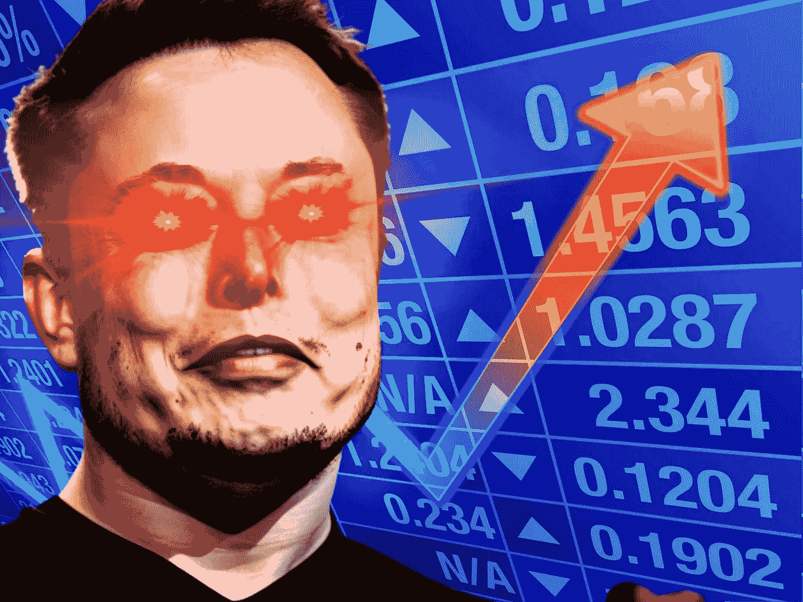

# 什么是泵和转储方案？欺诈者如何赚钱

> 原文：<https://medium.com/coinmonks/whats-a-pump-and-dump-scheme-how-fraudsters-make-money-fe0892032ff0?source=collection_archive---------38----------------------->

> 你有没有想过为什么股票会上涨，或者比特币会突然突破 6 万美元？这都是相同的概念… **除了泵和倾卸是故意的。**

当对***任何东西的需求上升****时，不管是天然气、电力、食品还是股票，价格也会上升。这就是“供给和需求”的概念，当某样东西的供应量减少时，它就会变得更有价值。*

*欺诈者通常会执行这样的“抽取和转储”计划:他们购买股票或加密货币，然后传播关于该公司或硬币的虚假或误导性信息，以吸引更多投资者，增加对该资产的需求，推高价格。*

> *从顶级交易者那里复制交易机器人。免费试用。*

*一旦资产增值，他们就会出售获利。但是因为他们购买了大量的股票，出售这些股票会大幅降低资产的价值。这使得购买股票的投资者手中只剩下一文不值的股票。*

# *埃隆马斯克的泵和转储方案？*

*一个很好的例子就是 **Dogecoin。在 2013 年首次推出时，这个有趣的迷因项目价值为 [$0.00058](https://www.coingecko.com/en/coins/dogecoin) ，随着硬币越来越受欢迎，它的价值也慢慢增加。2020 年，硬币的价格翻了两番，达到 0.002 美元，相当于 1/5 便士；除非你有很多钱，否则一文不值。***

*然后在 2021 年 1 月 20 日，由于 Reddit 用户的关注和 Elon Musk 的鼓励，Dogecoin 的价格上涨了 800%，达到了 0.07 美元*

*这就是疯狂的地方。2021 年 4 月 27 日，埃隆·马斯克在推特上写道:*

*当时有 6800 万粉丝，这条推文会像病毒一样传播，并在 4 小时内将 dogecoin 的价格提高 300%，然后在接下来的几个小时内下降到新高的一半。*

*这是马斯克第一次在推特上谈论这个话题，看到他对硬币市场价值的深远影响很奇怪。他可能一直在计划这件事，也可能只是巧合。*

*无论如何，看到他推广一种特定的加密货币，价格在创下历史新高后的几个小时内急剧下降**是很奇怪的***

*我们将通过他的推文看到 Dogecoin 的进一步推广，因为他 [**接受 Dogecoin 作为特斯拉的支付方式，**](https://twitter.com/elonmusk/status/1530209049261658112) 声称[支持 dogecoin](https://twitter.com/elonmusk/status/1538406040374595585) ，甚至还说:*

> *“如果[@麦当劳](https://twitter.com/McDonalds?ref_src=twsrc%5Etfw%7Ctwcamp%5Etweetembed%7Ctwterm%5E1485953263040188416%7Ctwgr%5E2e0508da169f8e28a9c5838d4fa80121a0a443ea%7Ctwcon%5Es1_&ref_url=https%3A%2F%2Fwww.outlookindia.com%2Fbusiness%2F10-elon-musk-tweets-that-created-waves-in-crypto-world-news-233190)接受 Dogecoin，我会在电视上吃快乐套餐”*

*虽然麦当劳拒绝了这一提议，但麦当劳的许多竞争对手如 MrBeast Burger 认真对待他的推文，并提出如果他回复，就接受 dogecoin。*

*2021 年 4 月 1 日，埃隆在推特上写道:*

> *“SpaceX 将把一只真正的狗放在真正的月球上”*

*然后他最臭名昭著的推文:*

*看到 Elon 对 Dogecoin 的大力支持，eToro 和 Gemini 等许多大型加密货币交易所将允许其用户交易 Dogecoin。这使得硬币的价值达到了历史新高；交易价格为每枚硬币 0.73157 美元。*

***那么这是一个泵送和倾倒方案吗？《财富》杂志的一篇文章报道了一起针对埃隆·马斯克的诉讼，寻求 2850 亿美元的赔偿，一些人怀疑这是真的。***

> *“被告虚假欺骗性地声称 Dogecoin 是合法投资，而它根本没有价值，”—凯西·强生*

*马斯克的推文以及他的公司 SpaceX 决定接受 Dogecoin 支付，人为地提高了硬币的价值。2021 年 5 月，这枚硬币的交易价格接近 0.73 美元的历史高点，但现在每枚硬币的交易价格为 0.06 美元。*

*虽然这场诉讼的结果还没有公布，但我们知道有些事情是粗略的。**这可能一直都是一个泵&自始至终的甩掉，因为我们知道** [**他自己掌握着一些 dog ecoin**](https://www.fool.com/investing/2022/11/04/3-cryptocurrencies-that-could-explode-now-that-elo/)**。***

*理论上，如果埃隆 ***真的是*** 参与了这个抽水和倾倒计划，他可能已经发了一些疯狂的推特，然后以历史最高价卖掉了他的狗币。**尽管没有证据表明这一点，Dogecoin 的不稳定值是一个泵和倾卸方案的很好的例子***

# ***结论***

*在撰写本文时，Dogecoin 的价格为 0.078 美元。这枚硬币的价值确实与埃隆·马斯克有着奇怪的联系，因为当埃隆·马斯克收购 twitter 时，价格飙升，而当民意调查决定他辞去 Twitter 首席执行官时，价格下跌。*

*这篇文章不是针对埃隆的。我喜欢他创立的公司，以及他完成的 SpaceX 项目，但他的一些推文可能会非常有争议，Dogecoin 的情况就是一个很好的例子*

**感谢阅读！**

> *加入 Coinmonks [电报频道](https://t.me/coincodecap)和 [Youtube 频道](https://www.youtube.com/c/coinmonks/videos)了解加密交易和投资*

# *另外，阅读*

*   *[Bookmap 评论](https://coincodecap.com/bookmap-review-2021-best-trading-software) | [美国 5 大最佳加密交易所](https://coincodecap.com/crypto-exchange-usa)*
*   *[加密交易机器人](/coinmonks/crypto-trading-bot-c2ffce8acb2a) | [造币评论](https://coincodecap.com/coingate-review)*
*   *最佳加密[硬件钱包](/coinmonks/hardware-wallets-dfa1211730c6) | [Bitbns 评论](/coinmonks/bitbns-review-38256a07e161)*
*   *[新加坡十大最佳加密交易所](https://coincodecap.com/crypto-exchange-in-singapore) | [购买 AXS](https://coincodecap.com/buy-axs-token)*
*   *[红狗赌场评论](https://coincodecap.com/red-dog-casino-review) | [Swyftx 评论](https://coincodecap.com/swyftx-review)*