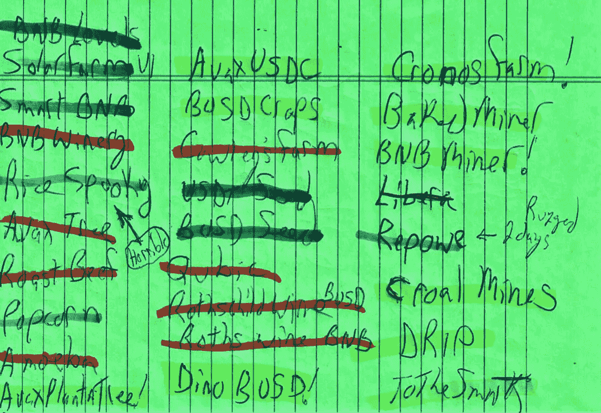
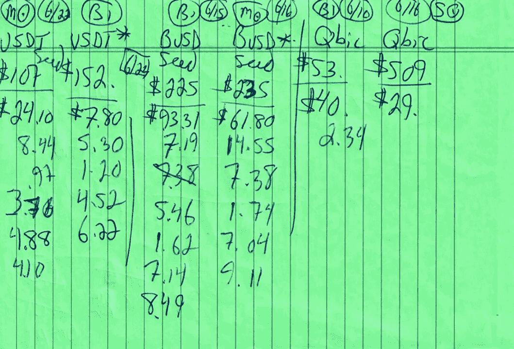
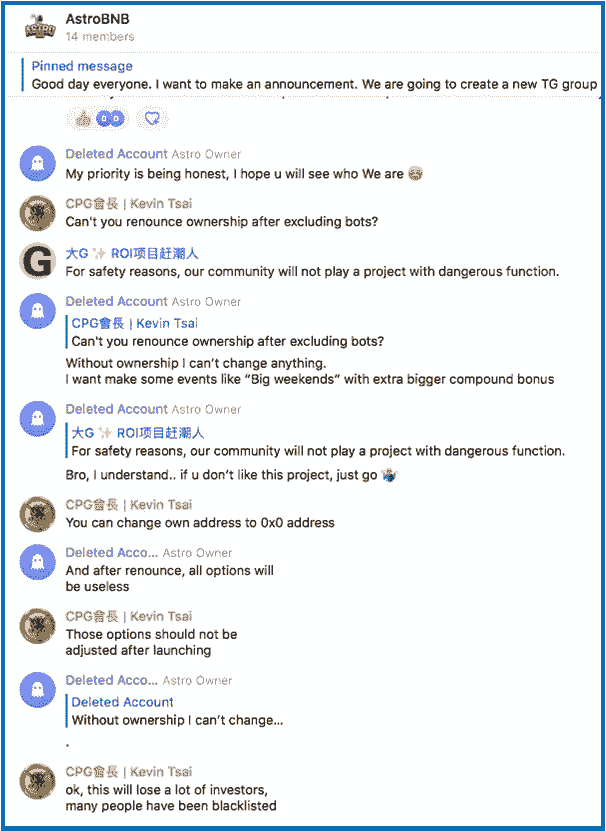
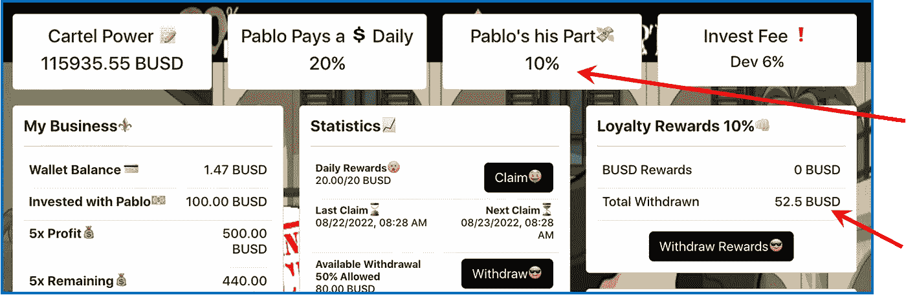
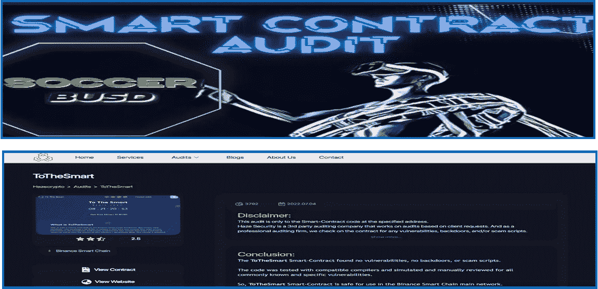
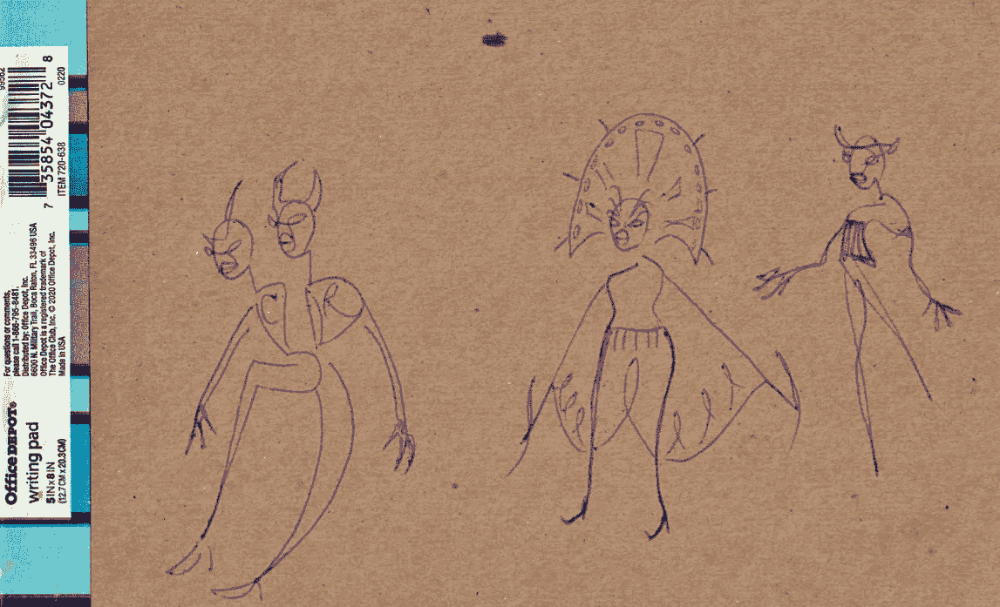

# 什么是 Shill？

> 原文：<https://medium.com/coinmonks/whats-a-shill-f0bd37f4eb1a?source=collection_archive---------9----------------------->

在写 DeFi 的时候被称为一个让我不得不去查一下…

DeFi pocket-change miner scorecard: sometimes you hit the ball & sometimes you get hit by the ball…

> “怀疑你的意图，在你的故事结尾尖锐地提到另一个潜在的拉地毯项目。首先，你那些刺耳的项目没有一个是经过审计的。”

我喜欢这个空间——它就像一场持续的对话。我来这里探索、放松和联系。所以我非常感谢有人花时间给我写一篇关于我的文章的笔记。我不知道到底什么是(刺耳的)shill，现在我知道了:

> 骗子是指公开给予一个组织可信度而不透露他们与该组织有密切关系的人。

毫无疑问——这个领域肯定有一部分人在兜售通常毫无价值的零钱矿工协议。

很高兴知道。但那不是我。

这就是 Medium.com[如此酷的原因:它提供了继续对话的机会…](/@jebalucas)

## 从头开始

我投资加密已经有几年了& 6 个月前发现了这个领域的一角。我很喜欢学习和玩这些 DeFi miner 赌注平台。像大多数人一样，我的工作强度很大，这些迷你赌博游戏可以很好地转移注意力。

> 然而，这些加密矿工是高风险的&潜在的损失是巨大的——就问我吧！
> 
> 早些时候，我一头扎了进去& [很快丢了一捆](/coinmonks/a-shallow-dive-into-roi-pocket-change-crypto-platforms-e86147653635)。

## 利润和损失

我喜欢体验式学习，所以我在各种零花钱投资项目中投入了少量资金，看看它们是如何运作的。一些人给了我投资回报，而另一些人却让我失望透顶。

上面的绿色分类账纸是我的初始投资清单，显示了 3 个结果:我的投资回报增加了(黄色)；项目在 ROI(红色)前自然融化；或者，该项目有意崎岖不平(蓝色)。

上面每一行代表一个月的投资。请注意，第一个月发生了许多混乱和自然死亡；到了第三个月，我的投资回报率开始向黄色倾斜。随着我开始更多地了解这个空间，我的收入也很好地调整了。第三行以黄色为主，代表收入高于我的原始投资…

所有这些都是很好的开始体验…

更多:下面是我的 3 个零钱协议投资的随机手写分类账。在我拿回大部分东西之前，他们中的两个已经被拖走了。我还在从第三个项目(Qubics)中刮汽油费，现在提供不到 1 美元/天的回报…

Miners no more: 2 of the 3 projects I invested into above were planned rug-pulls. Now I know…

## 哪里出了问题？

我决定花些时间研究这个领域，看看我的投资在哪里偏离了方向。耐心很重要&在我知道更多之前不投资是关键。

对于每个新项目，我都会阅读白皮书。我仔细研究了[众多的审计](/coinmonks/dipping-a-toe-into-cryptos-pocket-change-miners-398f2995c61d) &对审计公司做了笔记。我学到了一些甜蜜的财务技巧，比如创建一个 [Prime &好友账户](/coinmonks/i-usually-play-by-the-rules-however-fdaf77d191b2)。

[Youtube](https://www.youtube.com/watch?v=N-UqWnalPZY) vids 教我区块链分析、交易统计&为 daily miner“唯一接收地址”活动创建 CSV 电子表格；此外，如何创建[“客流量”图](/coinmonks/running-up-that-hill-with-no-problems-f268d879a206)，轻松显示项目的相对优势。

> 请记住:不幸的是，除了学习如何发现不道德的代码之外，这些步骤都不能完全防止恶意的有计划的欺骗。学习如何识别有毒的合同代码是我下一个有针对性的学习经历…请看下面的对话:

## 电报讨论

观察电报中关于即将上线的新兴加密矿工项目的讨论，我从下面的对话中学到了很多。一种新的零钱协议的开发者认为，她/他应该被允许使用黑名单功能&一旦协议激活，就保留协议的所有权。

即将投资的社区对此不以为然，并反驳道。有两句话很突出:“出于安全原因，我们社区不会玩有危险功能的项目。”

同样一事无成的是，另一个人在下面写道:“好吧，这会失去很多投资者。”那一刻，一群人离开了房间——我猜是以前的潜在投资者。我是其中之一。

A Telegram discussion about not investing into a project with a possible rug-pull.

## 外卖:

为了防止恶意的欺骗，在协议生效后放弃黑名单和放弃所有权是诚实和可持续采矿协议的非常重要的方面。

在离开电报室之前，我抓拍了一些截图，并给自己做了笔记，观察这个项目是否有潜在的漏洞。如果是的话，也许在以后的文章中会有更多的介绍…

> 除了媒体，我们还能在哪里发现这些有益的信息，然后与他人分享呢？

## 进化得很好

我随着我尝试的每一个新写作项目和我投入的每一个新协议而进步。我在这里学习和成长。此外，做一点额外的零花钱也很不错…

> 这可能是加密领域的一个棘手的角落。我在想，如果我在半年前读到一些关于拉地毯和其他骗局的文章，那该有多好。

为此，我喜欢写一些文章，给阅读这篇文章的人一些启发。我对一篇文章的结尾感到失望，因为我一无所获。如果每篇文章都传递一些有益的信息让你带走，那不是很好吗？这是一个有价值的目标。

## 事情是这样的:

我喜欢探索&剖析新的零钱加密赌注协议。我要么把他们分开，要么决定投资这个项目，鼓励他们的可持续性发展。这些矿工中很少有人会升到最高层；那些是我正在寻找的。

*注意:当我成功地从一个协议中赚了钱——不一定是我的全部投资回报，只是现在——我会写下我的经历。*

> *如果你喜欢这个协议&决定投资进去，那就是我的目标&我很激动。投资于该议定书有助于其可持续性。*
> 
> 使用本文中的推荐链接将为我提供一点补偿&这是让我知道这些对话是有益的极好方式。如果你使用我的推荐链接，谢谢！

这很简单…

## 我做什么？

象征学并不多。当有人使用我的好友/推荐链接时，我会得到总投资的%，通常是 5-10%；通常是 5-7 美元。这就像在餐馆因为优质服务得到几美元小费一样。不过，几块钱就能走很长一段路。

有趣的是，我从一个推荐链接中收到的最多的是我描述为“高风险和实验性投资”的“零花钱矿工”…[在这里阅读深度投资](/coinmonks/busdcartel-the-newest-defi-clone-to-rough-up-dinobusd-e30b97f02a1b)，但**不要投资它**——TVL 一直在快速下降，所以它的结局很明显&近…

The referral bonus for this declining protocol was 10% (upper arrow); I received $52.50…

BUSDCartel 是昙花一现的协议，但却是学习一两个教训的好地方。

这里有一个:在我的文章中，我多次将上述协议称为高风险投资。六个人用我的链接总共投资了 525 美元，为我提供了 52.50 美元的推荐奖金。太好了。

## 继续回来…

最酷的是，写信人可以随心所欲地阅读文章，并随时离开。他们可以带走任何共鸣的部分，留下任何不共鸣的部分。如果你喜欢你所读的东西，有很多方法可以表现出来。如果你觉得被冒犯了，你不必这样做，但是，你甚至可以给我写封信。

你可以自由地在我明确表示我的文章已经完成的地方停止阅读，就在无耻的插头部分之前。

我希望写信人不断回来，因为如果我的话没有提供任何帮助，其他人可能会。

## 注意:

相反，信中提到的所有项目确实都有经过核实的合同。两个项目由 Bit_Control 完成，第三个项目由 Hazecrypto 验证。

Hazecrypto & Bit_Control are 2 popular DeFi verified/audit companies.

> *我当然会继续回来……*

谢谢你走到这一步。我希望你能在这篇关于我们生活的疯狂的密码世界的观点文章中找到一些有价值的东西。总是很高兴有你跟着我

*我鼓励朋友们只玩你不需要的东西。在放弃你辛苦挣来的零花钱之前，请把这次谈话当作你整体研究的一小部分。又是 Thx。*

## 不要脸塞:

Shameless Plug! Borrowed from @shamelesslyplugged

## 稍微慢下来…

我和其他人一样欣赏高风险/高回报的协议。

然而，最终更有趣的是我不必担心的持续的每日回报。我把这个协议称为我的退休账户:

> [滴滴网](http://drip.community/faucet?buddy=0x024ee915c2BF9d12F98b750119051A752e18CAa0)是一个简单易用的协议，每天提供 1%的投资回报。由于复利的数学概念，随着价值的增加，我每天都投资在手表上。

[滴滴网络的水龙头](http://drip.community/faucet?buddy=0x024ee915c2BF9d12F98b750119051A752e18CAa0)是一种低风险、高回报的合约，其运作方式类似于高收益存单，每天支付 1%的投资回报，最高可达 365%。投资者可以通过存款复利来扩展他们的收益。我很快就要深入潜水了。

我是**隐孢子虫滴滴**团队的一员。我们是一个欢迎和乐于助人的全球滴滴爱好者社区。我们在自己的私人电报小组上交流，分享点滴提示、策略、突发新闻等等。如果你想加入对话，请加入 Cryptozoa 团队(购买进入 [DRIP](http://drip.community/faucet?buddy=0x024ee915c2BF9d12F98b750119051A752e18CAa0) 并使用上面我的好友地址)，然后前往 [Cryptozoa 电报网关](https://t.me/+58cJQwtqVoU4MTc5)。让值班管理员知道**卢卡斯**派你来的——然后一旦你上船，找到我并给我发短信，我很乐意收到你的来信！

**滴光纸**——[https://www.docdroid.net/0i3RJTu/drip-lightpaper-pdf](https://www.docdroid.net/0i3RJTu/drip-lightpaper-pdf)

DRIP Network…you’ll be hearing a lot about this protocol from me upcoming…

如果我启发了你&你希望我成为你在滴滴网 *( &在财务自由之旅)*的好友，我将不胜荣幸！**注:**没有一个哥们儿就不能投资*。*

我承诺做你的点滴指导:我会成为你的好伙伴和良师益友，鼓励你，帮助你提高收益和投资回报率。我们在 Telegram 上还有一个非常活跃的私人团体，在那里你可以得到其他滴滴爱好者的支持

## 如何从滴滴开始

1.  去[https://DRIP . community/fountain](http://drip.community/faucet?buddy=0x024ee915c2BF9d12F98b750119051A752e18CAa0)用 **BNB** 换**滴滴**。
2.  然后进入:[https://drip . community/水龙头](http://drip.community/faucet?buddy=0x024ee915c2BF9d12F98b750119051A752e18CAa0)，向下滚动找到一个好友。
3.  您必须在**推荐**部分输入一个**好友地址**。考虑为您的**好友**添加我的地址:[0x 024 ee 915 C2 BF 9d 12 f 98 b 750119051 a 752 e 18 CAA 0](http://drip.community/faucet?buddy=0x024ee915c2BF9d12F98b750119051A752e18CAa0)(如果您使用上面的链接到达那里，您可以单击“检测到好友”按钮。
4.  然后向上滚动到存款，至少存入 **1 滴**(确保你有足够的 **BNB** 来支付油费。)
5.  你在[上设置了](http://drip.community/faucet?buddy=0x024ee915c2BF9d12F98b750119051A752e18CAa0)****。**准备好每天领取 1%的收益吧！**

 **[## 滴水社区

### 低风险/高回报

滴滴.社区](http://drip.community/faucet?buddy=0x024ee915c2BF9d12F98b750119051A752e18CAa0)** 

**我哥们什么都画！我称之为他的账本系列。我喜欢下图。**

****

**Two heads? Whatever…**

> **交易新手？尝试[加密交易机器人](/coinmonks/crypto-trading-bot-c2ffce8acb2a)或[复制交易](/coinmonks/top-10-crypto-copy-trading-platforms-for-beginners-d0c37c7d698c)**