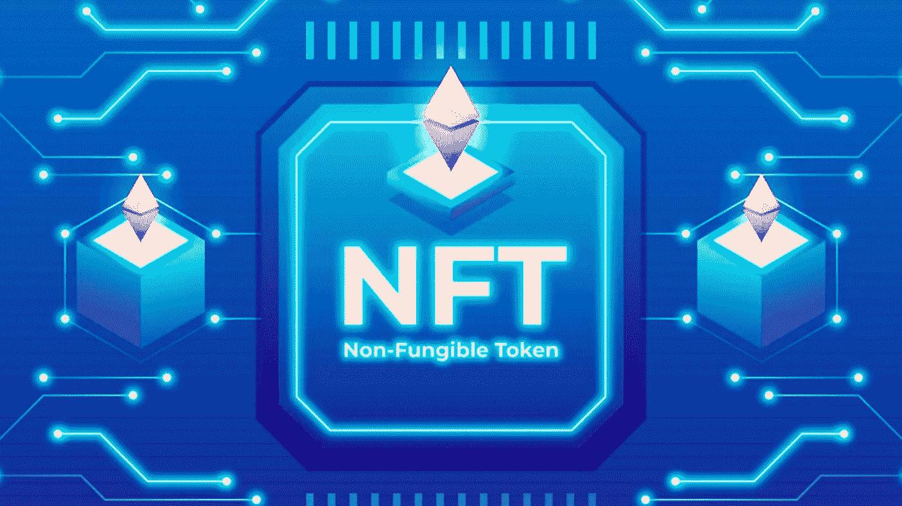
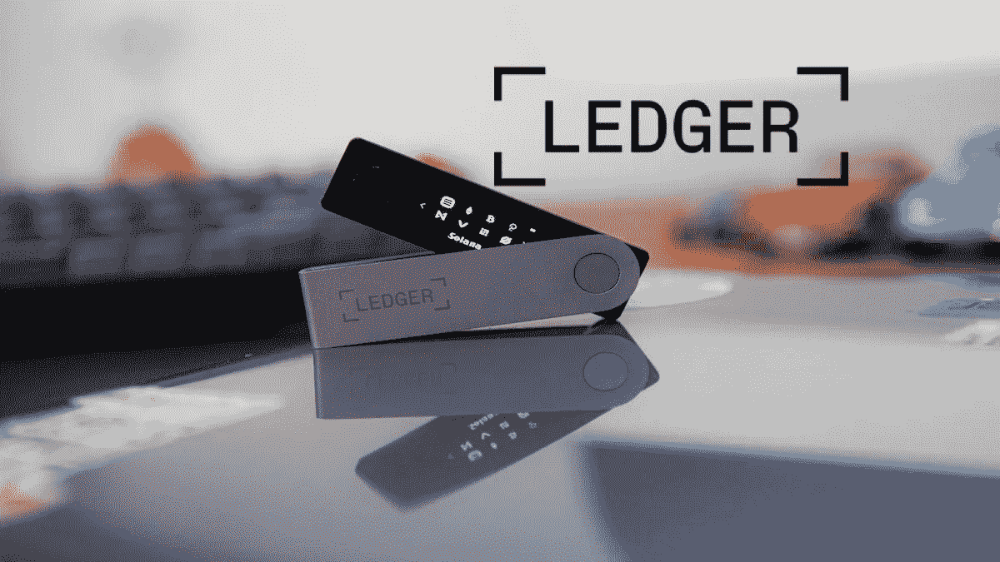
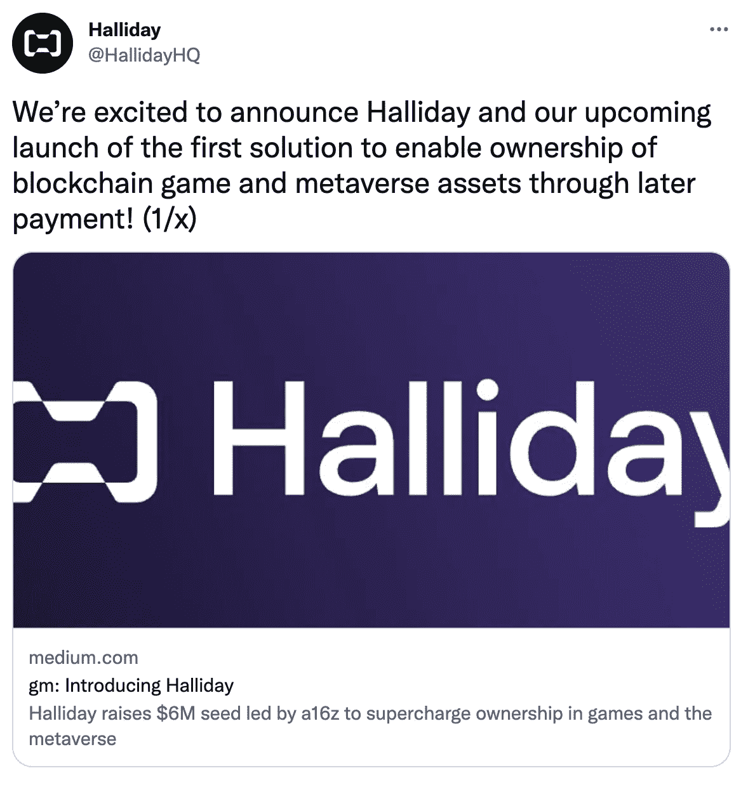
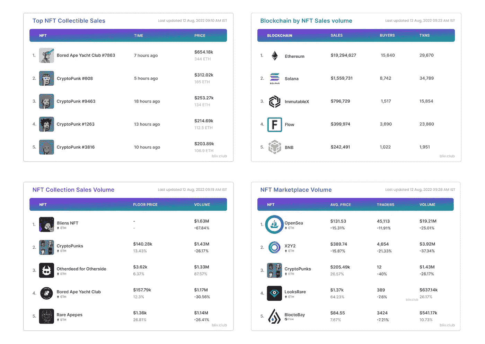

# NFTs 中的新功能—8 月 12 日🔥

> 原文：<https://medium.com/coinmonks/whats-new-in-nfts-12th-august-4e221e224a37?source=collection_archive---------19----------------------->

**你每周摄入的 NFT 所有东西**

# 大字标题📰

*   **兰博基尼介绍“史诗般的公路旅行”NFT 系列**
*   **Instagram 通过 Flow 区块链引入 NFT 整合**
*   **加里·维纳查克的 NFT 项目——Vee Friends 获得由 A16z 领投的 5000 万美元种子资金**
*   **Magic Eden 提交启动 ApeCoinDAO NFT 市场的提案**
*   **NFT 分销平台——Pinata 在 A 轮融资中融资 1800 万美元**
*   **Web3 初创公司——Halliday 已经为“现在购买，以后支付”NFTs 筹集了 600 万美元**

# 完整的故事

# 兰博基尼推出“史诗之旅”NFT 系列

继两次成功的 NFT 下降至今，兰博基尼正准备释放一个爆炸性的 NFT 系列，将发生在 8 个月的时间。

每个 NFT 都是一个 30-40 秒的动画，带有实用的音频，收藏家将被邀请加入“史诗之旅”，直到 2023 年 3 月完成。

“自 1963 年成立以来，兰博基尼汽车公司一直走在前列，其超级跑车证明了这一点，这些跑车一直是全世界儿童和成人梦想的主角，”兰博基尼汽车公司营销总监 Christian Mastro 说道。

# **Instagram 通过 Flow 区块链引入 NFT 整合**

Instagram 平台上的不可替代代币(NFT)现已在 100 多个国家推出。

Meta Newsroom 通过在其生态系统中采用 NFTs 确认了其向 Web3 领域的持续扩张。亚洲、亚太、中东和美洲的 Instagram 用户将能够连接他们的数字钱包，并显示他们喜欢的 NFT。

这个消息表明 Meta 对 NFTs 越来越感兴趣，因为以太坊和多边形区块链已经被整合了。

# Ledger NFTs 上市仅 24 小时就销售一空

Image:nftnewstoday.com

莱杰市场推出后仅 24 小时内就售出了 10，000 张 NFTS，这是有史以来第一张安全的透明签名币。

自从 NFTs 在 2021 年成为主流，新的市场如雨后春笋般涌现。目前有近 250 个活跃的 NFT 市场。然而，大多数平台不具备与 Ledger 相同的安全功能。

安全性的提高对发射的成功至关重要。自市场开放以来，用户在不到 24 小时内就购买了所有 10，000 份 Genesis Ledger NFTs。NFT 收藏品的售价约为每件 0.3 ETH，在拍卖时略高于 484 美元。

# 神奇伊甸园提交了一份启动 ApeCoinDAO NFT 市场的提案

领先的索拉纳 NFT 市场已经向 ApeCoin DAO 提交了一份提案，为无聊的 Ape 游艇俱乐部 NFTs 建立一个特殊的 NFT 市场。Magic Eden 表示，该市场将大幅削减费用，为 ApeCoin 提供可持续的公用事业，并提供一个平台，社区可以通过该平台推出自己的项目和倡议。

Magic Eden 是不断增长的索拉纳 NFT 市场的主导者，一直占据着 90%或更多的交易量。上周，它宣布了向更大的以太坊扩展的计划。它正在寻求与目前的领导者 Opensea 竞争，如果它能让无聊的 Ape 社区加入进来，这将是他们的一大胜利。

# NFT 分销平台——Pinata 在 A 轮融资中融资 1800 万美元

专注于 NFT 的媒体分发平台 Pinata 在由硅谷风险投资公司 Greylock ventures 和加密本地投资者潘迪拉共同牵头的 A 轮融资中筹集了 1800 万美元，以扩大 NFT 媒体基础设施。该公司去年也进行了一轮 350 万美元的融资，由 Greylock 和 offline Ventures 牵头。其他投资者包括 Volt Capital、Alchemy 和 Opensea。

该平台专注于为基于媒体和内容创作的 NFT 项目提供内容。自今年 1 月以来，其用户数量已从 104000 人增至 240000 人。著名的合作伙伴包括 Draftkings、宇迦实验室、协议实验室和 Opensea。

Image: Pinata

# Web3 初创公司——Halliday 已经为“现在购买，以后支付”NFTs 筹集了 600 万美元

韩礼德已经在 Andreessen Horowitz 的带领下筹集了 600 万美元的种子资金，以加速其 BNPL NFTs 产品的创建。其他参与的投资者包括韩国风险投资公司 Hashed、A.Capital 和 SV Angel。

Halliday 的目标是让游戏中的购买和非功能性游戏的所有权证明对游戏玩家来说更加实惠和方便。它将在未来几周内推出区块链游戏“王国联盟”的测试版。

# NFT 统计📊

*   销售额最高的 NFT 系列
*   单个 NFT 收藏品的最高销售额
*   销量最高的区块链
*   基于交易量的顶级 NFT 市场

你喜欢阅读本周的时事通讯吗？想要直接送到你的邮箱吗？或者有什么反馈？

如果是，请订阅我们的时事通讯，分享您的想法👇

> 交易新手？试试[密码交易机器人](/coinmonks/crypto-trading-bot-c2ffce8acb2a)或者[复制交易](/coinmonks/top-10-crypto-copy-trading-platforms-for-beginners-d0c37c7d698c)