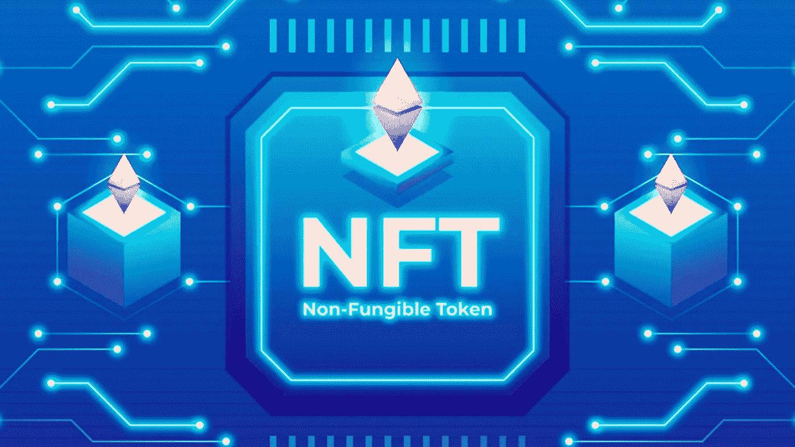
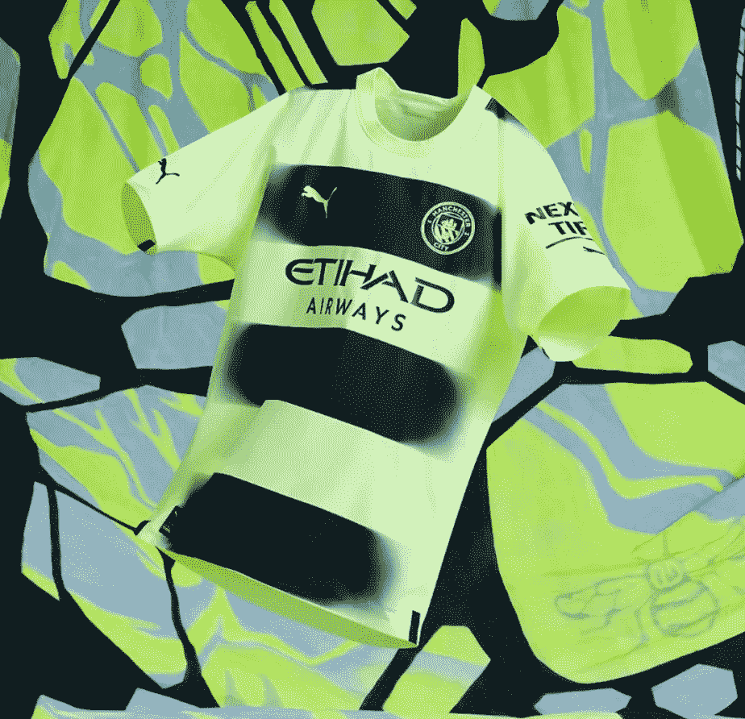
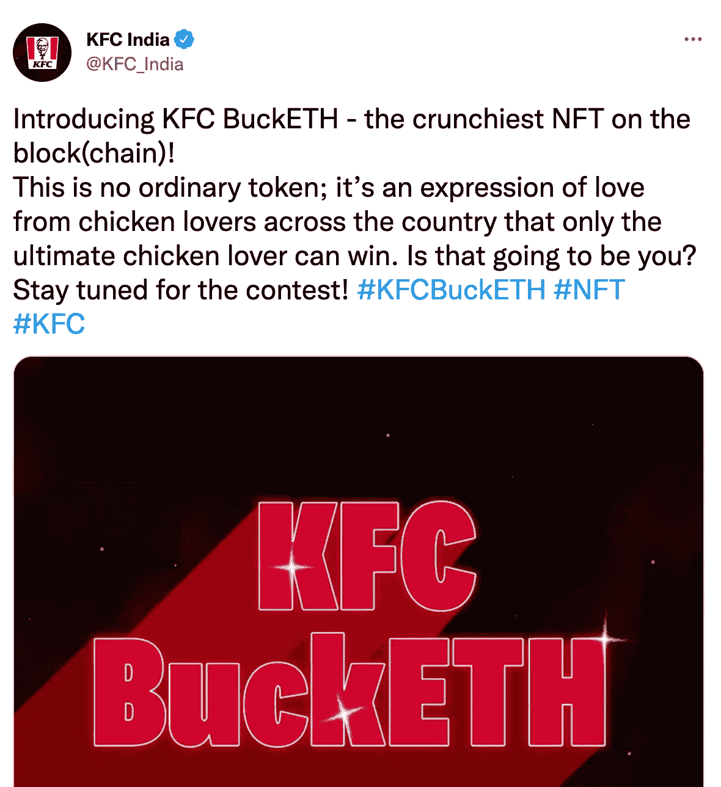
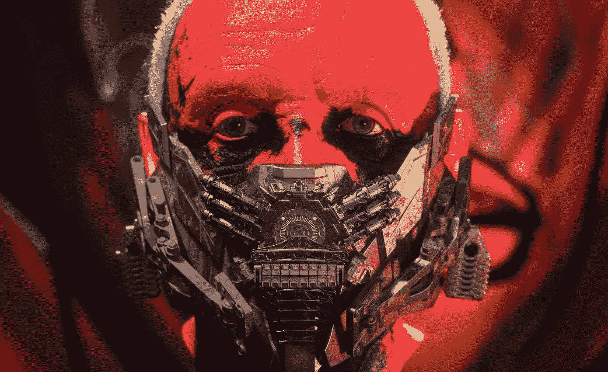
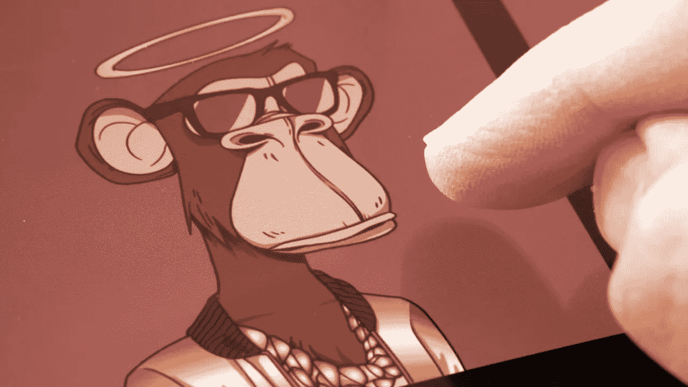
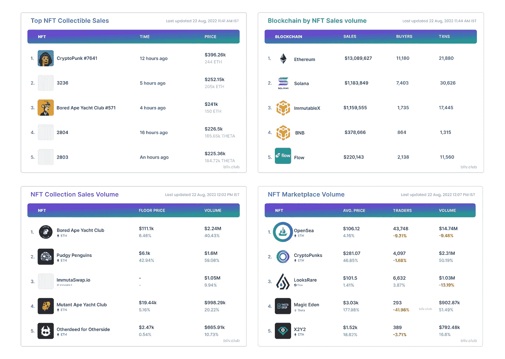

# NFTs 的新功能—8 月 23 日🔥

> 原文：<https://medium.com/coinmonks/whats-new-in-nfts-22nd-august-bdc6a145aea6?source=collection_archive---------16----------------------->

**你每周摄入的 NFT 所有东西**

# 大字标题📰

*   **曼城联手 ROBLOX 亮相元宇宙新球衣**
*   **戈登·拉姆齐通过沙盒将地狱厨房的体验带到元宇宙**
*   **通过推出肯德基 NFT 连锁店**,肯德基首次涉足加密领域
*   **奥斯卡获奖演员安东尼·霍普金斯将推出 NFT 系列，并在元宇宙大展拳脚**
*   **零头——一家 NFT 初创公司筹集 2000 万美元扩大 NFT 集体所有制**

# 完整的故事

# 曼城与 ROBLOX 联手推出全新元宇宙球衣

Image: Man City — Twitter

英超联赛(EPL)冠军曼城队最近在游戏平台 Roblox 的游戏之地公布了他们在元宇宙 2022-23 赛季的新第三套替代球衣。这是俱乐部首次推出元宇宙球衣。Roblox 是一个允许用户创建和分享自己游戏的网站。

这件球衣有一个霓虹黄色的背景，更准确地说是“嘶嘶的光”，有三个黑色的宽条纹，官方称为“巴黎之夜”，由该套件的制造商彪马。劳拉·库姆斯、卡尔文·菲利普斯和鲁本·迪亚斯是三位在公开场合穿着这套服装的男女俱乐部明星。

曼城的元宇宙活动以一个重新设计的 Roblox 大厅为特色，代表他们的主场阿提哈德体育场。它还允许用户试验主客场套件。

# 戈登·拉姆齐将通过沙盒把地狱厨房的体验带到元宇宙

戈登·拉姆齐，这位世界知名的满嘴脏话的名人，将会把热门真人秀节目《地狱厨房体验》带入沙盒虚拟世界。

沙盒将与 ITV 工作室进行令人兴奋的合作，将其标志性的世界建筑带入厨房，在其蓬勃发展的元宇宙迎来第一次全面的烹饪体验。这个流行节目的粉丝将能够在虚拟世界中重现他们最喜欢的场景。

这个不可思议的新场地将会出现在 ITV 的《沙盒中的土地》中，并将包括拉姆齐参与设计的特色和互动元素。因此，游戏玩家可以创造菜肴，收集食谱，并在烹饪范围内进行基于美食的挑战。

# 通过推出肯德基 NFT 连锁店，肯德基将首次进入加密领域

肯德基印度公司通过推出自己的 NFT 系列产品 KFC buckETH 进入了 Web3 领域。肯德基与总部位于孟买的数字营销公司 Blink Digital 合作，在区块链以太坊打造肯德基桶，并在 opensea 上举办。他们铸造了这幅艺术品，以庆祝肯德基印度公司在该国 150 个城市开设 600 家餐厅的里程碑。

NFT 系列为肯德基粉丝提供了一个以独特的方式与品牌建立联系的机会。NFT 将在社交媒体竞赛中公开竞逐。获胜者还将获得一年的肯德基供应。

# 奥斯卡获奖演员安东尼·霍普金斯将推出 NFT 系列，并在元宇宙展开他的翅膀

Image: Orange Comet

奥斯卡获奖演员兼艺术家安东尼·霍普金斯爵士与 Web3 媒体公司 Orange Comet 合作，创作并推出了他的第一个 NFT 系列，被称为**永恒系列**。

这个名为《永恒的收藏》的项目将包括三个场景，围绕霍普金斯在他的电影生涯中塑造的 10 个不同的角色原型展开。NFT 将分三个阶段发布——偶像类、传奇类和杰出类。它们都有不同的效用。

霍普金斯将把他收藏的收益捐给他选择的慈善机构。NFT 系列将在 Opensea 上发布，暂定发布日期为 9 月 16 日。

# 分数——一家 NFT 创业公司筹集 2000 万美元扩大 NFT 集体所有制

Image: Shutterstock

Fractional 是一个允许集体拥有 NFTs 的协议，它将自己重新命名为 Tessera，并筹集了 2000 万美元的首轮融资。

Crypto giant Paradigm 领投了这轮融资。这轮融资的其他投资者包括 Focus Labs、Uniswap Labs Ventures、eGirl Capital 和 Yunt Capital。

# NFT 统计📊

*   销售额最高的 NFT 系列
*   单个 NFT 收藏品的最高销售额
*   销量最高的区块链
*   基于交易量的顶级 NFT 市场

**你喜欢看本周的时事通讯吗？想要直接送到你的邮箱吗？或者有什么反馈？**

如果是，请订阅我们的时事通讯，分享您的想法👇

> 交易新手？试试[密码交易机器人](/coinmonks/crypto-trading-bot-c2ffce8acb2a)或[复制交易](/coinmonks/top-10-crypto-copy-trading-platforms-for-beginners-d0c37c7d698c)