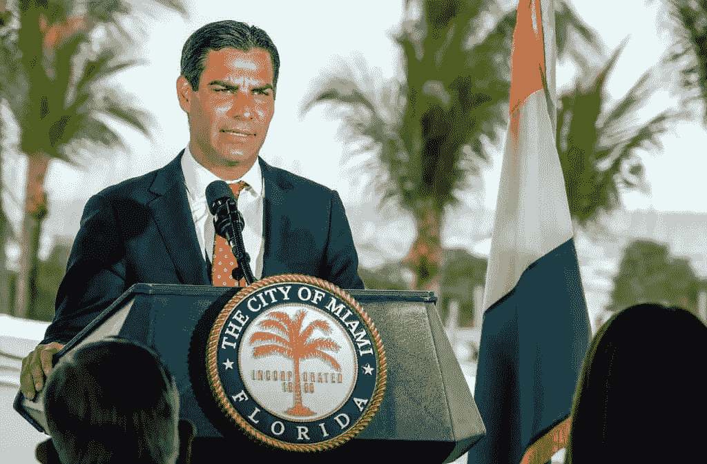
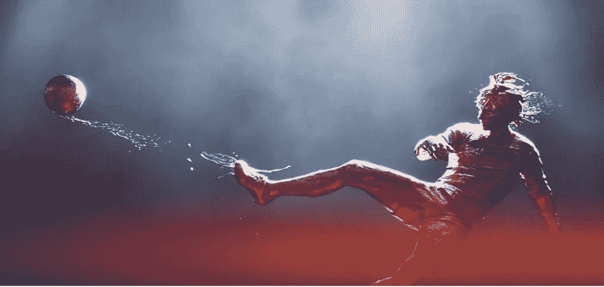
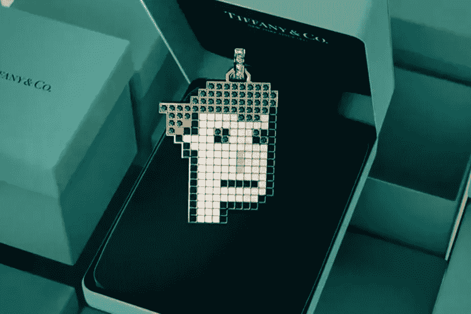
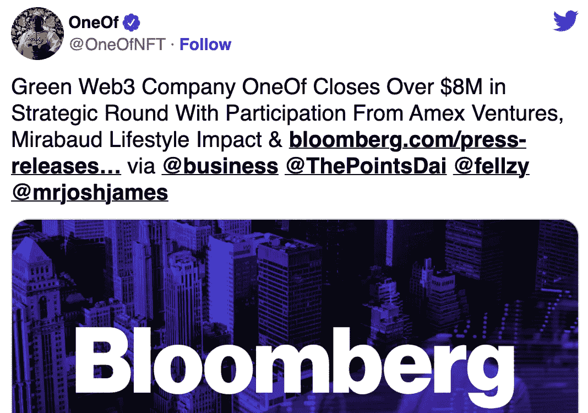
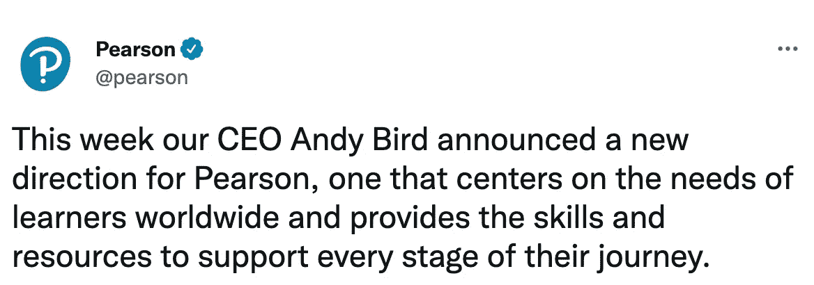
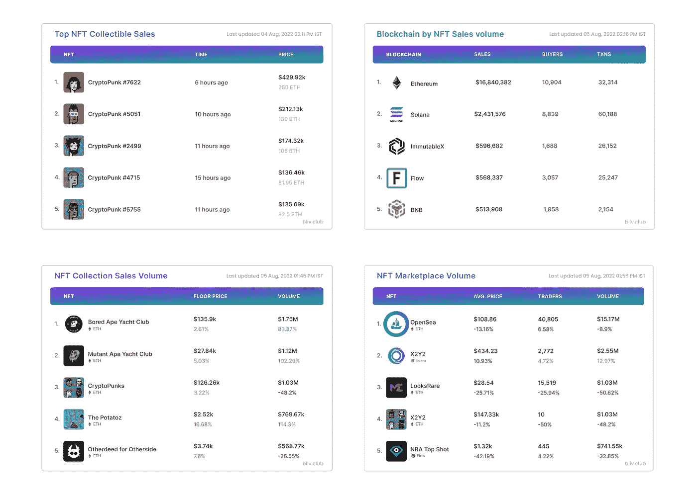

# NFTs 中的新功能—8 月 5 日🔥

> 原文：<https://medium.com/coinmonks/whats-new-in-nfts-5th-august-58c85fe624f1?source=collection_archive---------33----------------------->

**你每周摄入的 NFT 所有东西**

# 大字标题📰

*   **Web3 友好城市迈阿密将启动 5000 个 NFT**
*   **约翰·克鲁伊夫巴萨 NFT 售价 70 万美元**
*   **加里·维纳查克的 NFT 项目——Vee Friends 获得由 A16z 领投的 5000 万美元种子资金**
*   **蒂芙尼为神秘朋克持有者推出 NFT 吊坠**
*   **NFT 音乐市场——其中一家公司在一轮战略融资中筹集了 800 多万美元**
*   **教科书出版商——Pearson 将其教科书作为 NFT 出售**

# 完整的故事

# 网络 3 友好城市迈阿密将启动 5000 个 NFT

Image: insidebitcoins.com

佛罗里达州的 Web3 创新领导者迈阿密市将与时代杂志出版商时代美国、万事达卡和 Salesforce 合作，推出 5000 美元的 NFT 系列。

该系列的 NFT 由 56 位不同的迈阿密艺术家策划，代表该市 56 平方英里的区域。它们计划于今年 12 月发布，旨在为持有者提供解锁独特体验的能力。

正如许多人所知，这不是这座城市(或苏亚雷斯)的第一个 Web3 项目，因为它之前推出了 MIA coin(MIA)，这是一种可以放在钱包里的替代硬币，其他人可以购买。

# 约翰·克鲁伊夫的巴萨 NFT 售价 70 万美元

*In a Way, Immortal NFT: FC Barcelona.*

西班牙足球巨人巴萨在苏富比拍卖行以 69.3 万美元的价格卖出了一件 NFT 艺术作品，该作品以巴萨传奇人物约翰·克鲁伊夫为主题。

由 40 名计算机图形和视觉效果艺术家团队创作的视听艺术作品“在某种程度上，不朽”，描绘了 1973 年对阵马德里竞技队的一个标志性进球。一个由 30 人组成的管弦乐队演奏的原声音乐伴随着这首曲子。

作为交易的一部分，NFT 老板现在将成为巴萨的数字大使，并将独家参加俱乐部的 VIP 活动。

# **加里·维纳查克的 NFT 项目——Vee Friends 获得由 A16z 领投的 5000 万美元种子轮**

Image: nftplazas.com

Adreessen Horowitz 宣布将为加里·维纳查克的 NFT 项目 VeeFriends 领投 5000 万美元的种子资金。

根据一篇 [*Medium*](https://blog.veefriends.com/veefriends-closes-seed-round-from-a16z-crypto-afa151561051) 的帖子，VeeFriends 计划使用种子资金来扩展其在实体和数字平台上的 283 个 VeeFriends 角色的知识产权(IP)。

该平台还打算雇佣新员工。

# 蒂芙尼为隐朋克持有者推出 NFT 吊坠

**Image: Tiffany and Co.**

美国奢侈品牌蒂芙尼(Tiffany and Co .)宣布推出 NFTiff。NFTiff 专为隐朋克持有者打造，将 NFT 变成由 Tiffany & Co .工匠手工制作的定制吊坠。买家还将收到一个额外的 NFT 版本的吊坠。每个吊坠至少由 30 颗钻石/宝石组成，挂在 18k 金链上，搭扣上镶有五颗钻石。

即将到来的销售将于 8 月 5 日开始，将推出 250 台限量版 NFT，每台售价 30 ETH。蒂芙尼与区块链云基础设施提供商 chain 合作开发了这个 NFT 项目。

# NFT 音乐市场——其中一家在战略轮融资超过 800 万美元

绿色 NFT 平台 Oneof 在一轮战略投资中筹集了超过 800 万美元，其中包括美国运通风险投资公司(美国运通的风险投资部门)。其他投资者包括 Mirabaud 生活方式影响和创新基金、Snow Hill Partners、Sangha Capital 和 Chain Link Crypto Fund 等。

Oneof 还宣布，它将推出一套可供美国运通卡会员使用的 NFT，作为美国运通主办的独家弹出式活动的一部分。到目前为止，这家初创公司已经筹集了 7200 万美元的总资金，包括 2021 年 5 月的 6300 万美元种子轮。

# 教科书出版商——培生将出售其教科书作为 NFT

领先的教科书出版商 Pearson 希望通过出售其书籍作为 NFT，从二次销售中获得额外收入。书被卖了不止一次，因为学生们通常会卖掉他们不再需要的书。一本普通的皮尔逊教科书在它的一生中最多能卖出 7 次。NFTs 将允许公司参与销售的所有步骤。

这家总部位于伦敦的出版商也在探索元宇宙技术的意义，因为它计划在虚拟世界中上课。

# NFT 统计📊

*   销售额最高的 NFT 系列
*   单个 NFT 收藏品的最高销售额
*   销量最高的区块链
*   基于交易量的顶级 NFT 市场

## 你喜欢看本周的时事通讯吗？想要直接送到你的邮箱吗？

## 有什么反馈吗？

如果是，请在下面分享你的想法👇

> 交易新手？试试[加密交易机器人](/coinmonks/crypto-trading-bot-c2ffce8acb2a)或者[复制交易](/coinmonks/top-10-crypto-copy-trading-platforms-for-beginners-d0c37c7d698c)