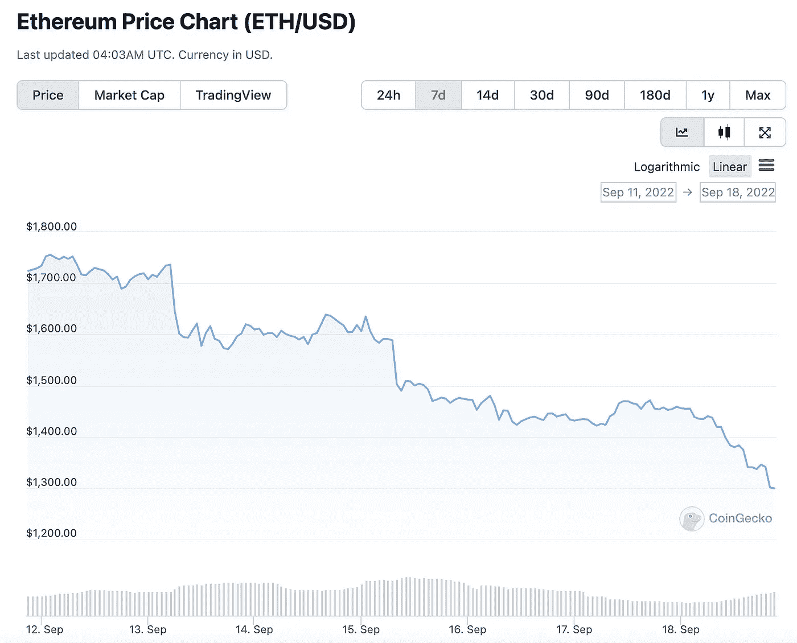
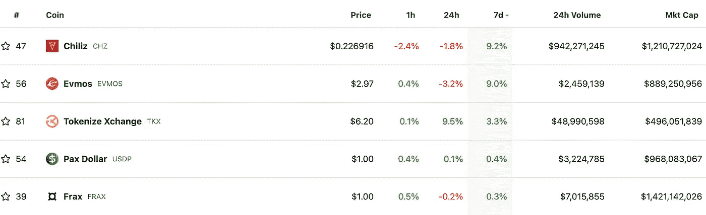
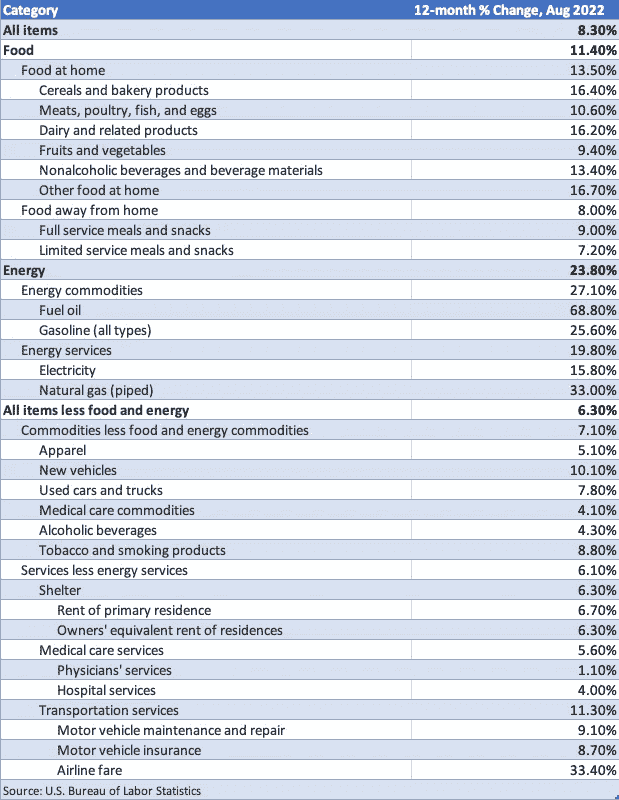

# 以太坊的下一步是什么？

> 原文：<https://medium.com/coinmonks/whats-next-for-ethereum-2e2e3b7ad2c9?source=collection_archive---------42----------------------->

# 内容(3 分钟阅读):

*   🤷以太坊的下一步是什么
*   🤔什么现在的**为 ETH** ？
*   👨‍👩‍👧‍👧[startup y](https://beta.startupy.world/membership/?ref=yarocelis)——社区管理的搜索引擎
*   📈本周表现最佳的前五名
*   📜通货膨胀是怎么回事？
*   📰热门阅读
*   🙏🏻感激…

# 🤷以太坊的下一步是什么？

[**Gary Gensler**](https://www.sec.gov/biography/gary-gensler#:~:text=Gary%20Gensler%20was%20nominated%20by,office%20on%20April%2017%2C%202021.) **，**于 2021 年 2 月 3 日被约瑟夫·拜登总统提名担任美国证券交易委员会主席，他表示**跑马圈地可能被正式视为一项投资。这将把硬币置于美国证券交易委员会的权限之下，而不是商品期货交易委员会(CFTC)**，该委员会经常在美国将加密货币作为数字商品进行监管。

> *“从硬币的角度来看……这是另一个迹象，在*[*Howey test*](https://www.investopedia.com/terms/h/howey-test.asp#:~:text=The%20Howey%20Test%20refers%20to,Securities%20Exchange%20Act%20of%201934.)*下，投资大众基于他人的努力预期利润。它看起来非常类似于贷款，只是标签有所改变。”*

以太坊的合并按计划完美进行，现在以太坊已经达成一致。合并数小时后，证券交易委员会主席暗示，在以太坊和其他密码之后，监管可能会更加严格。这使得硬币呈螺旋式下降，自合并以来已贬值超过 20%。

Coingecko.com—7 天 ETH 图表

# 🤔现在怎么办？

优点:

*   **赌注**成为可能，即作为数字资产的 ETH 可以产生正的实际收益率(5.5–13.2%)，因此，通过传统的基于现金流的方法对区块链网络进行估值首次成为可能。
*   供应不仅会受到限制，甚至会减少，即**通过减少 ETH 发行和增加燃烧导致通缩**；因此，ETH 最终可能会升值。
*   目前的估计是，利害关系证明比工作证明消耗的能源少 99.95%。
*   与 PoW 上已经非常安全的比特币网络的 50 亿美元相比，该网络的安全性将大幅提高至约 200 亿美元

缺点:

*   机构仍在观望，等待在下注前 ETH 是否会被视为证券。
*   大多数缓慢的交易速度、高昂的汽油费和拥堵问题尚未解决，但我们刚刚目睹的良好融合将吸引更多的开发商和投资者在技术领域工作，以解决这些问题。
*   我们不要忘记其他 POS 第一层连锁店，它们已经获得了市场份额，并吸引了大量项目。至少可以说，索拉纳、雪崩、特佐斯都有自己的问题，但他们仍有潜力在这种环境下茁壮成长。

**结论:**

以太坊在合并后发生了巨大的转变。从小投资者到鲸鱼，从机构到政府，所有人都在关注 ETH。即使 ETH 被归类为安全类，前景似乎也是光明的。

开发者和投资者将致力于使它更快、更便宜、更广泛地被采用，因为成千上万的应用程序依赖于它。赌博对所有投资者来说都极具吸引力，而通货紧缩增加了这种吸引力。**它将继续面临许多障碍，如法规、竞争对手和安全问题，但它仍是区块链世界中最好的连锁店。**

[Startupy](https://beta.startupy.world/membership/?ref=yarocelis)

> *我很高兴地宣布，我已经成为 Startupy 的策展人和会员。一个社区管理的搜索引擎。零 SEO BS。* [***我邀请你加入这个为漫游、研究和思考而设计的知识和见解的令人愉快的图书馆。***](https://beta.startupy.world/membership/?ref=yarocelis)

# 📈本周顶级密码搬运工

# 📜通货膨胀是怎么回事？

在周二公布 8 月份的成本价格指数(CPI)数据后，市场经历了相当残酷的一周。

8 月份的总体 CPI 同比增长 8.3%，低于 7 月份的 8.5%。但是，鉴于分析师的普遍预测为 8.1%，看到市场的反应并不令人惊讶。

尽管 8 月份的同比 CPI 比 7 月份有所下降，但由于市场是前瞻性的，它在很大程度上是基于预期运行的。总体预期是，8 月份同比 CPI 将下降 40 个基点，因为它只下降了 20 个基点，我们看到了抛售

上图中，你可以看到过去 12 个月的通货膨胀数据，这些数据被分类。燃料价格涨幅最大，因此能源价格和机票价格也随之上涨。

# 📰热门阅读

*   [阻止 Web3 大规模采用的三大障碍——Trust Wallet 首席执行官](https://cointelegraph.com/news/3-barriers-preventing-web3-mass-adoption-trust-wallet-ceo)
*   [比特币价格和以太坊出血，Altcoins 遭受打击](https://cryptonews.com/news/bitcoin-price-ethereum-bleed-altcoins-takes-hit.htm)
*   [SEGA 万代纳木错博彩巨头盯上区块链博彩业](https://cointelegraph.com/news/bandai-namco-sega-among-gaming-giants-eyeing-blockchain-gaming)
*   [评估 y00ts 是否将是那个把索拉纳 NFTs 带到月球的人](https://ambcrypto.com/assessing-whether-y00ts-will-be-the-one-to-take-solana-nfts-to-the-moon/)
*   [FTX 首席执行官 Sam Bankman-Fried 称公司仍有 10 亿美元现金可用于收购](https://dailyhodl.com/2022/09/18/ftx-ceo-sam-bankman-fried-says-firm-still-has-1000000000-in-cash-left-to-deploy-for-acquisitions/)
*   [概括地说，NFTs:每周回顾](https://bitcoinist.com/nfts-in-a-nutshell-a-weekly-review-67/)
*   [这就是为什么美联储加息 0.75%可能对比特币和替代硬币有利](https://cointelegraph.com/news/here-is-why-a-0-75-fed-rate-hike-could-be-bullish-for-bitcoin-and-altcoins)
*   [Waves 创始人:不修复治理，DAOs 将永远无法工作](https://cointelegraph.com/news/daos-will-never-work-without-fixing-governance)

> 交易新手？尝试[加密交易机器人](/coinmonks/crypto-trading-bot-c2ffce8acb2a)或[复制交易](/coinmonks/top-10-crypto-copy-trading-platforms-for-beginners-d0c37c7d698c)