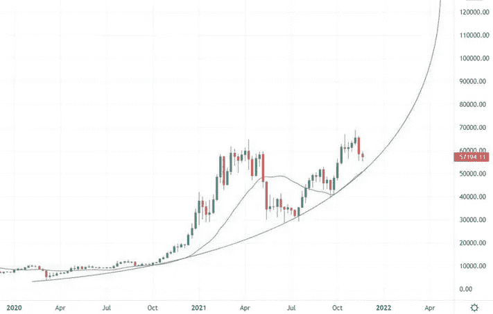
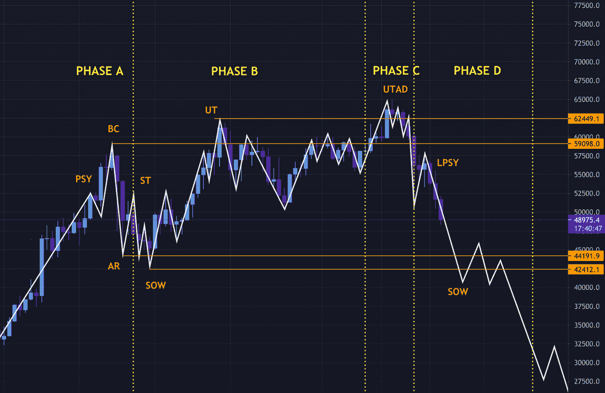

# 这和比特币的价格有什么关系？

> 原文：<https://medium.com/coinmonks/whats-that-to-do-with-the-price-of-bitcoin-89cc6ea20abf?source=collection_archive---------34----------------------->

*在关于市场操纵的讨论中，零售加密货币投资者指的是什么？*

去年，在加密货币领域，很少有话题像价格操纵那样容易引发激烈言辞和愤怒。能怪谁呢？在此前 6 个月的高收盘后，比特币的美元价值在 Q1 收盘时大幅下跌，并带走了整个市场。许多人开始指责鲸鱼犯规。

这是比特币抛物线走势图，从 2020 年 3 月的大约 5000 美元涨到 2021 年 2 月的 50000 美元。随后，该指数在 50，000 美元至 60，000 美元之间波动，直到 4 月份跌破该指数。

在反弹期间，比特币多媒体的多头对机构加密资产负债表(该资产负债表正在迅速扩张)口吐白沫，结果是许多散户投资者在这段时间买入；这是一件注定要失败的事情，因为仅仅两周前他们就损失了 40%的投资，此后五个月才达到收支平衡。发生了什么事？

> **要点:**
> 
> -机构是最大的市场参与者，自 2020 年第三季度以来，其交易量占比不低于 90%
> 
> -由于 2020 年的完美风暴，受益于后游戏停止投资环境、锁定和经济刺激，比特币的价格呈抛物线状
> 
> -中国矿工外流和市场情绪变化等问题导致了月内价格暴跌

社交媒体暗示市场操纵，这对于加密货币来说并不陌生。[欺骗](https://www.investopedia.com/terms/s/spoofy.asp#:~:text=to%20strategies%3A%20spoofing.-,Spoofing%20is%20a%20form%20of%20market%20manipulation%20in%20which%20a,placed%20of%20the%20opposite%20type.)是指下达大量买入或卖出订单以引发有利的价格变动，然后在订单被执行之前取消订单以执行有利可图的交易。这是证券欺诈的一个例子，将招致罚款，但在加密货币中，没有权力起诉坏人。由于监管滞后的原因，处于起步阶段的市场仍被称为蛮荒的西部。

被宣传为对 2021 年的修正和震荡负责的模式是威科夫分布，这是在一个名为“不复杂”的 YouTuber 就比特币的价格行为与其教科书模型之间的相关性发出警告后进入公共话语的。

按照威科夫理论，比特币的抛物线式上涨和随后的停滞可能是由市场中的大型运营商精心策划的——被称为一个实体:复合人他的目的是通过操纵散户投资者的恐惧和贪婪，从他们身上榨取尽可能多的钱。他还煽动高于或低于支撑和阻力区域的运动，目的是误导投资者，创造获利机会，最终在需求耗尽时重新累积。

比特币的集中化证明了这一理论: [1000 人拥有 40%的供应量](https://www.bloomberg.com/news/articles/2017-12-08/the-bitcoin-whales-1-000-people-who-own-40-percent-of-the-market)，研究人员发现，在 2021 年平均每月 420 亿美元的交易量中，至少有 [90%](/intotheblock/cryptos-institutional-appeal-keeps-growing-1db522061912) 来自大型运营商。更进一步，尽管威科夫的复合人的预期观点是作为大财团利益的*集合体*，但勾结并没有超出界限；在受监管的市场中，当局很难进行验证，但在加密货币中几乎不可能。这有两个原因:

1.  该系统是准匿名的，也就是说，虽然所有交易历史在区块链上都是公开可见的，但如果钱包持有者的身份未知，这就毫无意义了。
2.  大型运营商可以将他们的加密资产分散在多个钱包中，以增加隐私和安全性。例如，众所周知，特斯拉在 2021 年 2 月购买了价值[15 亿美元的比特币](https://www.teslarati.com/tesla-tsla-bitcoin-profits/)，这意味着他们持有 37，020 到 51，137 个比特币，但没有人能够核实他们的钱包地址。

然而，大资金的掠夺性市场活动还有更多微妙之处。从直升机的角度来看，还有许多其他因素导致了 Bitcion 的快速崛起和随后的衰落，这些因素不能如此容易地用市场操纵来解释。

# **崛起**

由于它造成的供应冲击，比特币每四年减半一次，总是给这一资产类别带来大量新资金。2016 年的减半导致比特币的市场估值在一年后达到 2370 亿澳元的峰值，而在最近的一年，比特币的市场估值达到 1.156 万亿美元的峰值，几乎是其 5 倍。两个重要的差异导致本轮价格上涨尤为迅猛:臭名昭著的 GameStop 空头挤压和全球疫情。

**全球疫情** 从 Q1 2020 年到 2021 年末，这一时期全球范围内出现了滚动封锁和经济刺激。其结果是，由于休假或其他旨在避免经济衰退的经济计划，大多数国家的人们都有充足的空闲时间和金钱。家庭股票市场的参与度[增加了](https://www.sciencedirect.com/science/article/pii/S154461232100458X)，亚马逊和网飞等科技股的份额出现了两位数的增长，因为它们看到了更多的定期使用。比特币能够从涓滴效应中受益，是因为它与科技股的相关性发生了变化。

GameStop 做空是由 r/WallStreetBets 上的一名 Reddit 用户引发的，他发表了关于对冲基金过度做空 GameStop 的调查结果。

卖空是借入一项资产并在公开市场上出售，希望以更低的价格购买并归还的过程。它带有内在风险，即在市场反弹时，必须以高于支付价格的价格填补这些头寸，这正是对冲基金在一次广为人知的事件中做空 GameStop 的情况，该事件以 Melvin Capital 的破产而告终。许多普通投资者几乎在一夜之间就获得了改变生活的资金，但这在金融市场创造了一种赌博的氛围，并持续了数月。

出于这些原因，许多低信息投资者带着不劳而获的钱进入加密货币，目标是在短时间内改变他们的处境。他们听到的唯一声音是那些迎合需求的声音:关于下一个 1 万倍硬币的媒体，或比特币年底将达到 100 万美元的理论；没有听到更温和的声音。正因为如此，比特币的价格呈抛物线状上涨，市场上的每一次下跌都被耸人听闻地视为提前买入的“最后机会”。许多人现在认为这是加密货币的狂热阶段。

# **秋天**

由于廉价的能源成本，中国一直是保障比特币网络安全的主要参与者，并负责全球 65%的矿业交易。然而，在 2021 年第一季度，关于中国共产党即将召开的 CBDC 的监管模糊性，导致地方矿商开始出售比特币。今年 6 月，中国停止了所有采矿作业，降低了比特币网络的计算能力。这意味着，在其难度算法调整之前，比特币采矿的利润较低，其他矿商将不得不出售更多比特币来支付运营成本。

大约在同一时期，有消息称特斯拉[出售了](https://decrypt.co/69170/elon-musks-tesla-sold-bitcoin-q1-earnings-report-reveals) 10%的比特币股份——后来被首席执行官拿出来证明流动性——但这导致了推文发布前市场情绪的负面转变。总的来说，这些事件的消息消灭了过度杠杆化的交易员，与大型运营商在市场上的任何违规行为相邻，并引发了清算级联，导致了月内价格暴跌。

# **结论**

最终，对加密货币散户投资者最有害的是他们的预期；有毒的乐观主义，不健全的理论，以及秘密媒体的赤裸裸的谎言在其中扮演了不小的角色。决定论在投资中有一席之地——这个领域令人兴奋，过去的数据表明，它会随着时间的推移呈上升趋势——但应该谨慎地取代良好的判断力。市场操纵的说法最终被那些人玷污了，他们把它作为一个笼统的术语，用来掩盖历史高点时期的不耐烦、缺乏知识和糟糕的投资决策。

以下是一些指导原则，可以帮助你对加密货币市场采取更审慎、更有收益的方法:

*   **根据你的风险承受能力制定策略** 无论是杠杆交易替代币还是持有大量比特币投资组合，都要努力了解和管理你投资的风险水平。一些人拥有的唯一策略是，当其价值一夜之间增长 100，000 倍时，他们将如何出售他们持有的密码。
*   行动要慢一点通过花更长的时间行动，你会成为一个更谨慎的投资者——你有更多的时间去研究和形成坚定的投资信念。正如巴菲特所说:*不要*赔钱。FOMO 是一个真实的东西。有多少次，当一项投资下跌 20%时，你对它的感觉是一种方式，而下一周又是另一种方式？
*   **研究加密货币中的所有信息** 流言在项目的短期价格行为中发挥着巨大作用，多媒体报道可以帮助你衡量情绪。然而，当你遇到一个听起来不现实的故事时，它很可能就是不现实的。

> 交易新手？尝试[加密交易机器人](/coinmonks/crypto-trading-bot-c2ffce8acb2a)或[复制交易](/coinmonks/top-10-crypto-copy-trading-platforms-for-beginners-d0c37c7d698c)