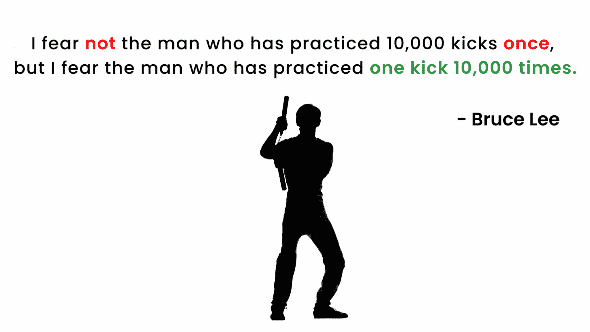

# 投资或交易股票的最佳策略是什么？

> 原文：<https://medium.com/coinmonks/whats-the-best-strategy-to-invest-or-trade-stocks-cd6948d531d3?source=collection_archive---------14----------------------->

这是我通过研究成功交易者学到的。

Source: Author’s Creation

人们应该使用什么样的最佳投资策略或风格来获得成功？

是:
价值投资
低波动投资
动量投资
成长投资
聪明贝塔投资
红利投资
细价股投资
日内交易
衍生品交易
(或)
趋势投资？