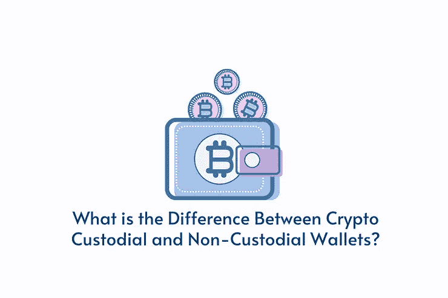

# 保管型和非保管型加密钱包有什么区别？

> 原文：<https://medium.com/coinmonks/whats-the-difference-between-a-custodial-vs-non-custodial-crypto-wallet-a12d3c52c063?source=collection_archive---------36----------------------->

进入加密领域时，选择安全的加密货币钱包非常重要。最受欢迎的钱包类型有软件钱包、硬件钱包和纸质钱包。不管市场上有哪种钱包，它们都被分为两类——“保管型钱包”和“非保管型钱包”。

在你决定使用哪种钱包之前，先看看这两种选择的优缺点。

# 保管钱包

保管钱包是由第三方保管你的私人钥匙的钱包。这个概念类似于银行，钱是你的，但你没有完全的控制权。保管钱包旨在为用户提供高效管理其加密货币的便利和快速访问。

软件钱包大多是保管钱包或者保管交易所。一些最受欢迎的保管钱包和交换的例子是[自由钱包](https://freewallet.org/)、[币安](https://www.binance.com/en)和[比特币基地](https://www.coinbase.com/) [。](https://manage.wix.com/dashboard/cc183aca-dcfd-4fe0-ab69-be36da0436ce/blog/6112b01c5bdec70015a5aafd/edit#_msocom_1)

# 优势

*   可达性。只需点击几下鼠标，使用您的凭证登录，用户就可以轻松访问和管理他们的加密货币。
*   更便宜或者没有交易费用。大部分集中式第三方交易所都提供保管钱包。与非保管式加密钱包相比，它们的交易费用通常更低。
*   客户支持。几乎所有的加密交易所都提供客户支持服务，只要用户遇到交易或账户问题，就可以得到帮助。尽管每个加密交易所的支持水平、满足用户需求的准确性以及解决用户面临的问题的准备时间都不同。
*   方便。保管钱包最重要的优势是，没有钥匙丢失。加密货币交易所是用户[私钥](https://www.gemini.com/cryptopedia/public-private-keys-cryptography#section-where-are-my-private-keys)的保管人，所以用户没有责任，也没有必要担心丢失。这与人们如何信任银行持有黄金是一个类似的概念。

# 不足之处

*   用户私钥的第三方所有权。没有私钥，从技术上讲，用户并不拥有你钱包里的资金。
*   数据泄露和/或黑客攻击的风险。由于加密货币交易所持有私钥并保护用户的个人信息，因此选择高度安全的平台非常重要。Liquid 是一家日本密码交易所，最近遭到黑客攻击，估计价值 9400 万美元的密码资产被盗。
*   互联网可访问性。保管钱包依赖于互联网的可用性。没有它，用户就不能存取他们的资金。

# 非保管钱包

非托管钱包可以是安装在移动设备、台式机、基于浏览器的软件形式，甚至可以是硬件设备。持有加密货币最安全的方式之一是使用硬件钱包。

它们通常看起来像一个带有屏幕和模拟按钮的 USB 存储设备。最受欢迎的非保管钱包是[特雷佐](https://trezor.io/)、[莱杰纳米 X](https://www.ledger.com/) 和[曾戈](https://www.zengo.com/)。

# 优势

*   所有权。非保管钱包的主要优势之一是用户将拥有自己的唯一密钥，这样其他用户就无法访问这些钱。为了转移资金，用户必须授权交易。
*   几乎没有数据泄露和黑客攻击的风险。任何人都可能成为黑客的目标，但与集中交易所持有的资金相比，你钱包里的资金很少。因此，非保管钱包的数据泄露和黑客攻击的风险更小。
*   不要求互联网可访问性。拥有一个非保管钱包不需要依赖互联网来存取你的资金。一些非保管钱包允许用户使用硬件在离线模式下管理他们的加密资产。

# 不足之处

*   问责制。有了非保管钱包，用户对自己的数字资产全权负责。一个小小的输入错误就可能导致加密货币的丢失，而且没有办法撤销。
*   设置流程。使用非保管钱包需要用户设置一个 12-24 字的[种子短语](/mogulproductions/blockchain-explained-custodial-vs-non-custodial-wallets-76e6128834b0#:~:text=Non%2Dcustodial%20wallets%20remain%20tough,words%20to%20access%20an%20account.&text=Then%2C%20non%2Dcustodial%20wallets%20have,funds%20(the%20public%20key))(用于备份目的)并记住长的字母数字私钥。整个过程可能会让人不知所措。
*   安全保管。最大的缺点之一是，如果你丢了钥匙，你就丢了钱。非保管钱包容易出现人为错误。如果你损坏了保存你所有资金的实体钱包，没有其他方法可以拿回来。

# 决定

在保管钱包和非保管钱包之间做出选择是一个重要的决定。最终，它取决于各种因素，如用户的偏好、生活方式、安全实践、加密交换的可信度及其数据安全政策、基础架构和操作。

“不是你的钥匙，不是你的硬币”是一个流行的说法，对于加密用户来说，他们更喜欢持有自己的私钥，完全控制他们的加密资产。如果你是一个想要学习密码交易的初学者，密码交易所可能是一个很好的起点，或者你甚至可以使用两个钱包的组合。尽管如此，请始终确保遵循最佳安全实践。

> 交易新手？试试[加密交易机器人](/coinmonks/crypto-trading-bot-c2ffce8acb2a)或者[复制交易](/coinmonks/top-10-crypto-copy-trading-platforms-for-beginners-d0c37c7d698c)