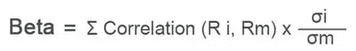
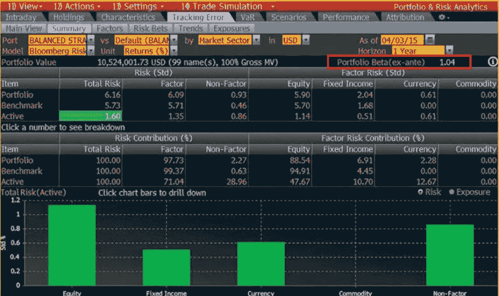
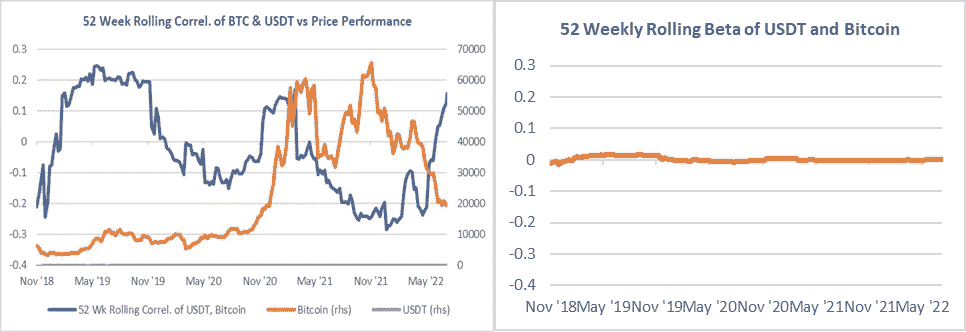
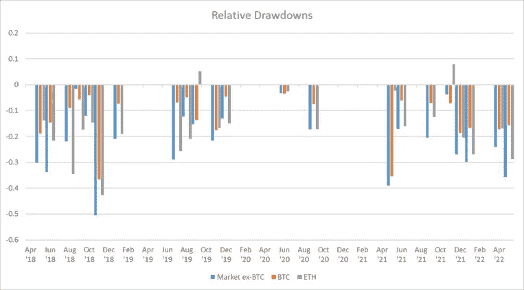
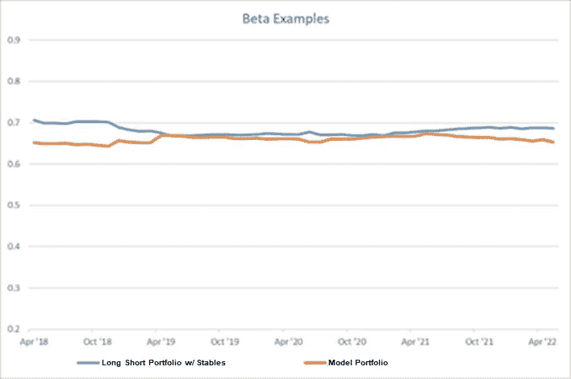
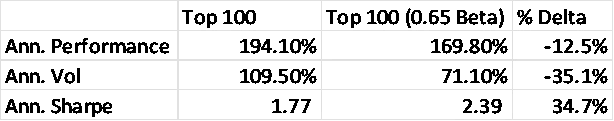
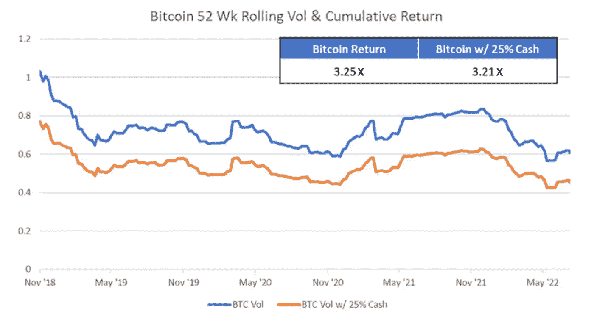

# 密码多样化有什么意义？相关性不高吗？

> 原文：<https://medium.com/coinmonks/whats-the-point-of-diversifying-in-cryptos-aren-t-correlations-high-58a808be0065?source=collection_archive---------7----------------------->

作为一名试图筹集资金的密码领域的投资组合经理，这是投资者提出的第一个问题。密码多样化有什么意义？反正相关性都很高。但是……相关性是值得关注的正确指标吗？

当谈到投资组合管理时，有两个术语经常被混淆:相关性和 beta。

相关性是方向性的一种度量，但它是 ***而不是*** 一种度量幅度。

另一方面，Beta 同时考虑了方向性和幅度(即波动性)。

在这里，我们将讨论在构建投资组合时这两者之间的重要区别。

*解构贝塔:*

正如你在上面看到的，贝塔的公式是相关性和波动性的函数，在投资组合管理过程中，贝塔是我们更关心的一个。下面是彭博港口风险模型的首页——投资组合管理的行业标准——来说明这一点。

重要的是要注意，潜在的表现出高度相关性的资产并不总是表现出高贝塔。例如，下面的图表展示了 USDT 和比特币随着时间推移的相关性。基于这些相关数字，人们可能会认为 USDT 相对于比特币会非常不稳定，随着时间的推移，它们的波动周期是一致的。然而，我们知道事实并非如此，因为 USDT 是与 1 美元挂钩的。查看测试版可以让我们更清楚地了解情况。

Source: coinmarketcap.com. Data as of 31/05/2022

**对于 Fyde Treasury Protocol 来说，这将是一个基础方法，因为我们的池目标是为广泛的加密市场提供 0.5-0.7 的测试版。这可以通过几种不同的方法来实现:**

**1。分配到较低的 beta 资产**

**2。分配给相关性较低的资产**

**3。在渴望看跌期权时通过写备兑买入期权来使用期权**

为了透明起见，并考虑到我们的基金将如何处理这一项目，我们将把重点放在前两项，作为我们投资组合管理战略的一部分，而不是一头扎进第三项。

下图显示了 BTC 和瑞士联邦理工学院相对于除比特币之外的前 99 种代币(我们在这里标记为“市场”)的提款情况:

Source: coinmarketcap.com. Data as of 31/05/2022.

平均而言，比特币相对于市场(即 DAO /协议令牌)有 50–60%的贬值。因此，如果我们处于一个 DAO 或协议令牌通常下跌 80%的环境中，比特币将下跌 40–45%。然而，从长期来看，前 10 名和前 100 名的回报率非常相似，自 2017 年以来前 10 名的回报率为 33.8 倍，前 100 名的回报率为 35.4 倍。如果波动性在下行时仍然如此之低，这怎么可能呢？这是因为更低的提取允许更快的复利，因此能够以更低的波动性实现类似的终点。

在避险情景中，相对于较小的代币，BTC 和 ETH 表现良好。这让我们想到如何利用市场代币、比特币、以太币和稳定币的组合来构建一个更低 beta 的投资组合。下面是我们能做的事情的两种表现。一个是多空投资组合，另一个是 Fyde 财资模型投资组合，由 60%的广义加密市场敞口、10%的比特币、5%的以太币和 25%的稳定币组成。

Source: Bitwise Indices, Bloomberg, Data as of 31/05/2022.

随着时间的推移，每月都会重新平衡，这是两个非常基本的策略。现金头寸是我们想要的，因为它仍然是抑制波动性的最简单、最直接的投资方法。如您所见，例如，将 25%的池放在 stables 中可以获得 0.6–0.7 的 beta，您可以看到 beta 随着时间的推移保持一致。这意味着，如果一个 DAO 在其原生令牌中下跌了 90%，那么按照 Fyde 模型投资组合的策略，它们在这里将下跌约 60%。用名义术语来说，如果你的起点是 1000 万美元，那么这就是 100 万美元跑道和 400 万美元跑道的区别。请记住，上面的两个策略是非常简单的例子。这并不涉及某些令牌如何在历史上表现出较低的相关性/贝塔系数(例如过去一年的咒语)，以及我们如何依靠这些杠杆。

通过缩小回报流的非线性波动性，我们可以为储户创造高夏普比率。这一措施非常重要，因为许多大型 Dao 和协议(类似于 trad-fi 中的国债投资组合)在其投资政策声明中侧重于优化每单位风险的回报(即夏普比率)。下面显示了如果我们为该领域的前 100 个令牌构建一个 0.65 beta 目标会发生什么。采用这种方法会带来-12.5%的相对业绩下降，但波动性降低了 35.1%，夏普比率比没有进行任何贝塔调整时高 34.7%。同样，这也与复利的力量联系在一起。

Source: Bitwise Indices, Bloomberg. Data as of 31/05/2022.

另一个简单的说明性例子是查看过去三年中比特币与 25%现金配置的比特币的表现:

Source: coinmarketcap.com. Data as of 31/05/2022.

对于长期生存的加密项目，它们必须在市场的所有状态下都保持在操作障碍之上。熊市期间 90%的缩减意味着项目跑道的结束，这将导致停止运营、解雇开发人员、员工和失去社区信心。然而，60%的提款为项目保留了足够的资金，使其持续到下一个牛市，并且超过了许多协议目前正在经历的情况(例如，指数合作基金在 10 个月内从 1.05 亿美元缩减到 400 万美元)。对于许多这样的项目、Dao 和协议，成功的关键是长期生存。

> 加入 Coinmonks [电报频道](https://t.me/coincodecap)和 [Youtube 频道](https://www.youtube.com/c/coinmonks/videos)了解加密交易和投资

# 另外，阅读

*   [8 大加密联盟项目](https://coincodecap.com/crypto-affiliate-programs) | [eToro vs 比特币基地](https://coincodecap.com/etoro-vs-coinbase)
*   [最佳以太坊钱包](https://coincodecap.com/best-ethereum-wallets) | [电报上的加密货币机器人](https://coincodecap.com/telegram-crypto-bots)
*   [交易杠杆代币的最佳交易所](https://coincodecap.com/leveraged-token-exchanges) | [购买 Floki](https://coincodecap.com/buy-floki-inu-token)
*   [3Commas 诉 Pionex 诉 crypto hopper](https://coincodecap.com/3commas-vs-pionex-vs-cryptohopper)|[Bingbon Review](https://coincodecap.com/bingbon-review)
*   [加密复制交易平台](/coinmonks/top-10-crypto-copy-trading-platforms-for-beginners-d0c37c7d698c) | [如何在 WazirX 上购买比特币](/coinmonks/buy-bitcoin-on-wazirx-2d12b7989af1)