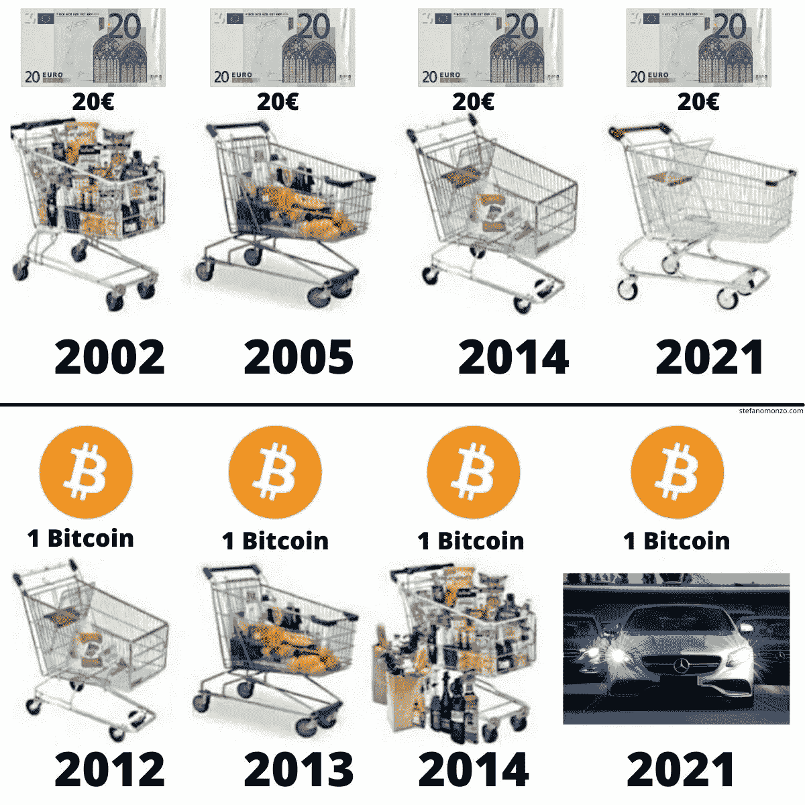
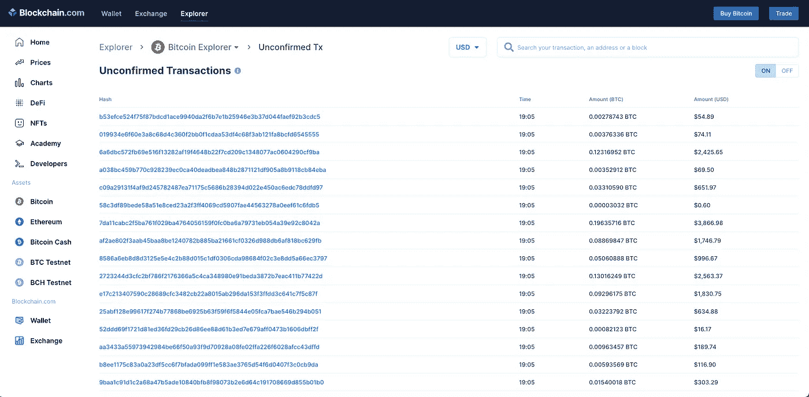

# 我们现在的货币体系出了什么问题，我们为什么需要比特币？

> 原文：<https://medium.com/coinmonks/whats-wrong-with-our-current-monetary-system-and-why-do-we-need-bitcoin-69adf6c7d5b2?source=collection_archive---------54----------------------->

Photo by [Kanchanara](https://unsplash.com/@kanchanara) on [Unsplash](https://unsplash.com/)

在我们生活的日子里，像美元和欧元这样的法定货币是有价值的，因为政府说即使他们没有任何有形资产的支持。

过去，我们的货币价值由金本位制支撑，而不是法定货币，直接将货币价值与黄金价值联系起来。一个金本位国家不可能在不缓慢增加黄金储备的情况下增加流通中的货币量。采用金本位制可以抑制通货膨胀。

如今没有一个国家用黄金来支持其货币。

政府控制着法定货币，他们利用中央银行凭空印钱。

近年来，我们的经济状况急剧恶化。在新闻中，金融市场和股票交易的形势似乎变得越来越紧张。

经济学家和分析师担心我们当前的货币体系将很快崩溃，自从冠状病毒疫情以来，政府正在大量印刷新的钞票，这是一个**大问题**。

当政府印钞票时，流通中的货币**多了**，结果，它减少了我们拥有的货币的**价值，这被称为**贬值。这意味着随着时间的推移，你口袋里的钱变得越来越不值钱，你的购买力也会下降。****

Purchasing power between US Dollar and Bitcoin. Reference from [Academy Moralis](https://academy.moralis.io/blog/crypto-and-inflation)

## 为什么比特币是更好的货币？

比特币是一种去中心化货币。这意味着没有公司或私人可以控制比特币。

政府要阻止比特币，要么需要**关闭互联网**要么**切断全球所有电脑的电源**。

政府可以禁止拥有和交易加密货币，但他们无法阻止。

## **比特币是如何产生的？**

当矿工利用他们计算机的能力来解决复杂的算法，作为比特币交易的验证时，就产生了比特币。矿工可以获得比特币作为奖励，比特币以数字形式存储，可以在买家和卖家之间传送，无需中间人。

比特币的另一个好处是**任何人都可以成为自己的银行。一旦你拥有了比特币，它就是你的了。你是你钱的主人，而不是银行。**

比特币**透明**。

每一笔转账都可以在区块链上公开查看。寄件人和收件人在一长串字母和数字后面保持匿名。

Bitcoin transactions. Reference from [blockchain.com](https://www.blockchain.com/btc/unconfirmed-transactions)

如果你有兴趣了解比特币背后的技术，看看我的另一个故事。

 [## 什么是区块链？我们如何使用它？

### 区块链是一个分布式数据库或分类帐，在计算机网络的节点间共享，存储…

medium.com](/@edurabreu/what-is-blockchain-and-how-can-we-use-it-ef19678dc4e5) 

有了比特币，可以马上汇款。

想象你正在度假，丢了钱包。家人或朋友可以在几分钟内给你汇钱，你可以立即使用。

有了比特币，这一切都成为可能。

有了比特币，汇款可以在几分钟内完成，所以你可以忘记过去需要等待几天才能转账的日子。

> 交易新手？试试[密码交易机器人](/coinmonks/crypto-trading-bot-c2ffce8acb2a)或者[复制交易](/coinmonks/top-10-crypto-copy-trading-platforms-for-beginners-d0c37c7d698c)