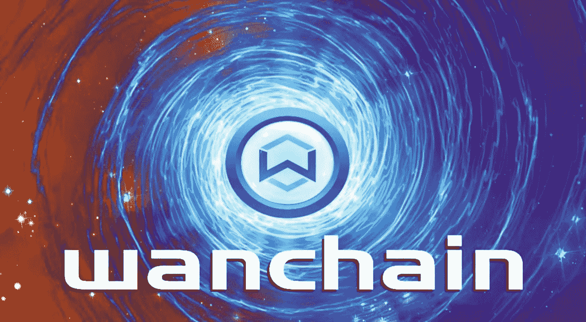

# 当跨链基础设施出现故障时—为什么 Crypto 需要 Wanchain 标准

> 原文：<https://medium.com/coinmonks/when-cross-chain-infrastructure-fails-why-crypto-needs-the-wanchain-standard-44695bccd2?source=collection_archive---------21----------------------->

在区块链和加密货币领域，跨链技术一直是日益增长的必需品。自 2021 年牛市以来，由于 DeFi、NFT 和整体炒作的兴起，加密货币和区块链技术的受欢迎程度呈指数增长。虽然许多人庆祝 crypto 的持续普及，但这一新的用户浪潮进一步凸显了 crypto 多年来一直在努力解决的可扩展性危机。为了解决这个问题，涌现出了多个第 1 层和第 2 层协议，这些协议有望在竞争中提高可伸缩性。

> 不知道什么时候买卖，试试[复制交易](http://coincodecap.com/go/bityard)。

这种新链的出现证明是部分成功的，它缓解了以太坊的交易量，允许新的生态系统增长，并为用户提供了更便宜的替代品和增加了生态系统的多样性。虽然这看起来像是可伸缩性问题的一个可行的临时解决方案，但是用户经常因为将他们的资产分布在大量不同的区块链中而感到困扰。这凸显了加密领域面临的增长最快的问题之一— *缺乏互操作性。*

缺乏跨链基础设施并不是什么新鲜事，然而，用户和区块链网络的快速增长极大地放大了互操作性的需求。为了应对这种不断增长的需求，该行业通过在许多不同的区块链平台上快速推出桥和跨链友好的应用程序来解决跨链危机。虽然这种解决互操作性问题的快速行动可以很容易地被视为加密的成功故事，但许多人认为相反的事情已经完成。

**当跨链基础设施出现故障时**

自 2021 年以来，跨链漏洞利用使加密领域充满了恐惧、不确定性和怀疑，因为它们是一些最大的加密漏洞利用的罪魁祸首。到目前为止，跨链攻击已经造成了超过 15 亿美元的损失，这使得跨链领域成为加密货币领域的又一个致命弱点。

除了巨大的金钱损失，跨链攻击还会对他们服务的协议和社区产生严重影响。这方面的一个例子发生在去年 11 月初，当时一个跨链协议网络 pNetwork 向它的用户“GalaGames”警告了 BNB 链跨链桥智能合约中暴露的错误配置。根据这一发现，发现问题中的错误可能会允许攻击者获得合同的所有权，从而使他们能够随意制造新令牌和更改 pGala。为了预防任何重大漏洞，GalaGames 向所有集中交易所发出紧急通知，暂停基于 BEP-20 的 pGala 令牌的交易。不幸的是，尽管有紧急通知，但并不是所有的交易所都停止了基于 BEP-20 的 pGala 令牌的交易，这本身就带来了意外的后果，因为投机者蜂拥而至，利用 dex 套利机会，而 pNetwork 正试图耗尽流动性以帮助纠正这一问题。

虽然崩溃的程度主要局限于少数机会主义套利者，但这种情况预示着一个小小的例子，如果该行业不优先考虑强大的跨链基础设施，可能会在更大的范围内发生什么。因为当今大多数主要的区块链平台都关注去中心化，所以通常没有第三方来阻止某些项目构建新技术，例如某些区块链和单个项目之间的跨链桥。由其他方缺乏稳健性的桥梁连接起来的项目和链条面临巨大风险，特别是如果他们自己不是这些桥梁的创造者。如果薄弱的跨链基础设施继续成为加密领域的规范，连接 DeFi 应用程序、区块链、CBDCs 甚至未来经济的桥梁的开发可能会给加密领域带来灾难。

幸运的是，像 Wanchain 这样的项目已经证明了健壮的跨链技术确实存在，并且有着美好的未来！

Image Credit: @WebZombies (Twitter)

**什么是万链？**

**Wanchain** 是一款完全兼容 EVM 的分散式区块链互操作性解决方案，利用了区块链最新的分散式、互连性和可扩展性，适合商业、公共、个人和国家使用。Wanchain 致力于通过互操作性、安全性和透明性推动区块链的采用，以下一代区块链为基础，配备完全分散的跨链网桥，将许多不同的现有和未来区块链网络互连起来。

多年来，Wanchain 开创了迄今为止最先进、最安全的跨链基础设施之一，目前支持 19 个不同的区块链网络和 45 种不同的资产，使其成为现有最大、最成功的跨链平台之一。Wanchain 成功的关键在于其对安全性、去中心化和透明度的专注，这从其在该领域的良好记录中可以看出。

随着 Wanchain 标准继续被区块链、项目和数字资产采用，对真正安全、公平和可靠的加密未来的希望越来越接近现实。

> 加入 Coinmonks [电报频道](https://t.me/coincodecap)和 [Youtube 频道](https://www.youtube.com/c/coinmonks/videos)了解加密交易和投资

# 另外，阅读

*   [3 商业评论](/coinmonks/3commas-review-an-excellent-crypto-trading-bot-2020-1313a58bec92) | [Pionex 评论](https://coincodecap.com/pionex-review-exchange-with-crypto-trading-bot) | [Coinrule 评论](/coinmonks/coinrule-review-2021-a-beginner-friendly-crypto-trading-bot-daf0504848ba)
*   [莱杰 vs n rave](/coinmonks/ledger-vs-ngrave-zero-7e40f0c1d694)|[莱杰 nano s vs x](/coinmonks/ledger-nano-s-vs-x-battery-hardware-price-storage-59a6663fe3b0) | [币安评论](/coinmonks/binance-review-ee10d3bf3b6e)
*   [加密交易机器人](/coinmonks/crypto-trading-bot-c2ffce8acb2a) | [Bingbon 评论](https://coincodecap.com/bingbon-review)
*   [Bybit Exchange 评论](/coinmonks/bybit-exchange-review-dbd570019b71) | [Bityard 评论](https://coincodecap.com/bityard-reivew) | [Jet-Bot 评论](https://coincodecap.com/jet-bot-review)
*   [3 commas vs crypto hopper](/coinmonks/3commas-vs-pionex-vs-cryptohopper-best-crypto-bot-6a98d2baa203)|[赚取秘密利息](/coinmonks/earn-crypto-interest-b10b810fdda3)