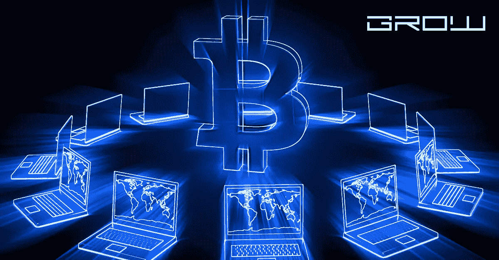

# 比特币是什么时候成为商品的

> 原文：<https://medium.com/coinmonks/when-did-bitcoin-become-a-commodity-a77dc0fda36e?source=collection_archive---------24----------------------->

Bitcoin become a commodity

自 2017 年以来，作为世界上最受欢迎和最有价值的加密货币，比特币已经成为至少一个国家的商品。

2017 年 1 月 1 日，比特币成为德国 GATA 法规下官方认可的商品。这种分类意味着比特币可以在德国证券交易所交易，也可以像任何其他形式的财产或投资一样被征税。在撰写本文时，超过 200 家公司在其平台上提供比特币加密交易，这仍然是美国现有公司的一小部分。世界似乎尚未赶上加密货币，但随着日本和新加坡等国家投入更多时间和资源来促进这种新形式的数字贸易，它可能很快就会开始。

有一点可以肯定，发明比特币的人已经改变了世界。如果没有中本聪和他的区块链思想，我们今天会生活在一个非常不同的世界。利用区块链技术作为数字货币的机制，Satoshi 创造了一种全新的方式在互联网上交易商品和服务。你不再需要被可能终止你的国际交易的边界和银行系统所束缚。有了这项技术，这些限制就消除了，你的钱是安全的，因为它是数字化的。

话虽如此，这种新形式的货币是如何变得如此庞大的？为什么比特币价值超过 1000 亿美元？这枚硬币的独特之处是什么？
(编者注:本文由我和其他几位撰稿人撰写)
比特币区别于其他货币的一点是，它是去中心化的，不受银行或政府的控制或管理。你不需要有一个银行账户或使用贝宝来让你的比特币钱包装满钱。这意味着您可以拥有无限量的资金，并使用这些硬币进行日常交易。

比特币也是一种非常容易赚钱的方式。如果你想开始使用加密货币，比特币会是最好的选择，因为它的价格和可用性。你可以使用 GDAX、Bitfinex 和比特币基地等交易所购买你的第一枚比特币。这些交换是安全的，您可以使用它们而不用担心被盗或其他安全问题。

但这种货币是如何获得如此大的价值的呢？
当中本聪在 2009 年首次创造加密货币时，它们还不值钱。当时的比特币价值很低，相比之下，目前每枚比特币的价值超过 5000 美元。比特币的价值每年都在上涨，在不到十年的时间里，它的价值超过了 1000 亿美元，这对于一种货币来说几乎是闻所未闻的。这种价格上涨让许多加密货币专家挠头，为什么这种硬币会有如此大的价值。

答案可能在于被称为区块链的加密货币的新发展，它是所有加密交易的公共账本。区块链是数字分类账(即数据库)，它们是分散的，不会被篡改或黑客攻击。结果是，您可以实时跟踪和转移您的资金，而不是等待几天甚至几周才能完成银行电汇。你支付的所有费用都包含在硬币的原始成本中，这就是为什么它们会如此便宜。

比特币与石油、黄金和白银等其他主要大宗商品的另一个相似之处是，它们都是使用区块链系统生产的。它们是使用计算机创建的，计算机使用挖掘过程来验证交易。挖掘过程包括生成称为哈希的新数字块，然后将这些数字块链接在一起，形成一个越来越短的块链，直到只剩下一个块。正是这种创建哈希链的过程为比特币提供了价值，因为它被用来制造新的硬币。

当比特币的需求增加时，它的价值就会上升，这在一定程度上是因为它的易用性。你可能会说，人们需要比特币来购物，因为几乎一半的比特币存在于用户的钱包里。

比特币交易也非常容易执行，因为没有第三方参与。这是一个点对点系统，一个人或团体可以与另一个人或团体交换硬币，而不需要任何金融机构的参与。因此，这使得交易非常简单，因为没有繁文缛节，也没有与银行费用相关的管理费用。

比特币价值上涨的另一个原因是因为它的稀缺性。将只会有 2100 万枚比特币被创造出来，大多数估计认为它们将在 2041 年全部被生产出来。这使得它成为一种有限的资源，而法定货币或股票可以在任何时候增加供应。许多人更喜欢使用数字货币，因为它不能被伪造或以其他方式操纵，为政府和银行创造更多的钱。

人们还以非常容易的方式在国际上转移他们的比特币，这是价值持续增加的另一个原因。因为这些交易是点对点的，你不需要依靠货币兑换或通过银行转账，这将产生巨额费用，并需要几天或几周才能完成交易。使用比特币，你可以在几分钟内启动交易，这意味着你只需点击几下鼠标就可以消费和节省资金。

有许多法定货币，如美元和欧元，正被迫与比特币竞争。有些人甚至说，传统市场正受到这种新型货币的挑战。这应该能让你明白为什么最近这么多人开始考虑比特币。同样重要的是要注意，如果一种主要货币下跌，这可能意味着在同样的趋势再次发生之前，比特币等货币有机会以更低的价格和更高的价值上涨。

比特币或其他数字货币的使用没有限制。它们可以像标准股票或债券一样被购买、用于交易和交易。当你想从投资中获利时，你也可以保留或出售它们。我甚至认为比特币比其他一些投资更稳定，因为法定货币的任何重大变动都会影响比特币的价值，这就是为什么它是加密货币的一个很好的起点。

关于比特币，你会注意到的一点是，它不受任何中央权威机构的控制。这也是比特币价格一直上涨的主要原因之一。人们不希望他们的钱被银行或任何其他机构控制，这些机构可以轻易地操纵他们财富的价值。这就是为什么对比特币的需求将继续上升，因为它是一种不受政府政策影响的财富来源。如果你从银行取出所有的钱，并把它们转换成比特币，你就能更好地抵御未来的经济危机。

许多其他数字货币也是如此，包括 Ripple、Ethereum 和 Litecoin，它们也因越来越受欢迎而呈上升趋势。现在有几十种加密货币可以在交易所交易，而且它们的价值也在不断上升。

谈到比特币和其他加密货币的交易，很多人都非常犹豫，因为他们不想把钱花在可能一夜之间失去很多价值的东西上。然而，我认为这是投资数字货币最好的事情，因为当你购买它时，你没有任何前期成本。没有银行费用或转账费用，如果价格下降，你可以保留你想要的东西。

许多专家认为，随着时间的推移，比特币等加密货币将变得比法定货币更有价值。这背后的简单原因是，它们没有利息成本，这意味着它们可以继续上涨，而不需要更多的经济刺激政策。

这也意味着比特币有可能减少全球债务，因为它可以用来以非常划算的方式进行国际交易。正如你所看到的，比特币的崛起有许多不同的原因，并且随着全球政府试图控制其使用以操纵其价值，比特币在未来几年将继续增长。这使它成为一项非常有趣的投资，因为你不会被束缚在任何投资中，如果它的价值下降，你可以保留你想要的。

以上是我对投资比特币等加密货币这个话题的看法。如果你对投资数字货币感兴趣，我有一些好消息要告诉你。有一个比特币交易所，我在用，从 2014 年 1 月开始一直在用。它叫双音调，当我需要交易时，它从来没有让我失望过。他们有一个非常简单的界面，费用很低。首先，您只需点击此链接进行注册，只需几分钟即可完成。它还将为您提供完整的交易平台，包括买卖比特币、以太坊、莱特币、Ripple 等。

> 加入 Coinmonks [电报频道](https://t.me/coincodecap)和 [Youtube 频道](https://www.youtube.com/c/coinmonks/videos)了解加密交易和投资

# 另外，阅读

*   [拥护卡审核](https://coincodecap.com/uphold-card-review) | [信任钱包 vs MetaMask](https://coincodecap.com/trust-wallet-vs-metamask)
*   [TraderWagon 回顾](https://coincodecap.com/traderwagon-review) | [北海巨妖 vs 双子星 vs BitYard](https://coincodecap.com/kraken-vs-gemini-vs-bityard)
*   [Exness 回顾](https://coincodecap.com/exness-review)|[moon xbt Vs bit get Vs Bingbon](https://coincodecap.com/bingbon-vs-bitget-vs-moonxbt)
*   [如何开始通过加密贷款赚取被动收入](https://coincodecap.com/passive-income-crypto-lending)