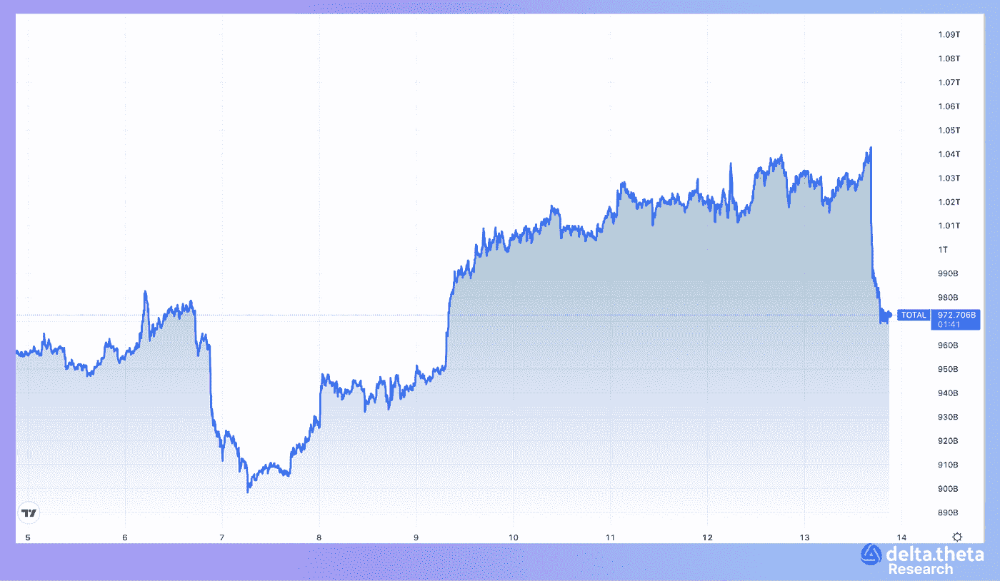
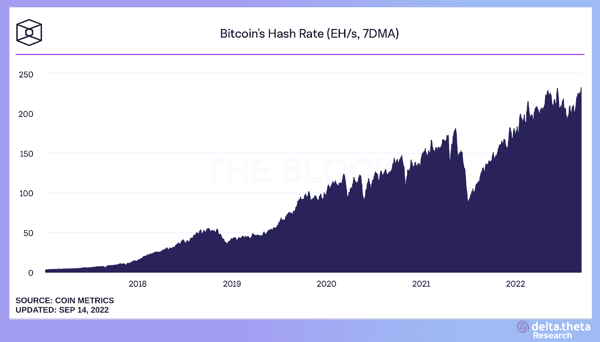

# 什么时候是开始投资加密的合适时机？

> 原文：<https://medium.com/coinmonks/when-is-the-right-time-to-start-crypto-investing-d6dd442b913d?source=collection_archive---------29----------------------->

消费者价格指数令人失望的统计数据的发布导致传统指数和加密市场的资本化急剧下降。8.3%的数字高于市场参与者的共识，可能会迫使美国美联储至少加息 0.75%，这将使金融市场的流动性状况变得非常复杂。因此，加密令牌的总资本约为 9700 亿，在不到一小时内下降了 7%。

发达国家货币当局进一步延长货币政策紧缩的主张正获得支持。此外，不断上升的全球美元指数(目前的数字为 109 点，低于之前的高点 120 点，但呈上升趋势)为非美国市场参与者投资加密资产带来了额外的成本，因此目前所有交易都是通过使用 USDT、USDC 和 BUSD 的 stablecoins 以美元的数字私人版本计价。

# 公共采矿部门的状况

尽管 BTC 价格大幅下跌，但采矿复杂性指标仍在持续增长，反映了基础设施的发展和长期投资者对该领域的信心。当前的下降与哈希速率(衡量网络计算能力的指标)达到 236 E/H 的历史最高水平相一致。

此外，第二季度的统计数据显示，上市公司正在经历不同程度的经营负担。当然，价格从历史高点到当地低点的跌幅超过 75%，使得所有矿业公司的活动都发生了调整。然而，从销售水平来看，我们可以区分领导者(如马拉松，HUT8，BitNile)和局外人(核心科学，Bitfarms，北方数据)。

与此同时，该行业的总收入从 2021 年的高点下降了两倍，例如，8 月份为 6.56 亿美元，交易处理份额为 900 万美元(根据 TheBlock analytical service)。

可以得出以下结论:

1.  尽管目前市场资本总额下降，但公司仍在继续增加产能。
2.  竞争正在加剧。廉价电力、税收激励和强大的采矿设备车队等组织优势开始变得越来越重要。竞争加剧。廉价电力、税收激励和强大的采矿设备车队等组织优势正变得越来越重要。
3.  市场的进一步下跌可能导致破产、合并和收购，以及在公开市场上出售抵押设备。这样的一系列事件将使领导者更加强大，在中期内将导致矿业股票的波动性增加。
4.  一家公司的储备越多，它应对不断变化的宏观环境的能力就越强，在未来比特币价格上涨的情况下，它的资本化也就越高。

目前的市场条件肯定不是最有利的，但同一行业公司之间竞争的加剧将使未来的领导者脱颖而出，在当前形势下，这是一个有趣的中长期投资机会。

# 社交媒体链接:

delta thet Eng TG Chat—[https://t.me/deltatheta](https://t.me/deltatheta)

Deltatheta 推特—【https://twitter.com/deltatheta_tech 

> 交易新手？试试[密码交易机器人](/coinmonks/crypto-trading-bot-c2ffce8acb2a)或[复制交易](/coinmonks/top-10-crypto-copy-trading-platforms-for-beginners-d0c37c7d698c)