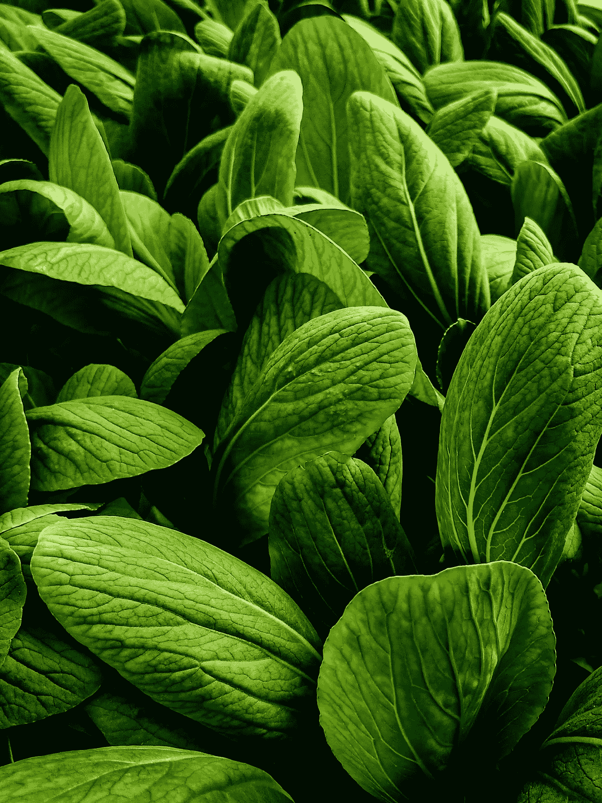

# 当缺乏食物分散了潜能

> 原文：<https://medium.com/coinmonks/when-lack-of-food-distracts-potential-4e92b9fb9caa?source=collection_archive---------62----------------------->

来源: [Tia](https://unsplash.com/@tee_ya)

## 美食超级明星

当我们真正了解我们在这个星球上是谁或什么，地球，岩石，生物圈…无论你想叫它什么，我们将意识到培育和保护她的进化功能是多么重要，这对全人类都很重要。