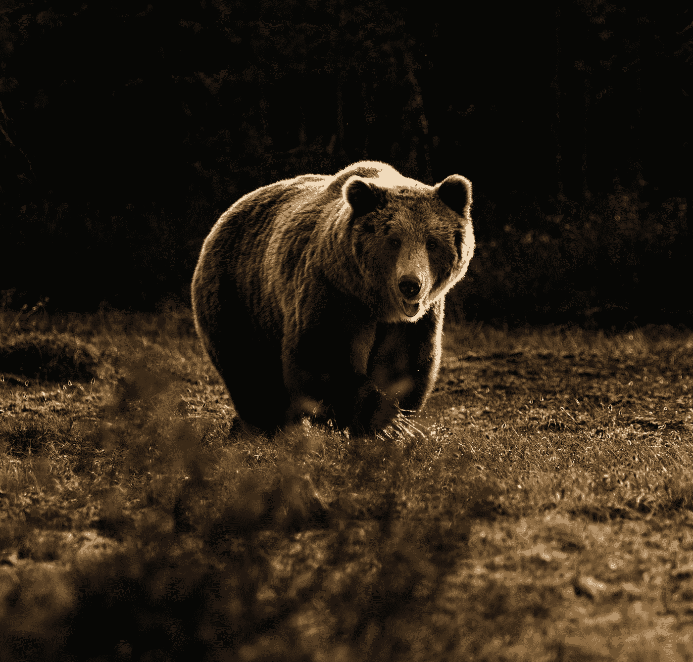

# 当熊市继续的时候

> 原文：<https://medium.com/coinmonks/when-the-bear-market-continues-88d5b515b35f?source=collection_archive---------31----------------------->

Photo by [Zdeněk Macháček](https://unsplash.com/ja/@zmachacek?utm_source=medium&utm_medium=referral) on [Unsplash](https://unsplash.com?utm_source=medium&utm_medium=referral)

隐秘的熊市仍在持续。在撰写本文时，比特币已经从近一年前的历史高点下跌了近 70%。但这也是迄今为止持续时间最长的熊市——在某些情况下，甚至更长。对于任何相信比特币和其他数字货币等去中心化数字资产价值的人来说，这是一个可怕的命题。如果你正在读这篇文章，你可能是…