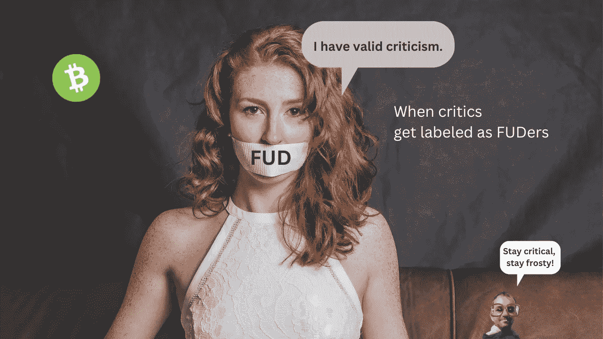
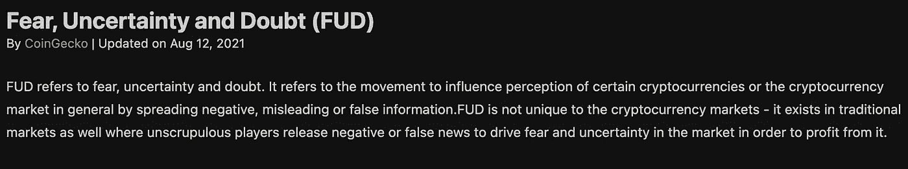
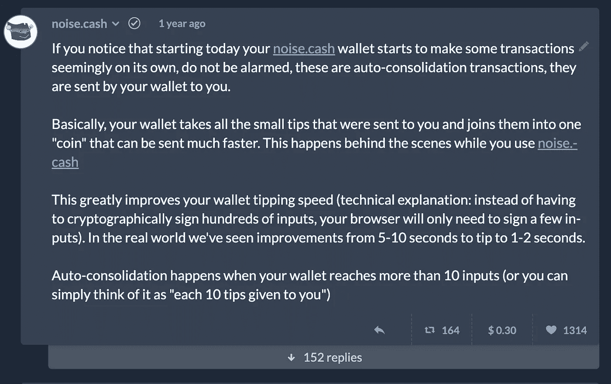
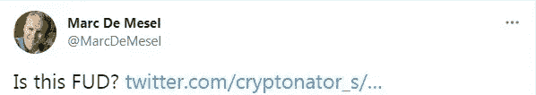
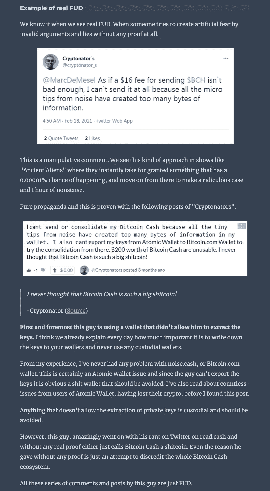

# 当正当的批评像 FUD 一样被压制

> 原文：<https://medium.com/coinmonks/when-valid-criticism-gets-silenced-as-fud-e5b02f5231e1?source=collection_archive---------18----------------------->

## 潘迪拉的短篇小说《一个真正的绿色 BCH 战士》

在隐秘的空间里，经常发生这样的事情，有正当理由批评或担忧的人被歧视为捏造者。并不是你听到的每一条负面消息都会自动 FUD，有时它只是基于冷酷事实的坏消息。

通过自己的研究找出有效的批评和 FUD 之间的区别是很重要的。我承认这可能很难，但最终，你自己要对自己的投资决定负责，评估这些信息是你自己的事。

# FUD 战士的进攻

在密码史上，有很多“FUD”战士骚扰提出合理担忧的人的例子。一个著名的例子是安全月 FUD 战士 Armee。他们除了骚扰那些说他们心爱的项目坏话的人之外什么也不做，即使它是合法的。

这是经常发生的事情，尤其是在 crypto 中，并且不局限于一个单独的项目。一个现象是，如果有人对一个项目的批评是合理的，他们就会被这个项目的支持者用 FUD 球拍打。这是一种特殊的恶意批评。

我关于这个潘迪拉家伙的故事涉及比特币现金，但我想指出，潘迪拉并不代表整个比特币现金社区。比特币现金社区的绝大多数人都很棒，我喜欢和他们一起玩 noise。

潘迪拉不像大多数人，因为他只是一个最大化主义者，喜欢把事情推向极端，最终，他是令整个社区陶醉的人。我认为，像真正的绿色比特币现金战士潘迪拉这样的最大化主义者实际上对他们的项目有害，即使他们没有意识到这一点。我仍然认为，那些抨击其他密码多于抨击银行和传统金融体系的人是有害的。

# 什么是 FUD？

根据 [**CoinGecko 词汇表**](https://www.coingecko.com/en/glossary/fear-uncertainty-and-doubt-fud) 对于加密货币的术语来说，FUD(恐惧、不确定性和怀疑的简称)是

> 通过传播虚假信息来劝阻人们购买特定加密货币的策略。

嗯，传播虚假信息，只是为了损害另一个项目，以压低某种加密货币的价格，这肯定是可疑的。这就是为什么没有人喜欢 FUDers，我明白了。FUDer 是骂人的话。

FUD 的对立面是基于确凿事实的有效批评。有效的批评对整个行业的发展很重要，试图给有效的批评贴上毫无根据的标签，这对 FUD 和 FUD 本身一样有害。也是见不得人的行为。这些人根本不反对 FUD，但他们正在制造更多的机会。

Screenshot [CoinGecko Glossary](https://www.coingecko.com/en/glossary/fear-uncertainty-and-doubt-fud).

# 我对比特币现金的批评

2021 年初，我遇到了一个真正的问题，因为我无法再发送我的比特币现金，即使支付高昂的交易费也不行。

Screenshot of my cluttered BCH wallet with some fun stickers.

那是怎么发生的？在那之前我一直以为比特币现金是以超低的交易手续费闻名的。我认为这是不可能的，我最初指责原子钱包的超高交易费。

我就这些高额交易费联系了原子钱包。Atomic Wallet 回复了我，并解释说，这个问题可能是由于许多传入的交易使钱包变得拥挤而导致的。这是比特币现金区块链的问题，而不是钱包的问题。

很多新的交易，我在想。事实上，我有数百甚至数千笔小额交易，大部分是零头。他们都来自一个新创建的叫做 noise.cash 的平台。这有点像 Twitter，但有比特币现金赞助的微提示。

我很高兴收到很多这样的小提示，直到我意识到我甚至不用支付超高的交易费就能转移我的资金。这就是发生在我身上的事情，我相信你可以向我强调，我对无法转移我的资金感到不安。

# 我的批评是正确的

我的批评是正确的，即使有些人，如潘迪拉，不希望这是真的。随着时间的推移，越来越多来自 noise.cash 的用户在试图发送他们来自 noise 的收入时面临着同样的问题，甚至包括那些之前嘲笑我的人。

甚至 noise.cash 也一度理解了所有微交易导致的问题，并对此采取了行动。

你现在必须直接在网站上输入你的密钥。这使得网站开始自动整合。事情是这样的，你可以通过将资金发送到你自己的钱包地址来避免由于许多交易而使钱包变得混乱。这需要几美分的交易费，人们开始怀疑“失踪的资金”。

在足够多的用户对即将发生的交易感到好奇后，noise cash 解释说这将使钱包变得更快。但他们没有告诉你，这可以防止你的钱包变得完全混乱。

然而，问题是真实的，我的批评是有效的，这就是噪音如何解决它。收到十次提示后，钱包自动将资金全部寄回给自己。

# 真正的绿色 BCH 战士(和马克·德·梅塞尔曼)的反应

由于我对比特币现金区块链的问题感到不安，我在 Twitter 上联系了其最大的支持者之一马克·德·梅塞尔曼。我问送 BCH 这么高的交易费怎么可能。

他转发了我的推文，并补充了一个问题“这是 FUD 吗？”

这一刻，我被正式标记为 FUDer，因为我公开提到我的比特币现金钱包面临这个问题。

事实上，许多小额交易正在塞满钱包，但尽管如此，我仍然是个糊涂虫，至少对一些像潘迪拉这样的比特币现金狂热分子来说是这样。他甚至为此写了一整篇文章，揭露我是一个愚蠢到不会使用非保管钱包的 FUDer。当我读到它的时候，我简直不敢相信自己的眼睛，但是你知道吗？

我知道我是对的，我一直都是对的。像潘迪拉这样的人不能让我闭嘴。

以下是潘迪拉《FUD 猎人邮报》的节选:“如何发现 FUD，如何击败它”。这篇文章就是 FUD 本身，许多人相信它最终会让自己的钱包变得凌乱不堪。

一定要看完。这是如此愚蠢，但同时阅读娱乐。

Screenshot Pantera [FUD post](https://read.cash/@Pantera/fud-how-to-spot-and-defeat-it-7c095466).

郑重声明:

1.  原子钱包是非保管型钱包
2.  当然，我写下了我的 12 字种子短语。这是针对多币种钱包的。
3.  一些钱包可以比其他人更好地处理比特币现金区块链，但在某种程度上，所有钱包都达到了极限，Bitcoin.com 钱包也是如此。
4.  我有证据，但他太盲目了，在他偏见的马克西头脑中看不到。

然而，我想这就是当你揭露狗屎时，你不得不面对的东西和那种人。

这不会阻止我提出批评或提出困难的问题。像绿色 BCH 巨魔潘迪拉那样幼稚的反应正是我前进的动力。

顺便说一下，我也写了一篇文章来解释发送比特币现金的高费用问题。你还可以在这里读到: [**发送比特币现金的 15 美元交易费！？🤯**](https://www.publish0x.com/cryptonators-junk-box/a-15-dollar-transaction-fee-for-sending-bitcoin-cash-xkyrdge?a=5xe7xNOa7r&tid=Medium)

另一件有趣的事情是。Noise.cash 很快就要关门了，这是我一年多前就预测到的事情，我再次被称为 FUDer。

此外，在这种情况下，我不在乎他们是否称我为 FUDer，因为我知道我是对的: [**“我全押比特币现金，因为它是真正的比特币”🤨真的吗？**](https://www.publish0x.com/cryptonators-junk-box/i-go-all-in-on-bitcoin-cash-because-it-is-the-real-bitcoin-r-xgpwrgm?a=5xe7xNOa7r&tid=Medium)

在我这篇文章的结尾，我想指出这篇文章的主旨不是说我是对的，潘迪拉是错的。关键的信息是，批评家们经常被贴上捏造者的标签，而这取决于你去发现它。

你独自对你的投资决定负责，这就是为什么你总是要做自己的研究来区分毫无根据的 FUD 和有效的批评。

你们大多数人已经知道 FUD 是一种市场操纵的方法。另一方面，让所有批评者闭嘴也是一种影响市场的不正当手段。加密货币词汇表中可能没有专门的首字母缩略词来描述这种钓鱼行为，但尽管如此，它还是像 FUD 一样可疑。

感谢你的阅读，如果这是你喜欢在媒体上阅读的东西，我会很高兴关注。

如果你喜欢，你可以关注我的 [**Twitter**](https://twitter.com/cryptonator_s) 和 [**Publish0x**](https://www.publish0x.com/@Cryptonators-Airdrop-Hunt?a=5xe7xNOa7r&tid=Medium) ，这是一个让你获得写作和阅读密码的平台。

> 交易新手？尝试[加密交易机器人](/coinmonks/crypto-trading-bot-c2ffce8acb2a)或[复制交易](/coinmonks/top-10-crypto-copy-trading-platforms-for-beginners-d0c37c7d698c)