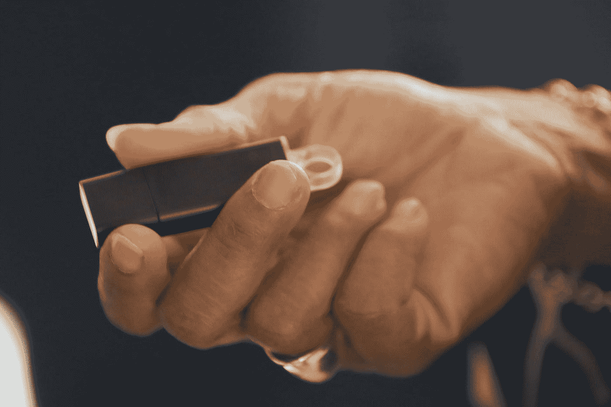
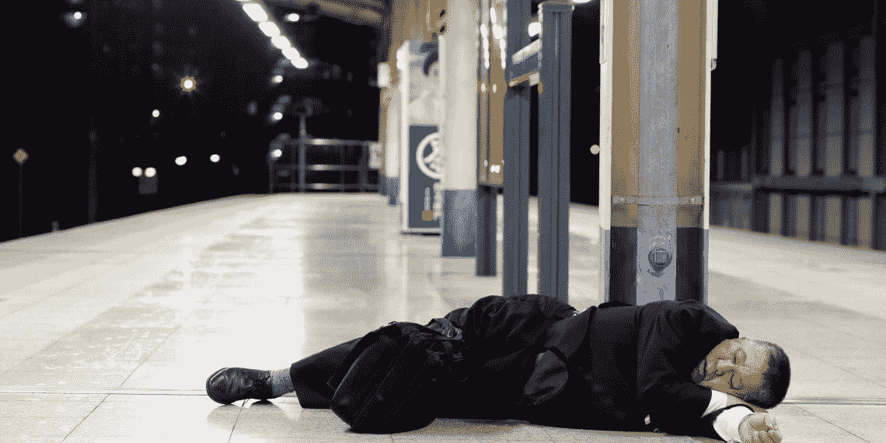

# 你上次烂醉如泥是什么时候？

> 原文：<https://medium.com/coinmonks/when-was-the-last-time-you-were-dead-drunk-d83101146dac?source=collection_archive---------60----------------------->

Apparently drinking till you collapse is a common sight in Japan.

偶尔我会读到一些非常有趣的标题，这就是黄金。

这周过得不好吗？

让我们看看你的一周是不是很糟糕，因为这个日本工薪族因为难以置信的醉酒而丢失了整个城市的关键信息。

这位不愿透露姓名的 40 多岁男子周二去大阪府工业城市尼崎市的一家当地餐馆喝酒时，把这个 u 盘放在了包里。据当地媒体报道，在喝了几个小时的酒后，这位 IT 工作者在街上睡着了，当他醒来时，装有闪存盘的包已经不见了。

哦，顺便说一句，对于日本的工薪阶层来说，在工作日的晚上大量饮酒是非常普遍的。

报告显示好像有人从他那里拿走了。

似乎忽略了他在工作之夜喝得烂醉的事实。

原来是他放错了地方。

我很惊讶他醒来后竟然还记得自己丢了包。

“虽然闪存盘被加密了，但它包含了 465，177 名 Amagasaki 居民的个人数据，包括他们的出生日期、地址、银行账号和纳税详情。他的公司 BIPROGY 受雇于该市政府，调查该市谁有资格享受免税。

That USB drive contained the personal details of Amagasaki’s entire population.

至少他费心加密了 u 盘。

我真的很想知道他是怎么找到包的！

结果是，他原路返回，模糊地回忆起把自己的包留在了一栋公寓大楼里，那是他在醉酒昏迷时随机经过的。

拜托，真的吗？

他的记忆力很好，即使他在几个小时的狂饮后已经烂醉如泥。

另外，那个日本城市有多安全？

一个随机的家伙把他的包放在无人看管的地方几个小时，甚至几天，没有人会去碰它或者偷它？

你真的要把它给日本人和他们的文化。

社会是安全的，有教养的，也是如此规规矩矩的。

话又说回来，在繁忙的工作日，喝到醉倒在大街上被认为是“正常”的。

我简直无法理解那件事。

这让我想起了多年前我在东京的一段时间。

我曾经看到一个喝醉的工薪族，穿着全套西装，手里拿着一个皮包，在路上睡得很香。

是的，不是在路边，而是在路上，汽车小心翼翼地绕过他的身体。

警察来了，非常耐心和理解，轻轻地推他，叫他醒来。

For a first world city well known for its cleanliness and tidiness, this is a bizarre sight on the streets.

这肯定是一个奇怪的景象。

我很确定如果是在美国，他会被吼起来并被逮捕。

不管怎样，网络安全可不是闹着玩的。

国家、城市、政府、公司和个人都注意到保护他们的数字信息是多么重要。

在这个世界上，我们所有的个人和公司信息越来越多地被放到云上，网络安全不能被视为理所当然。

网络安全就像保险和避孕套，你宁愿拥有它而不需要它，然后需要它而不拥有它。

=)

-

-

# startups # business # startupx # growth # success # social media # culture # entrepreneur # strategy # eth #比特币#加密货币# bayc # NFT # getrich # airdrop # branding # master card # line # revolution # web 3

> 交易新手？试试[加密交易机器人](/coinmonks/crypto-trading-bot-c2ffce8acb2a)或者[复制交易](/coinmonks/top-10-crypto-copy-trading-platforms-for-beginners-d0c37c7d698c)