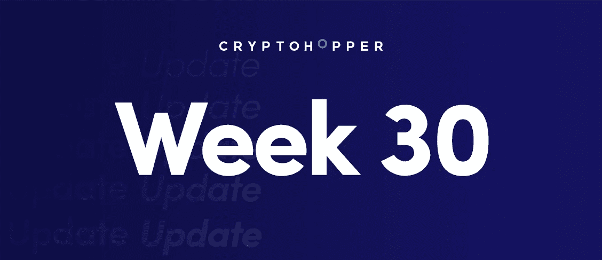
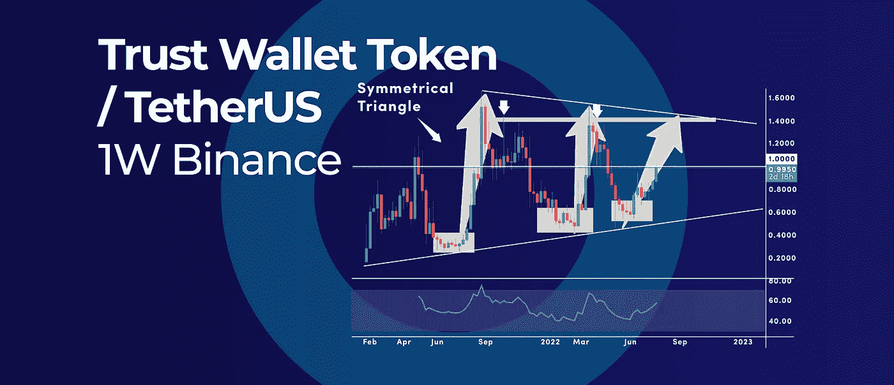

# 比特币何时会创下历史新高？|以及本周加密更新中的更多内容。

> 原文：<https://medium.com/coinmonks/when-will-bitcoin-see-a-new-all-time-high-and-more-in-this-weeks-crypto-update-6f1a0d747ddb?source=collection_archive---------29----------------------->

When will Bitcoin See a New All-Time High?

*   分散的艾略特波浪周期有一个未完成的 3 波回调
*   信任钱包令牌多年三角模式呼吁 1.4 美元的目标
*   比特币何时会创下历史新高？我们什么时候能看到熊市的结束？

## 分散的艾略特波浪周期有一个未完成的 3 波回调

Decentraland Elliot Wave Cycle Has an Unfinished 3-Wave Pullback

分散地(MANA)长期艾略特波浪周期有一个未完成的 3 波回调，需要在下一轮牛市之前完成。简单地说，艾略特波浪周期是在趋势方向上的五浪运动中运行，然后是与趋势相反的三浪运动。

## 什么是分散地(法力)？

分散之地是一个运行在以太坊区块链上的分散虚拟世界。世界是由被称为“分散应用程序”(dapps)的地块组成的。这些 dapps 可以是从游戏到社交网络的任何东西。分散之地由法力令牌驱动，用来购买土地和其他虚拟物品。分散的埃利奥特波浪周期有一个未完成的 3 波回调，这表明法力的价格在未来很可能继续上涨。

## 艾略特波浪分析

从长期来看，MANA 处于五波牛市周期中，目前从 2021 年 11 月峰值的回调看起来只是第四波的修正。通常，第 4 波是在第 3 波中展开的逆势运动。

浪 4 的第一段“a”可以被称为在 0.59 美元的低点完成。第四波的 b 波可能正在进行中。在 1.50 美元附近——这是一个前所未有的高点，第二波“b”可以找到阻力，最后一波“c”的价格可能会转低，以完成第四波的 3 波回调。

2018 年 4 月的峰值是另一个主要的周期性高点，这是在我们在第四波触底之前成为强支撑位的绝佳候选。然而，由于在 Elliott Wave 分析中，第 4 波从未与第 1 波重叠，我们可以预计下一个较低的法力腿将落在 2018 年峰值以上的某个地方。

## 什么是艾略特波浪分析？

艾略特波浪是技术分析的一种形式，用来预测未来的市场运动。它基于市场循环运动的思想，每个循环有两波。第一波是上升趋势，第二波是下降趋势。艾略特波浪理论被用来识别这些趋势，并预测市场下一步的走向。

## RSI 振荡器

此外，每周 RSI 已经跌破 50 的中间水平，这通常发生在第四波价格回调时。因此，一旦周线 RSI 突破 50 中位，我们可以使用这个信号来完成第四波。

从短期来看，1.00 美元的心理水平是多头关注的第一个重要水平。

## 信任钱包令牌多年三角模式呼吁 1.4 美元的目标

Trust Wallet Token Multi-Year Triangle Pattern Calls for $1.4 Target

自诞生以来，信托钱包令牌(TWT)进入了一个漫长的巩固期，形成了一个对称的三角形。多年对称三角形形态现在要求重新测试 1.4 美元附近的上方阻力位。

## 什么是信任钱包令牌？

信任钱包令牌是一种基于区块链技术的新型加密货币。它的创建是为了提供一种更安全、更高效的交易方式。Trust Wallet Token 团队由来自各个领域(包括金融、法律和营销)的经验丰富的专业人士组成。他们计划使用令牌为加密货币用户创建一个更高效、更友好的生态系统。

## 对称三角形图案

这种多年基础模式有可能在未来几个月继续推动价格走势，除非我们在对称三角形的任何一边都获得明确突破。首先，台湾电信的价格在 0.30 美元附近建立了一个基础，随后是一个强大的上升趋势，在 1.65 美元达到顶峰。

随后的抛售将 TWT 的价格推至 0.45 美元附近，形成了另一个基础，我们再次从这个基础上反弹，但价格未能达到之前的高点。TWT 再次突破 1.40 美元，跌至 0.55 美元，形成另一个基础。

短期来看，我们已经离开了底部，如果同样的模式再次重复，当前的反弹可能会跌破之前的主要高点——2022 年 3 月的高点 1.40 美元。

每周突破并收盘于 1.00 美元的心理水平之上有可能巩固看涨的情况。

## 对称三角形图案是如何工作的？

对称三角形模式是一种用来识别潜在趋势变化的交易模式。当三个密码的价格以对称的三角形模式移动时，就形成了这个模式。在模式中移动的第一个项目将为后面的其他两个项目奠定基础。一旦其他两个项目中的一个开始移动，它将导致第三个项目的价格也发生变化。这个过程一直持续到其中一个项目脱离三角形模式，开始向不同的方向移动。

## RSI 振荡器

周线 RSI 也已经突破 50 中级以上；这个信号出现的前两次，我们有两次强有力的反弹。只要周线 RSI 继续打印积极的动力读数，多头就占据上风。

## 比特币何时会创下历史新高？我们什么时候能看到熊市的结束？

When will Bitcoin See a New All-Time High? And when can we see an end to the Bear Market?

在撰写本文时，比特币的(BTC)价格比其历史高点低 51.42%，整个加密市场一直在缓慢下滑。因此，现在有很多不确定性，许多投资者现在都在问这个恶性熊市何时结束，我们将看到一个新的历史高点。

## 隐秘的熊市周期

之前的加密市场周期可以帮助我们粗略估计当前的熊市趋势何时结束的可能性最大，以及新的牛市何时开始。例如，上一次加密货币熊市持续了大约 2.5 年，因为在 2.5 年后，我们有了一个新的高价。

从 2021 年 11 月的峰值算起，两年半的时间将我们带到 2024 年 3 月，这可能是宣布熊市结束的时间。这意味着，我们可以预计届时将创下历史新高。下一次减半事件预计将发生在 2024 年 5 月左右，这与过去的周期一致。

## 比特币减半周期

从长期来看，比特币似乎遵循 4 年周期，也称为比特币的 4 年减半周期。在每次减半活动中，每个区块授予矿工的比特币数量减半。经济学最基本的概念之一是，如果某种东西的供给受到限制，而对它的需求保持不变或增加，那么它的价格就会上涨。

这也是每次减半事件后比特币价格往往会恢复的主要原因之一。例如，在 2020 年 5 月的第三次减半事件后，比特币结束了熊市，随后呈抛物线走势。

如果历史再次重演，比特币继续遵循其 4 年减半周期，下一轮抛物线牛市最早可能在 2024 年发生。

**底线:**如果数字是正确的，熊市可能在 2024 年 3 月结束，那么仍然有交易和盈利的方法。我们已经写了一篇博客，告诉你如何做到这一点。你可以看看下面的博客。

## 加密货币熊市:聪明投资者的策略

自诞生以来的十年里，加密货币市场经历了几次牛市和熊市。精明的投资者利用这两个周期来优化他们的投资组合，而不是让他们的情绪和直觉来指导他们的投资。在本文中，我们回顾了精明的投资者在加密货币熊市周期中使用的关键策略。

[在此阅读博客](https://www.cryptohopper.com/blog/6787-cryptocurrency-bear-market-strategies-of-a-smart-investor)。

订阅我们的媒体每周博客和更新。
在[推特](https://twitter.com/cryptohopper) | [脸书](https://www.facebook.com/cryptohopper)|[Reddit](https://www.reddit.com/r/CryptoHopper/)|[insta gram](https://www.instagram.com/cryptohopper/?hl=nl)上关注我们

在 [Cryptohopper](https://www.cryptohopper.com/) 开始交易！

> 交易新手？试试[加密交易机器人](/coinmonks/crypto-trading-bot-c2ffce8acb2a)或者[复制交易](/coinmonks/top-10-crypto-copy-trading-platforms-for-beginners-d0c37c7d698c)