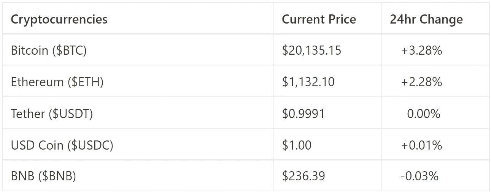
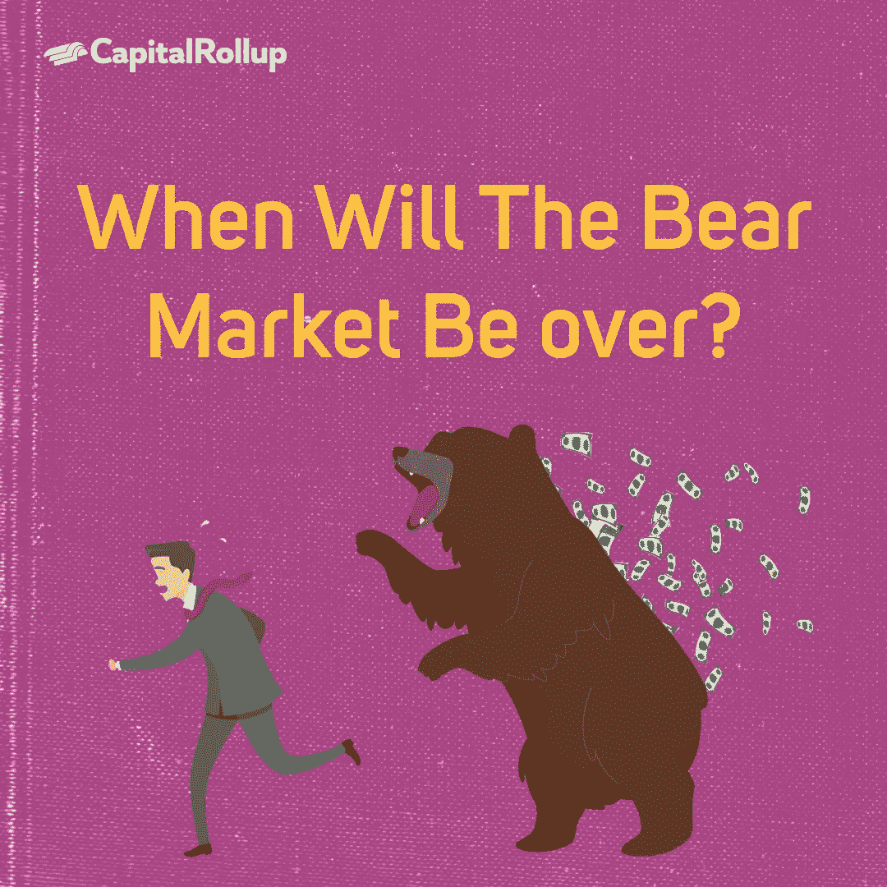

# 熊市何时结束？

> 原文：<https://medium.com/coinmonks/when-will-the-bear-market-be-over-e0aa60ba51?source=collection_archive---------26----------------------->

欢迎来到最新一期的 CapitalRollup Digest！今天的文摘是 7 月 6 日的，大约需要 5 分钟。我们马上开始。

*   今天的市场看起来怎么样？(前 5/10 大流行加密货币)

Price Market Update

# 熊市何时结束？

经过几天的加密价格上涨，总市值超过 1 万亿美元，价格回落，BTC 回到 20，000 美元以下，ETH 在 1000 美元左右。一个问题继续萦绕在加密投资者的脑海中，熊市何时结束？

今天，我们将尝试讨论秘密熊市，什么导致了它们，以及它们何时结束。

> 交易新手？试试[密码交易机器人](/coinmonks/crypto-trading-bot-c2ffce8acb2a)或者[复制交易](/coinmonks/top-10-crypto-copy-trading-platforms-for-beginners-d0c37c7d698c)

## 首先，什么是熊市？

根据 Investopedia 的说法，熊市是指市场经历长时间的价格下跌。它通常描述在普遍悲观和负面投资者情绪的影响下，证券和大宗商品价格从近期高点下跌 20%或更多的情况。熊市是指证券或商品的价值持续下跌的市场状况。**相反，当资产在一段时间内稳步上升时，就是“牛市”

虽然该定义主要用于描述股票市场等传统资产，但它也适用于加密货币等资产类别。

根据上述定义，这意味着自 2021 年第四季度以来，我们一直处于一个隐秘的熊市，当时美元 BTC 的价格从 68，000 美元的历史高点下跌，目前位于 20，000 美元以下。

2022 年，比特币下跌了 35%，以太币下跌了 43%，其他一些硬币下跌了 90%，而一些硬币已经完全从市场上消失了。

需要注意的是，熊市可能持续数年，也可能只持续几周。

## 我们经历过多少次隐秘的熊市？

根据熊市的定义，在比特币存在的过程中，总共有 4 次加密熊市

第一次熊市发生在 2012 年 1 月 11 日——2012 年 7 月 11 日，比特币从 7.08 美元的峰值跌至 4 美元，价格跌幅达 40%。第二次熊市也发生在 2012 年 8 月至 12 月之间，当时比特币的价值下跌了 37%，从 13.35 美元跌至 8.4 美元。

从 2013 年 11 月到 2015 年 1 月，第三次秘密熊市持续了 415 天，BTC 美元价格从 1194 美元的峰值跌至 197.24 美元的低点，在此过程中损失了 83%以上的价值。

持续了一整年的 2018 年第四次加密熊市仍然被投资者称为最糟糕的一次，因为价格从之前的历史高点 19，114 美元跌至 3，252 美元，损失了 80%以上的价值，而以太坊则从 1，396 美元跌至 86 美元。

第四次熊市也导致了许多 crypto 和 web3 公司的死亡。

## **2022 年的熊市何时结束？**

正如我们所见，不管持续多久，每一次熊市总会结束。现在的问题是当前的危机何时会结束。

尽管目前加密资产的价值有所下降，但仍有迹象表明这不是结束，价格仍可能比当前价值下降 15%至 20%。这意味着，如上所述，我们可能会看到 15000 美元的比特币。BTC 价格已经从高点下跌了近 75%，预计还会再跌 10%至 15%。

这可能意味着需要一段时间才能看到比特币、以太坊和其他加密资产在 2021 年达到历史最高水平，或者从目前的价值增加 50%。

然而，有一些积极因素，尽管正在经历的市场条件表明，加密肯定不会消亡，如；

*   当前活跃的比特币钱包
*   购买首枚比特币的钱包数量增加
*   接受加密支付的公司和
*   主要持有者对比特币的持续购买。-

## **关闭**

没有人真正知道牛市何时会回来，然而，各种猜测继续预测，我们可能会在年底前走出当前的周期。

总体而言，熊市导致投资收益和利润的巨大损失，但它们需要防止加密膨胀。此外，新的参与者也加入进来，这提高了采用和需求。

如果你正在寻找如何在熊市期间投资，我们写了一些可能会有帮助的东西。在这里勾选 [**。**](/@hi_capitalrollup.com/crypto-bear-market-should-i-hodl-or-sell-my-coins-6d58cb6e7f)

# 琐事🤔

**熊市期间投资者应该做什么？**

A.和他们的财务顾问谈谈。

B.评估他们的风险承受能力

C.考虑市场下跌带来的机会。

D.以上都有。

在下一期的 CapitalRollup Digest 中找到答案。😉

**最后一个小问题的答案是 a .)它不受政府或组织控制**

# 每日一词！

💡**看跌还是看跌**

看跌与看涨正好相反。它是一种资产价格会下跌的信念。说一个交易员“看跌股票”意味着他们认为股票价格会下跌。

**用在句子中的术语:**
*——当投资价格下跌时出现的* ***熊市*** *行情称为下跌趋势。*

*   **社区更新📢**

我们与 3 位行业领袖组织了一次 Twitter 空间会议，我们在会上讨论了“分享您的熊市经验& CeDeFi 内爆”，您可以在这里[收听](https://twitter.com/i/spaces/1YpKkZzakbNxj?s=20)

# 我们今天在读什么📰

我们正处于熊市吗？以下是如何辨别。 [***阅读更多***](https://finance.yahoo.com/news/bear-market-heres-tell-124000322.html?guccounter=1&guce_referrer=aHR0cHM6Ly93d3cuZ29vZ2xlLmNvbS8&guce_referrer_sig=AQAAAHZLgME3nD9voZJrdQVCATBW6KB9fDHQGc24yyv_h3eFN5iwRp-HeFiprn3_AoOWDsodzkk2ToLrq9HXiGD_1aTuccXO2QV_FEOdXJwFyzlaxHz7nDRXx44Jd-5FlwY5GAaRQGyKSGPUidsa3VaB4SQ6teSo06Gg3XOpPMsdAJuR)

**熊市:定义、持续时间、如何投资**。 [***阅读更多***](https://www.businessinsider.com/personal-finance/what-is-a-bear-market?r=US&IR=T)

## **与朋友一起学习和投资加密💰**

当您邀请您的朋友开始使用 CapitalRollup 进行有利可图的投资时，您将获得独特的奖励。

💬对 CapitalRollup Digest 有什么反馈吗？ [**告诉我们！**](mailto:hi@capitalrollup.com)