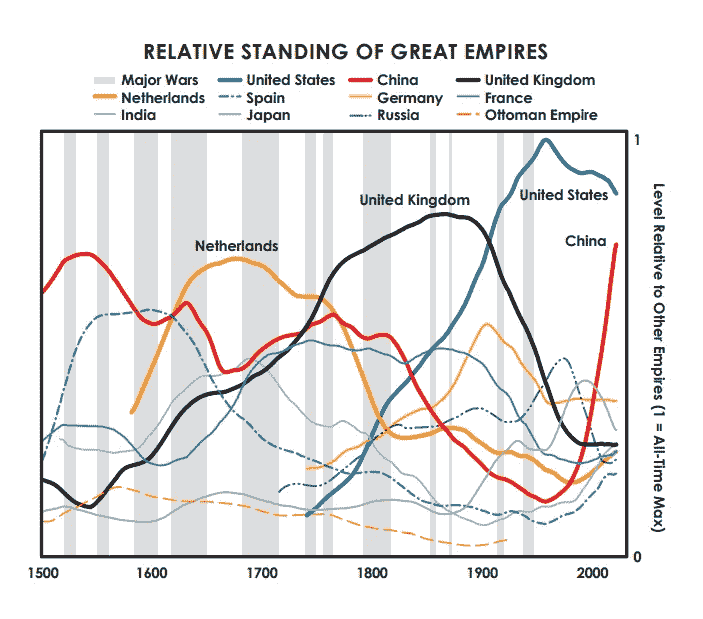
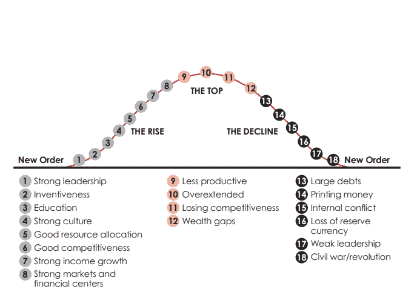
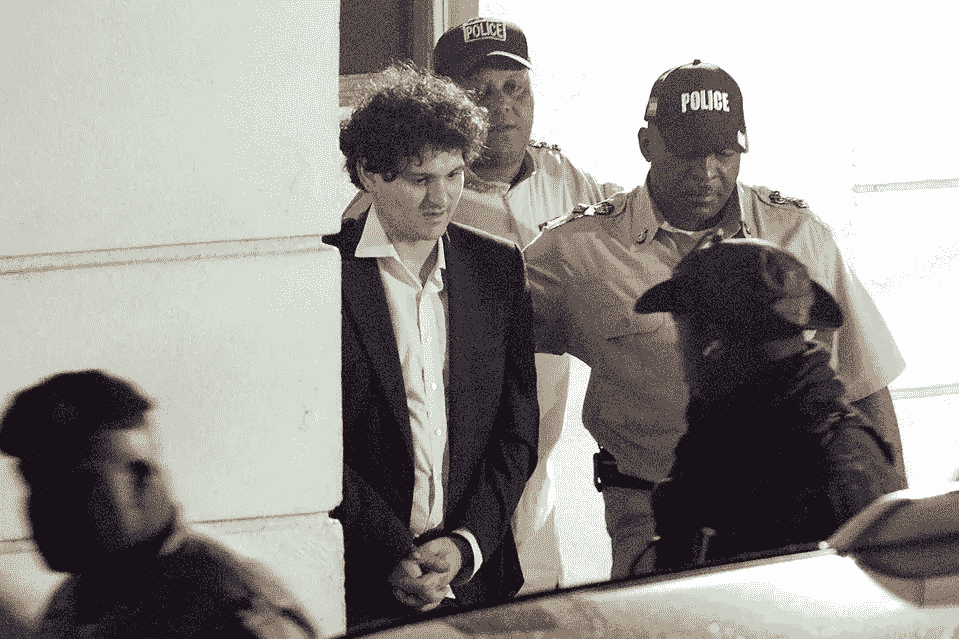
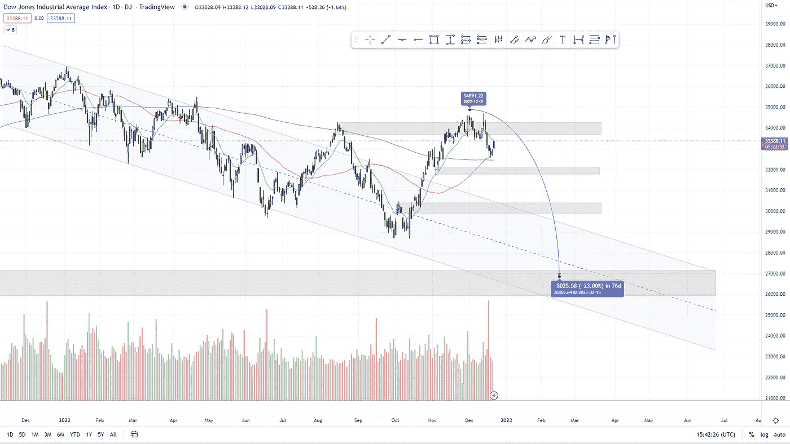
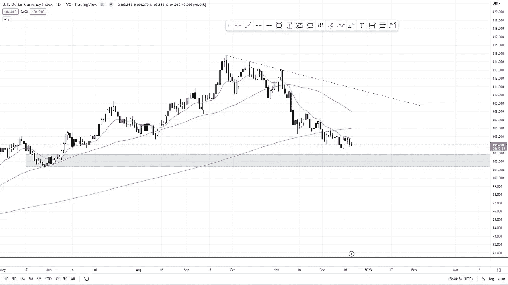
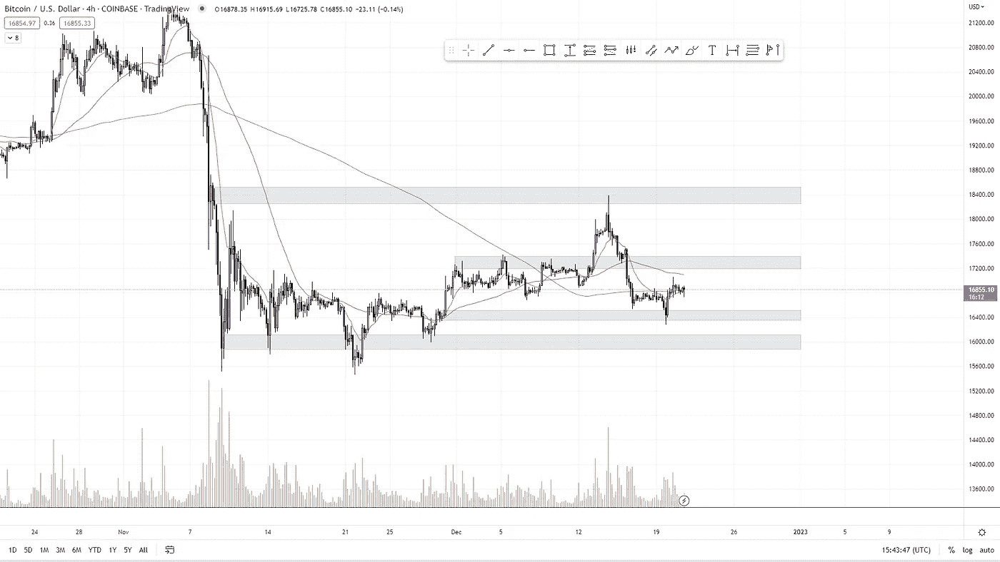

# 什么时候会发生大的变化？

> 原文：<https://medium.com/coinmonks/when-will-the-big-changes-occur-d24b5a892fb1?source=collection_archive---------59----------------------->

www.boomish.org

# 在本周的报告中

*   我们都知道，全球结构的巨大变化将会发生，而且必须发生。但是这些变化是什么样的呢？我们什么时候能期待他们？
*   FTX 前首席执行官山姆·班克曼·弗里德的被捕标志着加密货币市场即将发生的许多变化中的第一个。
*   **US30** 价格分析。
*   **美元**价格分析
*   **BTC** 价格分析。

‍

# 巨大的变化就在前方，但是什么时候会发生呢？

‍

我们中的许多人都会同意巨大的变化即将来临。全球环境的建立方式可能会极大地影响未来，尤其是西方。与这些周期相关的一个有趣的视角是**雷伊·达里奥**在他的书*“应对不断变化的世界秩序的原则”*中提出的理论和观察。

‍

每个王国都会灭亡。每个帝国都会灭亡。每个国家都垮台了/每个垄断都垮台了。或者至少，从历史上看，这些规则没有例外。

‍

在接下来的分析中，我将把王国、国家、世界强国和帝国称为帝国。

‍

一些符合大帝国通常衰落的时事如下。

# 大帝国的历史循环

‍

历史上，这个世界见证了许多帝国的兴衰。有些保留到了今天，有些已经完全消失了，比如希腊和罗马帝国。这些帝国留下了遗产，但在某些时候，作为世界强国，它们已经消失了。

‍

然而，其他帝国，如中华帝国，在公元前 200 年以前的许多世纪里一直是世界的主导力量。，并且至今仍是主导力量。尽管它有起有落，但它的下一个高潮似乎比以往任何时候都更近了。

‍

下面的图 1 显示了三个最大的世界帝国的相对实力。在过去的 500 年中，三个最具统治地位的帝国是荷兰、英国和美国。

‍

美国的力量目前正在衰落，而相比之下，中华帝国比以往任何时候都更接近成为世界上最强大的力量，如果他们还没有实现的话。

‍

每当一个帝国或国家成为‘世界强国’或最强大最有影响力的国家时，它往往会为世界持有储备货币。

‍

今天，这就是美元，但似乎我们离改变越来越近了。

‍

俄罗斯和中国目前正在准备一种新的黄金支持的货币，此举旨在取代美元作为世界主要储备货币的地位。

‍

在西方，我们看到了一种应对的感觉，许多专家站出来说，“任何这样的货币都不太可能实现这个目标”，“专家保证美元是当今‘最安全’的货币”

*All Credits: Ray Dalio*

# 帝国的循环

‍

我请求你快速看一下下面的图 2，研究一下历史上观察到的周期，把美国和西方放在列表的某个地方。

‍

尽管我不喜欢这么说，但我们正处于急剧下滑阶段，并正看到衰退阶段的许多特征。只有一部分是负债累累，印钞，内部冲突，领导不力。

‍

可以说，我们正目睹储备货币的流失。谁知道呢，一场革命可能即将来临。

‍

这并不意味着散播恐惧，而是确保周期和帝国的事实被展示给你们。

*All Credits: Ray Dalio*

‍

# 山姆·班克曼·弗里德的被捕标志着变革

‍

倒闭的 FTX 加密货币交易所的创始人萨姆·班克曼·弗里德在巴哈马被捕。

‍

警方称，30 岁的班克曼-弗里德因违反美国和巴哈马法律的“金融犯罪”被捕。

‍

据报道，班克曼-弗里德重新考虑了他早先反对引渡的决定，预计将于 12 月 19 日在巴哈马出庭，寻求撤销原判。

‍

通过同意引渡，他将能够在美国法院出庭。如果罪名成立，他可能会被判入狱 115 年。

‍

*图 4 萨姆·班克曼-弗里德在巴哈马被捕*

‍

# 美国 30 号公路/ DJIA

‍

股票市场在 12 月 1 日达到最高点，在 12 月 13 日 FOMC 反应期间达到顶峰。

‍

虽然这个峰值仅仅是一个灯芯，并没有看到任何后续通过。

‍

总体思路还是和前几周一样。包括 32000 点和 30000 点在内的许多支撑区域都可以看到反弹。

‍

尽管从全球经济形势来看，低点应该最终会被打破。最终目标 26000–26500。

‍

*图 2 DJIA 1D 12 月—12 月(交易视图)*

‍

# ‍DXY

‍

尽管股市自见顶以来出现了相对不错的暴跌，但美元仍持续疲软。

‍

我们可能会看到一个反转，真正的支撑位在 102 点，然后缓慢下降。这确实给股市带来了一个问题。如果尽管股市波动，DXY 指数没有表现出上涨或下跌，那么一旦它追上来，就会迅速追上去。

‍

如果 DXY 渴望反弹，股市将会出现大规模抛售。投资者和交易者应该记住这一点。

‍

*图 3 1D DXY 5-12 月(交易视图)*

# 比特币

‍

就像股票市场一样，FOMC 反应泵在 18400 点左右的高点。

‍

比特币在 16400 找到了立足点，多头目前必须通过翻转 17400 的阻力来证明其实力。

‍

如果比特币在 16400 点失去立足点，那么我们将看到 15500 至 16000 点低点的快速重新测试。

‍

*图 4 1D 比特币 1-11 月(交易视图)*

> 交易新手？尝试[加密交易机器人](/coinmonks/crypto-trading-bot-c2ffce8acb2a)或[复制交易](/coinmonks/top-10-crypto-copy-trading-platforms-for-beginners-d0c37c7d698c)
> 
> 多样化的密码持有，了解[币安替代品](https://coincodecap.com/binance-alternatives)
> 
> 加入 Coinmonks [电报频道](https://t.me/coincodecap)和 [Youtube 频道](https://www.youtube.com/c/coinmonks/videos)获取每日[加密新闻](http://coincodecap.com/)

# 另外，阅读

*   [复制交易](/coinmonks/top-10-crypto-copy-trading-platforms-for-beginners-d0c37c7d698c) | [加密税务软件](/coinmonks/crypto-tax-software-ed4b4810e338)
*   [网格交易](https://coincodecap.com/grid-trading) | [加密硬件钱包](/coinmonks/the-best-cryptocurrency-hardware-wallets-of-2020-e28b1c124069)
*   [密码电报信号](/coinmonks/top-3-telegram-channels-for-crypto-traders-in-2021-8385f4411ff4) | [密码交易机器人](/coinmonks/crypto-trading-bot-c2ffce8acb2a)
*   [最佳加密交易所](/coinmonks/crypto-exchange-dd2f9d6f3769) | [印度最佳加密交易所](/coinmonks/bitcoin-exchange-in-india-7f1fe79715c9)
*   开发人员的最佳加密 API
*   最佳[密码借贷平台](/coinmonks/top-5-crypto-lending-platforms-in-2020-that-you-need-to-know-a1b675cec3fa)
*   [免费加密信号](/coinmonks/free-crypto-signals-48b25e61a8da) | [加密交易机器人](/coinmonks/crypto-trading-bot-c2ffce8acb2a)
*   [杠杆代币](/coinmonks/leveraged-token-3f5257808b22)终极指南