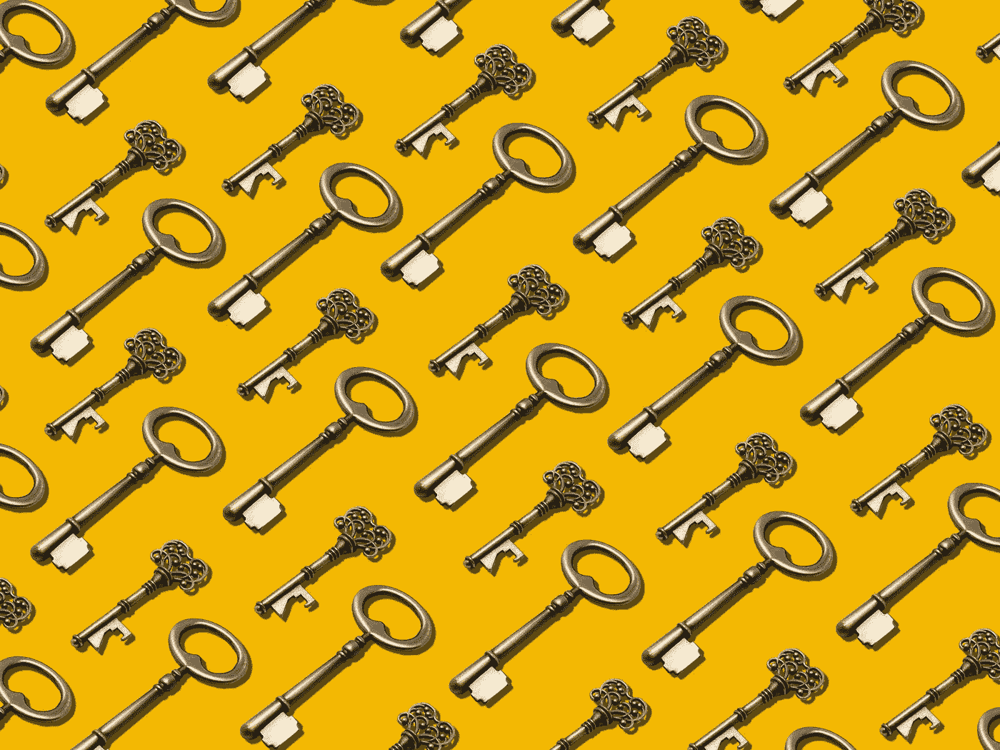

# 我们什么时候才能学会

> 原文：<https://medium.com/coinmonks/when-will-we-learn-6b68522a936a?source=collection_archive---------47----------------------->

> 不是你的钥匙，不是你的密码

who has your keys? hopefully only your hardware wallet

一个经常被重复的短语。为什么“不是你的钥匙，不是你的密码”被几乎所有在这个领域工作了一年多的人如此频繁地提及？

如果你能够承受一年以上的涨跌，那么你很可能已经看到多个交易所和软件钱包遭到黑客攻击。如果你的密码在交易所，你就在乞求失去你的密码。

在安全实践方面，托管多种加密货币的软件钱包与交易所没有什么不同。所有这些在线服务都被称为“热门”钱包，这是有道理的。他们不断连接到该公司的中央服务器，这些服务器 99%的时间由亚马逊的 a.w.s .或谷歌的托管平台托管。通常这些服务会声称他们不持有你的私人钥匙，但正如我们看到的索拉纳的一个钱包被黑客攻击，这根本不是真的。solana 的钱包犯了一个严重的“错误”,将私钥以纯文本的形式存储在他们的服务器上。他们为什么要把钥匙放在第一位？我是说，你难道看不透他们的谎言吗？所有人都在撒谎。

这些黑客，这些安全漏洞，这些服务是故意在他们的系统中留下漏洞。这不仅仅是一个假设，因为在加密货币的过去 12 年里，这种情况似乎一直在发生。想象一下，你是其中一家公司的开发者，你看到所有的财富都涌入你的服务。需要一个特别的人在他们的公司内推广好的安全准则而不被解雇。他们不在乎你的隐私。他们做的是不择手段赚钱的生意。

通常，而且几乎总是，这些黑客来自内部来源。这意味着他们不是黑客。他们正在剥削他们的客户，因为当消费者太愚蠢、太不方便使用硬件(冷)钱包时，拒绝数百万或数十亿美元是多么困难。

如果你一定要使用软件钱包和交换，最好用它只转移加密回到你的硬件钱包。如果你能买得起密码，你就能买得起硬件钱包。

请不要再愚蠢和没教养了。

只要消费者继续依赖 20 岁年轻人和天生贪婪的个人开发的应用程序，这种情况就永远不会停止。

你需要自学，把你的密码保存在一个有空隙的硬件设备中。气隙是指设备必须插上电源才能使用。使用硬件钱包是目前最好的保存密码的方式。一旦你在你的硬件钱包上设置了地址，由于区块链技术的工作方式，无论设备在线或离线，你仍然可以直接发送加密到你的硬件钱包。所有这些设备所做的就是在其中存储你的私人密钥，通常由一个 pin 来保护，并且能够设置额外的安全措施。

见鬼，你可以把你的硬件钱包放在银行金库的保险箱里，如果你知道你的密码的公共地址，你仍然可以把密码发送到里面。

看在上帝的份上，让我们知道这些黑客，这些软件应用，这些交流永远不会改变。生存下来，做对自己最有利的事情，这是人类与生俱来的天性。当你有能力窃取数十亿美元而不被抓住时，你通常会把别人当成替罪羊。

特雷索。莱杰。这是我唯一推荐的两个硬件钱包。请直接从制造商那里购买一次。除非你希望你的密码突然消失，否则不要从亚马逊订购。

也就是说，比特币是地球上最有价值的资产。像这样保护它。

把血氧饱和度叠加。安全地。

**n̷x̷s̷**