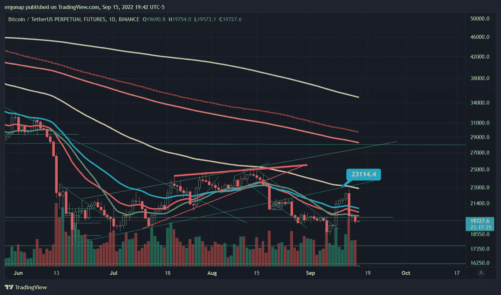
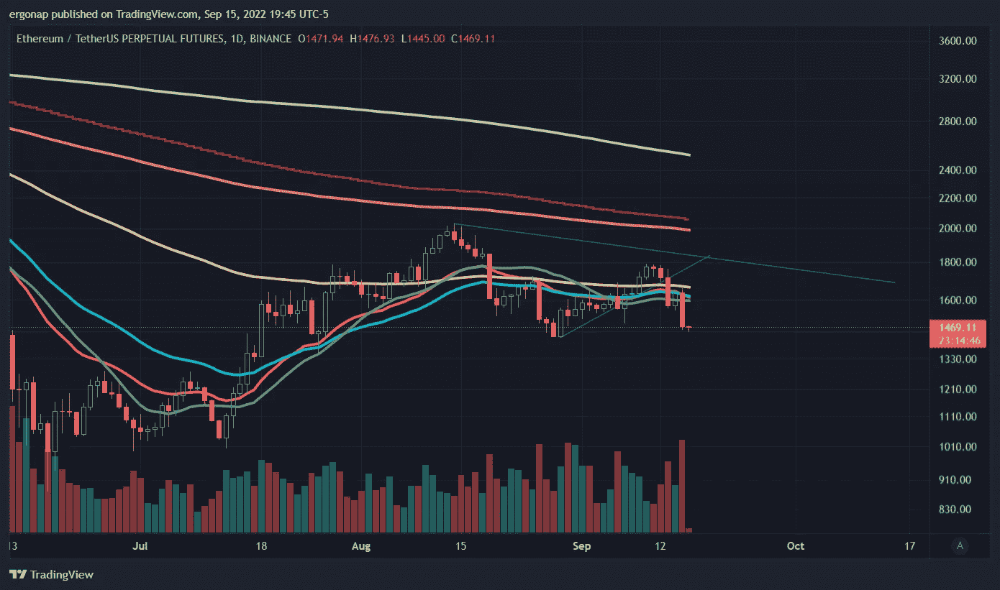
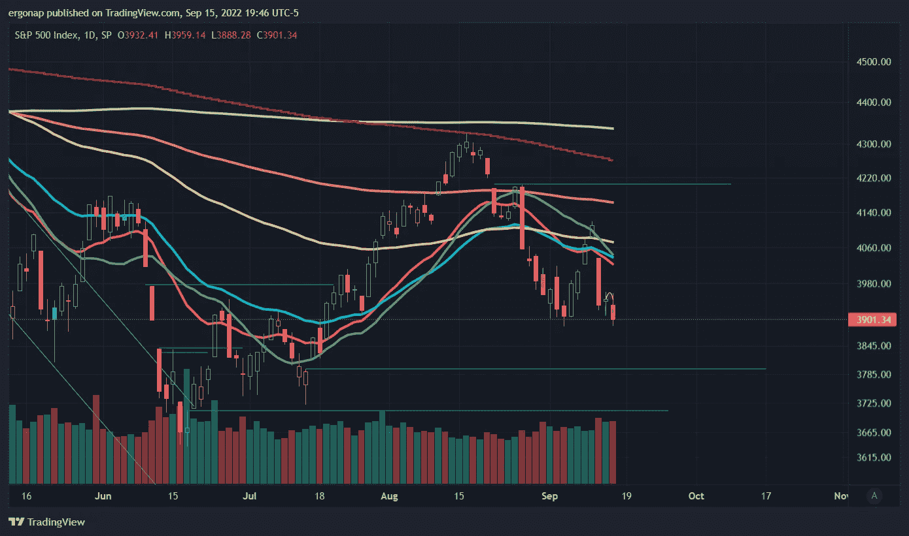
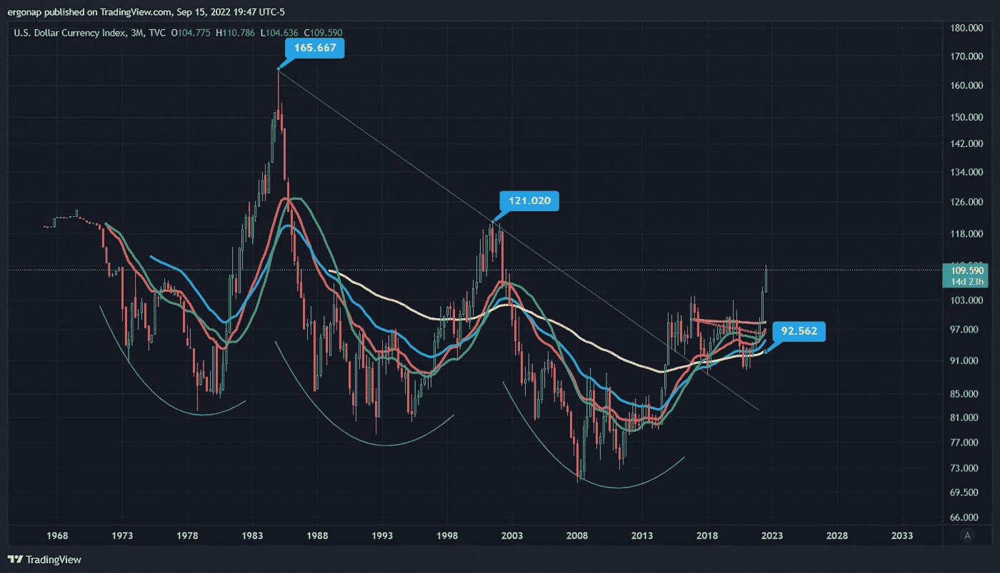

# 我们去哪里？当然是向下。

> 原文：<https://medium.com/coinmonks/where-do-we-go-down-of-course-dfd08c845a89?source=collection_archive---------22----------------------->

## 加密货币市场/比特币市场分析 9/15

所以，我们的大通道趋势得到了证实。除此之外什么都没变，真的。

[https://www.tradingview.com/x/mLp5u6eS/](https://www.tradingview.com/x/mLp5u6eS/)

CPI 略看跌，PPI 看跌，四重巫术是明天。看起来人们在几天前抛售了近 10 亿美元的 BTC 股票，自 8 月以来抛售了 50 多亿美元。

一切都表明，基本上加密是有流动性危机。人们没有意识到整个 hodl 模型是为了给 crypto 增加流动性，但 crypto 无论如何都是反对流动性的(burns，回购，通缩指标)。

惊喜:不起作用。不出所料，合并后的$ETH 是熊市。数字下降。

[https://www.tradingview.com/x/L81rcJuA/](https://www.tradingview.com/x/L81rcJuA/)

即使是短期的$SPX 看起来也准备测试 3600 ish，大约再下降 10%——对于 crypto 应该是 30%+。

[https://www.tradingview.com/x/ExMQmwfi/](https://www.tradingview.com/x/ExMQmwfi/)

没什么好说的，都是老一套。任何刺激都是短暂的，真正的衰退很可能会在 2023 年第四季度或第一季度到来。$DXY 继续月球，因为咄。

based on this, the real top was basically 4/2021 for all markets, but explain what happened later in 2021 too. [https://www.tradingview.com/x/jpFfPcd2/](https://www.tradingview.com/x/jpFfPcd2/)

这种$DXY 意味着我们可能有几年的时间来纠正这种情况。即使是短期的调整也只是确认了看涨，除非我们回到 4/2021(Btc 峰值)的水平，这看起来一点也不太可能。

> 交易新手？试试[加密交易机器人](/coinmonks/crypto-trading-bot-c2ffce8acb2a)或者[复制交易](/coinmonks/top-10-crypto-copy-trading-platforms-for-beginners-d0c37c7d698c)