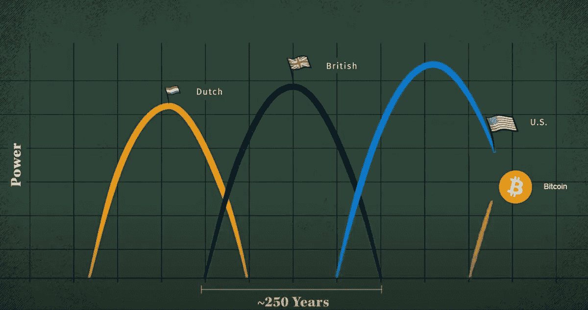
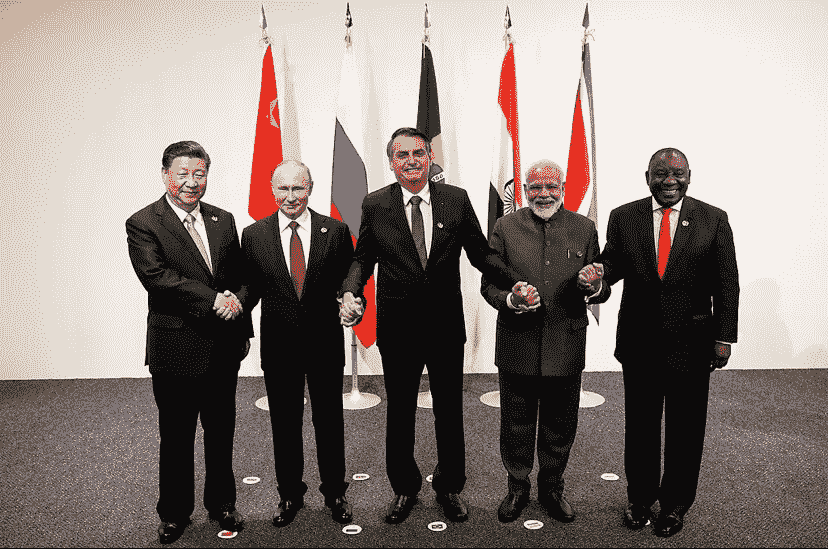
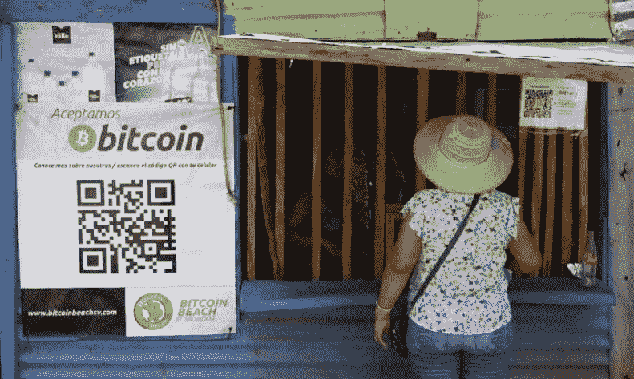

# 比特币在成为世界储备货币的路上何去何从？

> 原文：<https://medium.com/coinmonks/where-is-bitcoin-on-its-way-to-becoming-a-worlds-reserve-currency-12e1571de65d?source=collection_archive---------20----------------------->

[Source](https://twitter.com/WClementeIII/status/1529860427886256135/photo/1)

# 地缘政治秩序的变化及其对央行储备的影响。

2 月 24 日俄罗斯入侵乌克兰后不久，我写了这篇文章。我花了一些时间来出版，因为我正忙着完成其他作品。

比特币是完美的储备资产，正因为如此，它为包括民族国家在内的任何人提供了采用比特币的机会，比如稳定本国货币或建立主权国家储备。最晚从 Saifadean 的书“[比特币标准](https://www.amazon.de/-/en/Saifedean-Ammous/dp/1119473861)”开始，比特币社区就已经意识到了这一点。人们是否认为国家采用比特币对比特币的成功很重要并不重要。民族国家正在采用比特币，因为它具有优越的货币属性。

在详细介绍比特币之前，我想回顾一下全球储备货币美元的历史。我将专注于美元如何成为全球储备货币，这对我们的货币体系以及最终对比特币及其成为数字世界储备货币的旅程意味着什么。

**美元如何成为世界主要货币**

1944 年 6 月 1 日至 22 日，就在第二次世界大战结束前，由美国领导的 44 个盟国在新罕布什尔州的布雷顿森林开会。美国及其盟友的意图是为国际货币体系建立规则，这导致了布雷顿森林协定。到第二次世界大战结束时，美国持有世界上大约四分之三的黄金供应，因此，一个纯金本位制已经过时。相反，美国提议所有盟国的货币都应该与美元挂钩。反过来，美元又与黄金价格挂钩。美元的价值被固定在一盎司黄金的 1/35。会议确立了美元作为世界储备货币，取代了纯粹的金本位制。这就是众所周知的布雷顿森林协议。这个想法是给各国更多的灵活性，而不是严格遵守金本位，同时提供比无标准货币体系更少的波动性，并建立美国作为中央货币当局([federalreservehistory.org](https://www.federalreservehistory.org/essays/bretton-woods-created))。

随着美元成为黄金的替代品，美元相对于其他货币开始升值。这给美国政府带来了问题，美国政府有兴趣向其盟友和世界其他国家出口商品和服务，这些商品和服务变得昂贵，因此没有吸引力。美国在外国军事项目上也花了太多钱，特别是在越南。金本位意味着美联储创造美元的能力有限。到 1970 年，美国用光了黄金来支撑其外汇储备，并面临严重的流动性危机。

**《尼克松休克》**

1971 年 8 月 15 日，尼克松总统宣布美国将结束美元与黄金的可兑换性，实际上结束了布雷顿森林协定，使美元成为[法定货币](https://en.wikipedia.org/wiki/Fiat_money)。
“尼克松冲击”开启了一个新时代,各国央行开始运行一个基于法定货币的体系，实行浮动汇率，没有货币标准。

**石油美元体系**

当尼克松宣布美元不能再兑换黄金时，美国不得不寻找另一种方式来创造对美元的需求，因为美国希望确保美元仍然是全球储备货币，以便能够继续控制全球货币体系。这导致了 1973 年石油美元体系的诞生，美国和世界最大的石油出口国沙特阿拉伯同意用美元固定油价。这意味着任何从沙特政府购买石油的国家都必须在交易完成前将其货币兑换成美元。作为回报，美国向沙特阿拉伯提供了安全保证。

*US President Richard Nixon meets with Saudi King Faisal bin Abdul-Aziz al Saud in Jeddah, Saudi Arabia after signing a landmark agreement with the Arab kingdom (June 15, 1974;* [Source](https://www.faimission.org/wire/special-report-unpegging-the-petrodollar))

这促使其余的石油输出国组织(石油输出国组织)国家以美元为其石油定价，并纷纷效仿。这 13 个成员国约占全球石油产量的 44%，世界已知石油储量的 81.5%。“petro”这个词代表石油。尽管布雷顿森林协定结束了，石油美元体系使得美元仍然是世界储备货币。石油美元是许多石油输出国组织成员国和其他石油出口国的主要收入来源。他们通常用出售石油获得的多余美元购买美国国债，由于美国政府作为债务人违约的概率较低，美国国债被认为是经风险调整后的最佳储钱方式。对美国国债的需求是美国政府最重要的流动性来源之一，而它在世界范围内作为价值储存手段的使用也是美元至今仍是全球储备货币的原因之一。

**地缘政治的变化:中国**

最近，全球经济力量的平衡已经从美国和欧洲转移到中国和其他几个快速发展的国家。中国将自己定位为发展中国家(特别是非洲)基础设施项目的主要双边开发贷款人，并可以建立国际经济机构和融资安排，旨在长期取代现有的美国领导的机构([国会研究服务，2022](https://sgp.fas.org/crs/misc/IF10676.pdf) )。今年 10 月，有传言称金砖四国(巴西、俄罗斯、印度、中国和南非)正致力于建立一种共同货币，与美元竞争世界主要储备货币的地位。

Meeting of the heads of state of the BRIC countries in 2019 ([Source](https://en.m.wikipedia.org/wiki/BRICS#/media/File%3AInformal_meeting_of_the_BRICS_during_the_2019_G20_Osaka_summit.jpg))

一个新的地缘政治时代

在 2022 年 2 月 24 日入侵乌克兰后，俄罗斯在国际社会中失宠，并受到大规模制裁。2022 年 2 月 26 日，美国总统拜登宣布查封俄罗斯中央银行总额 6300 亿美元的外汇储备([欧盟委员会，2022](https://ec.europa.eu/commission/presscorner/detail/en/STATEMENT_22_1423) )。这个决定预示着一个新的地缘政治时代的到来。这是有史以来将美元体系武器化的最激进举措，将破坏美元作为全球储备货币的性质，因为这可能促使其他外国势力出售其美国国债，因为它们担心美国政府未来可能出于政治原因冻结其储备。仅中国就持有超过 1 万亿美元的美元储备。是以美元( [Lyn Alden，2022](https://www.lynalden.com/march-2022-newsletter/) )持有外汇储备最多的国家。

各国央行可能会重新考虑其储备做法，转而将更多的黄金作为储备资产，同时也可能专注于维持更多的工业和农业大宗商品库存。实际上在该国管辖范围内的稀缺商品不能被制裁或冻结。

**比特币**

美国政府并没有忽视这一变化。2022 年 3 月 2 日，美联储主席杰罗姆·鲍威尔(Jerome Powell)公开表示，存在多种储备货币的空间，包括加密货币( [Brooke，O. 2022](https://coingape.com/just-in-fed-chairman-says-theres-room-for-multiple-reserve-currencies/) )。

比特币的相关属性使其成为理想的储备资产。供应是有限的。永远不会超过 2100 万。它易于携带，可分割，耐用，可替换，抗审查，非保管。央行可以建立自己的冷钱包(离线存储加密货币的设备)，保护自己的比特币免受制裁威胁。这是为数字时代专门建造的货币——无许可、开源、声音和全球化。比特币易于购买、存储和出售。流动性高，可全天候交易。这是数字黄金。这些特征使其成为央行的理想资产，因为储备旨在让央行有能力不惜一切代价捍卫货币([麦克勒朗，2022](https://www.omfif.org/2022/03/freezing-foreign-exchange-reserves-opens-door-for-central-banks-to-buy-bitcoin/) )。

**领养**

我们已经看到一些小国将比特币作为储备资产。2021 年 9 月，萨尔瓦多成为首个让比特币成为法定货币的国家([bbc.com](https://www.bbc.com/news/world-latin-america-60135552#:~:text=In%20September%2C%20El%20Salvador%20became,the%20impoverished%20Latin%20American%20country.))。不久后，总统纳伊布·布克莱表示，他的国家以平均 30，744 美元的价格购买了 500 枚比特币作为储备资产。从那以后，这个国家已经[进行了无数次比特币购买](https://www.bloomberg.com/news/articles/2022-07-01/el-salvador-buys-more-bitcoin-despite-57-loss-and-a-debt-crisis#:~:text=The%20government%20bought%2080%20Bitcoins,Bloomberg%20based%20on%20Bukele's%20tweets.)。中非共和国是第二个在 2022 年 4 月将比特币作为法定货币的国家( [Hoije，Goko，2022](https://www.bloomberg.com/news/articles/2022-04-28/bitcoin-is-declared-a-legal-currency-in-central-african-republic-l2isppnb) )。对于像萨尔瓦多这样没有官方货币的发展中国家来说，采用比特币比大国更容易，因为现有的货币体系几乎不需要做什么改变。然而，一旦更大的民族国家理解了比特币的用途，它们也采用比特币将是一个时间问题，尽管这一过程将更加复杂。

Bitcoin Beach in El Salvador ([Source](https://www.google.de/amp/s/www.marketplace.org/shows/marketplace-tech/el-salvador-citizens-mostly-avoid-bitcoin-despite-government-adoption/)).

**未来采用**

例如，美国需要找到支撑美元的东西。他们不太可能用黄金来支撑美元。这将正中俄罗斯和中国的下怀，它们的黄金储备要大得多。正如卢克·米基奇所解释的那样，这让美国“背水一战”。“人们对美元的信心正在丧失，他们肯定希望保持自己的全球储备货币地位。美国上一次处于类似的脆弱境地是在上世纪 70 年代的高通胀时期。在 1973 年美国政府通过与沙特阿拉伯的石油美元协议将美元与石油挂钩之前，美元似乎会贬值。如今，美国也面临着类似的难题，但变数不同。他们不再有用黄金支持美元的选择。”

**结论**

综上所述，可以假设美元将失去其作为全球主要储备货币的唯一地位。将会有其他竞争性储备货币，如人民币，由与中国有密切经济联系的国家使用。这将伴随着将黄金和其他大宗商品作为央行储备的转变，尤其是在东方，但随着比特币越来越多地被接受为数字价值储存手段，央行很可能会将其加入储备。银行存款几乎完全由数字管理。电子货币是当今最常用的货币形式。各国央行也将持有数字储备资产，这是合乎逻辑的。这很有可能是比特币。当然，没有什么是确定的，但综合起来看，比特币作为一种稀缺的数字价值储存手段，似乎是不可战胜的。

黄金无法与比特币竞争。比特币是更好的价值储存手段。
绝对稀缺的数字原生无记名资产，没有交易对手风险，无法膨胀，易于运输，最终在数字时代击败黄金。把实物黄金放在自己的金库里，让外国势力很难冻结它，也很难转移它。比特币可以以光速发送到世界上的任何地方，几乎不需要任何成本。比特币成为世界储备货币的可能性很大。这一事件的转折点可能是比特币被用作能源产品贸易的全球记账单位。当石油、天然气、电力都用比特币定价时，比特币一定会取代美元成为世界储备货币([格雷格·福斯](https://rockstarinnercircle.com/wp-content/uploads/2021/04/Why-Every-Fixed-Income-Investor-Needs-To-Consider-Bitcoin-As-Portfolio-Insurance.pdf)，2021；第 27 页)。[我认为这是可能的，因为在不久的将来，通过财政激励，比特币采矿将成为我们能源市场不可或缺的一部分](https://armantheparman.com/hbue/)。历史上第一次，我们有了电力的全球买家:[比特币矿工](https://twitter.com/JMellerud/status/1545118209682071552?s=20&t=ss9r0wNwEB7nCBgp8yL2Sg)。全球能源资产所有者现在可以选择出售给两个能源买家:电网，或比特币能源市场，因此能源可能会在某个时候以比特币定价。

如果你喜欢这篇文章，你可以在 [Twitter](https://twitter.com/leonamschel) 上关注我，访问我的[主页](http://www.asystemofrules.org/)或者给我发一些 sat:【law@getalby.com】T4