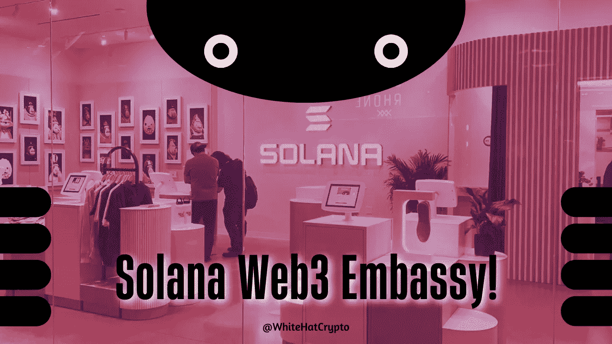

# 索拉纳的 Web3 大使馆到底在哪里！？

> 原文：<https://medium.com/coinmonks/where-the-hell-is-solanas-web3-embassy-cc021ea4b353?source=collection_archive---------44----------------------->

索拉纳正计划开设真实世界零售店& Web3 大使馆！

Solana Web3 Embassy!

随着汤姆·布拉迪、史蒂夫·青木、史努比·道格和埃隆·马斯克等名人的加入，加密公司和网络 3 品牌已经慢慢渗透到流行社会。

像以太坊 NFT 线无聊猿游艇俱乐部这样的品牌甚至已经扩展到“IRL”项目和企业，包括一家位于洛杉矶的无聊猿主题餐厅。

索拉纳最近透露了开发和销售自己的[安卓智能手机](https://decrypt.co/103707/why-solana-mobile-smartphone)的雄心，看起来也重视走实体路线。

在纽约市，一家索拉纳主题商店即将开张。这家名为 Solana Spaces 的新店位于 Hudson Yards，是与 Solana 基金会合作开设的，该基金会是 Solana 区块链网络的幕后支持者。

“在(商店)里面，你将了解索拉纳是如何工作的，Web3 是什么。Solana Spaces 本月早些时候在推特上写道:“我们将为你准备一个钱包和你的第一个 NFTs，并指导你完成你的第一次网上交易。它接着说，该地区打算成为索拉纳的“文化中心”和“大使馆”。

除了 NFT 和幻影钱包教程，该地区还将展出互动艺术品，以及许多索拉纳品牌的商品，包括特别版 Blanksoles 运动鞋。

上周末，Solana Spaces 向 30 人的有限团队敞开了大门，让他们在正式亮相之前对这家商店进行体验。

尽管这家商店还没有正式开业，但它已经在社交媒体上引起了极大的兴奋，路人做了记录，并通过 Twitter 上传了商店的图片。

Solana 的 native coin SOL 目前是市值第九大的加密公司，近年来，它一直是更昂贵的以太坊区块链的一个很好的替代选择，用于交易 NFT 和使用去中心化的应用程序。

这篇文章中提供的内容不是赞助的，据我所知是正确的。这篇文章不是金融建议，我们不对针对这篇文章采取的任何行动负责！

请随时查看我们的社交平台，了解每日加密更新，或通过以下渠道联系我们:

[YouTube](https://www.youtube.com/channel/UCjfinzatswbVaRd89zn5kJQ/featured)

[推特](https://twitter.com/whitehatcrypto)

[Instagram](https://instagram.com/white.hatcrypto?igshid=YmMyMTA2M2Y=)

[Gmail](http://cryptowhitehat@gmail.com/)

信息来源:解密

> 交易新手？试试[加密交易机器人](/coinmonks/crypto-trading-bot-c2ffce8acb2a)或者[复制交易](/coinmonks/top-10-crypto-copy-trading-platforms-for-beginners-d0c37c7d698c)