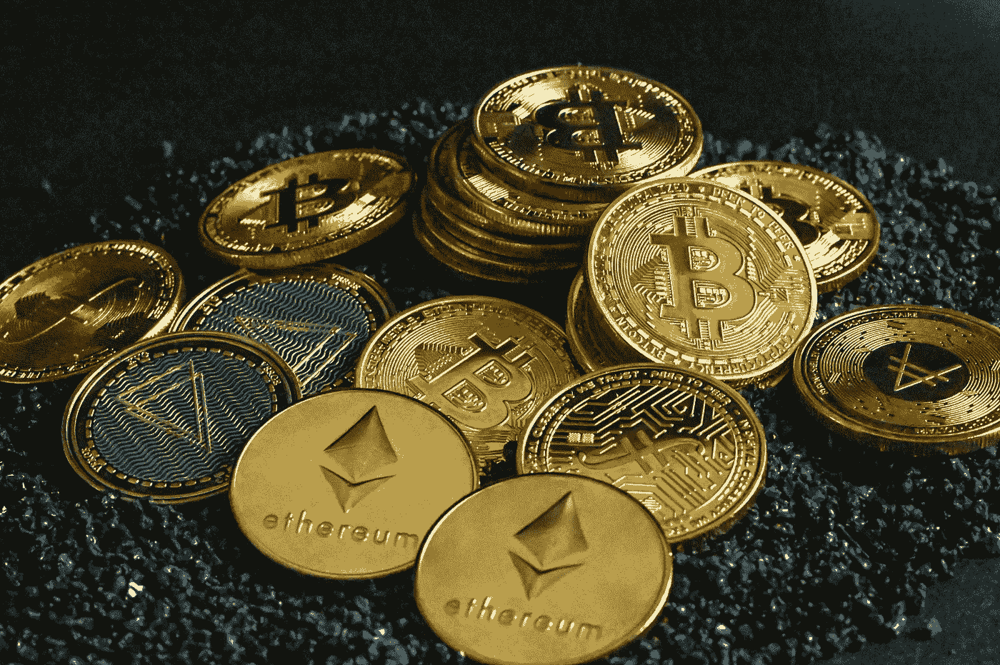
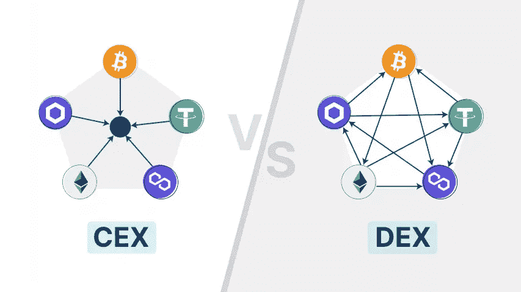

# 在哪里购买替代硬币和要记住的因素！

> 原文：<https://medium.com/coinmonks/where-to-buy-altcoins-and-factors-to-have-in-mind-1a0b23b09456?source=collection_archive---------65----------------------->

Source: [https://unsplash.com/@quantitatives](https://unsplash.com/@quantitatives)

就像比特币一样，你可以在交易所购买替代币，由于现有的替代币有成千上万种，所以不是所有的交易所都提供所有的替代币。

因此，选择一个能提供你感兴趣的大部分或全部硬币的交易所是非常重要的。有几家交易所提供大多数即将到来的加密货币。但你想买的硬币越不为人知，你就越有可能不得不寻找另一个兑换点。

当然，您可以使用多个交换，但是您需要记住您的登录凭证并保证它们的安全。

简而言之，哪里是购买代用币的最佳地点，这个问题没有统一的答案。如今有很多交易所和不同的购买 altcoins 的方式，各有利弊。

# 需要考虑的因素

**安全**

安全性是一个基本特征，当搜索一个交易所时，我们应该确保该交易所提供许多安全特征。这是很重要的，这样你的资金保持安全，不被他人窃取。例如，一个重要的功能是双因素身份认证。

**流动性**

市场流动性越强，就越稳定。由于流动性更高，交易者更多，订单的完成速度要比流动性低的交易所快得多。在流动性低的市场上交易可能更难完成你的买入/卖出订单。你可以很容易地在 CoinMarketCap 上查看交易所的流动性。可以看看 24 小时成交量，交换分数。

**可用性**

根据您使用 exchange 平台的频率，它应该尽可能对用户友好。有些交换比其他的更容易使用。身份验证的简单性、用户界面和客户服务对于选择正确的交易所都很重要。

**限制**

根据您居住的地方，某些交换可能会在您所在的地区受到限制。例如，如果你生活在一个特定的国家，一些交易所不可用或者不允许你交易。在选择一家交易所时要考虑到这一点。

**名声**

这可以被认为是所有其他特征的总结。交易所的声誉好吗？试着用谷歌搜索一下你的交易评论，看看其他人有什么样的经历。

# 交易所的类型

Source: [learn.eqonex.com](https://learn.eqonex.com/news/centralized-exchanges-cexs-vs-decentralized-exchanges-dexs)

## 集中交易所——CEX

你可以把 CEX 想象成一个类似于证券交易所的地方，但它是针对数字资产的。集中式交易所大规模协调加密货币交易，他们充当买方和卖方的中间人，通过佣金和交易费赚钱。它们本质上是一个市场，在这里你可以找到所有在交易所上市并准备交易的硬币。

集中交易很容易使用，数百万人使用它们进行各种交易。不利方面，由于他们是一个中央集权的组织，他们会控制你的资金。

一些最常用和众所周知的集中交易所是:[比特币基地](https://coinbase.com/join/abreu_a9p)、[币安](https://www.binance.com/pt-BR/activity/referral-entry/CPA?fromActivityPage=true&ref=CPA_00UDIAC9OB)、[库币](https://www.kucoin.com/ucenter/signup?rcode=r3T4PZU)和[Crypto.com](https://crypto.com/app/h4kqnw9up8)

## 分散交易所——DEX

它们是点对点市场，加密货币交易商在其中直接进行交易，无需中间人。分散式交易所允许用户通过与交易平台背后的智能合约进行交互，直接从钱包中进行交易。交易者是他们资金的所有者，如果他们犯了错误，如丢失了私人钥匙或把资金发送到错误的地址，他们要对资金的损失负责。

dex 取消了对监管和授权在特定交易所内进行的交易的要求。

一些最常用和最著名的分散式交换有: [Uniswap](https://uniswap.org/) 、 [PancakeSwap](https://pancakeswap.finance/) 和 [1inch](https://app.1inch.io/#/1/swap/ETH/DAI)

*我不提供个人投资建议，也不是合格的持牌投资顾问。以上信息都不是财务建议。我不会也不可能对你因在此阅读的任何内容而采取的任何行动负责。*

> 交易新手？尝试[加密交易机器人](/coinmonks/crypto-trading-bot-c2ffce8acb2a)或[复制交易](/coinmonks/top-10-crypto-copy-trading-platforms-for-beginners-d0c37c7d698c)