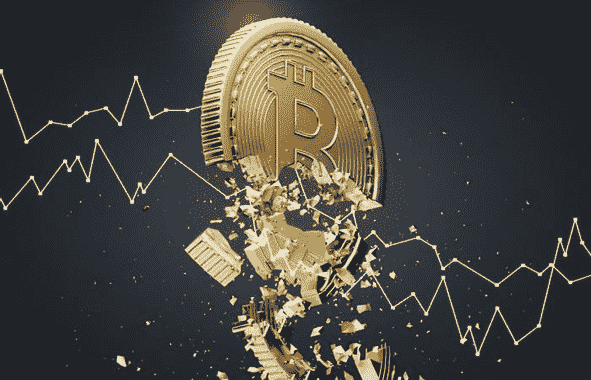

# 根据欧洲央行的数据，我们对比特币的态度如何

> 原文：<https://medium.com/coinmonks/where-we-stand-with-bitcoin-according-to-ecb-9bbb4c84e0cf?source=collection_archive---------35----------------------->

今天早些时候，欧洲中央银行(ECB)在他们的博客上发布了一篇观点文章，“比特币的最后立场”。说作者不相信比特币显然是一种轻描淡写:

“比特币的价值在 2021 年 11 月达到 69000 美元的峰值，到 2022 年 6 月中旬跌至 17000 美元。此后，价值在 2 万美元左右波动。对于比特币的支持者来说，表面上的稳定标志着通往新高度的道路上的喘息。**然而，更有可能的是，这是通往无关紧要之路**之前人为诱导的最后一搏——这在 FTX 破产并导致比特币价格远低于 16000 美元之前就已经可以预见。”

两位作者认为，监管机构不应将比特币合法化，原因有三:

*   比特币不适合作为支付系统。
*   比特币不适合作为一种投资形式。
*   比特币系统是一个前所未有的污染者。

我想依次对每一点作简短的评论。

# 作为支付系统的比特币

作者写道，“比特币交易繁琐、缓慢且昂贵。”

从技术上讲，作者在这一点上是正确的。但现在的现实是，只有极少数比特币持有者使用 BTC 进行日常支付。一般持有人会把他们的 BTC 放在钱包里作为长期储蓄账户。

随着时间的推移，这种情况可能会随着所谓的第 2 层解决方案的出现而改变，在第 2 层解决方案中，节点可以立即验证大量的微交易。要了解更多信息，我强烈推荐阅读[林恩·奥尔登对照明网络](https://www.lynalden.com/lightning-network/)的深入剖析。

# 作为投资的比特币

两位作者写道，“比特币的市场估值纯粹是基于投机”。原因是比特币“不产生现金流(像房地产)或股息(像股票)，不能被有效利用(像商品)或提供社会福利(像黄金)。”

总的来说，[我认为把比特币和加密](/coinmonks/crypto-as-the-hopium-of-the-people-f4875a437031)放在一起是错误的，因为作者在他们的博客文章中毫不留情地这么做了。虽然比特币与法定货币竞争，但大多数(如果不是所有的话)其他加密货币更类似于上市公司的股票。

比特币和几乎所有其他加密货币项目的主要区别在于，比特币背后没有法人可以提起索赔。比特币网络是高度分散的，分布在成千上万张纸币中。这反过来又使比特币高度安全，不会被重复消费，就像钞票被水印防伪一样。

从理论的角度来看，[比特币符合“货币测试的六大特性](https://www.newton.co/blog/bitcoin-6-properties)”——这意味着比特币适合作为一种货币。

# 比特币是前所未有的污染者

比特币比银行业或圣诞灯污染更少。争论实际上可以归结为我们是否承认比特币的潜在价值是货币。此外，越来越多的比特币开采是利用廉价的可再生能源进行的——这是应该的。如果你对这一点有强烈的感觉，我强烈建议你看看 Nic Carter 的“[对白宫关于秘密采矿](/@nic__carter/comments-on-the-white-house-report-on-the-climate-implications-of-crypto-mining-8d65d30ec942)的气候影响报告的评论”

# 全部的

很明显,《比特币最后的立场》的作者只把比特币视为对他们职业的威胁。他们没有对[比特币白皮书](https://bitcoin.org/bitcoin.pdf)进行任何有意义的引用，也没有对反对的观点给予任何考虑。我们需要的不是苛刻的判断，而是公开的对话，以确保技术机会不会被浪费。

> 交易新手？尝试[加密交易机器人](/coinmonks/crypto-trading-bot-c2ffce8acb2a)或[复制交易](/coinmonks/top-10-crypto-copy-trading-platforms-for-beginners-d0c37c7d698c)