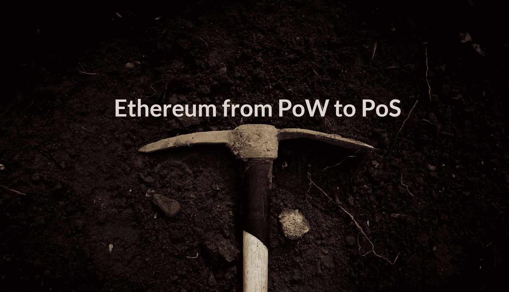

# 合并到 PoS 后以太坊矿工将何去何从？看一看可开采的 ERC20s

> 原文：<https://medium.com/coinmonks/where-will-ethereum-miners-go-after-the-merge-to-pos-a-look-at-pow-mineable-erc20s-ed069b88fdc8?source=collection_archive---------14----------------------->

## 以太坊开发者决定在新的日期推出合并，将以太坊从 PoW(工作证明)转换为 PoS(利益证明)。ETH 不能再开采后，矿工会开始铸造哪些加密货币？

# 从 PoW 到 PoS 合并

合并的新日期是 2022 年 9 月 19 日，以太坊(ETH)开发者计划从 PoW 转换到 PoS。这将导致 ETH-miners 失去盈利能力

## 其他硬币和令牌，以继续与您的 GPU 挖矿

矿工会去其他区块链开矿吗；比如以太坊经典(ETC)，DogeCoin (DOGE)，ZCash (ZEC)，Haven Protocol (XHV)，或者 Ravencoin (RVN)？GPU 矿工都有能力开始挖掘这些硬币，但那些仍然喜欢使用 ETH 的所有功能，不想切换到另一个区块链的 ETH 矿工怎么办？他们的答案可能是可开采的 ERC20 代币。

## 可开采的 ERC20 代币

可以在下面的文章中找到对可挖掘的 ERC20 令牌的介绍。什么是可开采的代币？

 [## 什么是可开采代币？

### 使用工作证明铸造 ERC20 代币作为以太坊上分散供应分配的方法

medium.com](/coinmonks/what-are-mineable-tokens-f290cb3215b2) 

以太坊和币安智能链上都有这些不同的可开采代币。它们以自己的方式独一无二，开采的难易程度也大相径庭。它们都与 CPU、GPU 和 FPGA 采矿单元兼容，以提高盈利能力。FPGAs 目前凭借这些可开采的令牌赢得了盈利能力竞赛，但是有些仍然是在足够低的难度下开始用你的 GPU 开采。

【https://0xbitcoin.org】0x 比特币(0x BTC)——[T5](https://0xbitcoin.org)

0xBTC 是第一个可开采的代币，也是铸造代币数量最多的代币(约 1000 万个 0xBTC)，因为 0xBitcoin 很快就会减半。由于几年来散列功率的长期增加，开采难度也是最高的( **15，436，867，380** )。

**比特柯尼索夫(BSOV)——**[**https://bsovtoken.com**](https://bsovtoken.com)

BSOV 是第二个可开采的象征，与通缩机制不同。大约铸造了 400 万 BSOV，由于长时间没有开采，难度为中低 **17，530，333** 。

**班克斯考因(BKC)——**[**https://班克斯考因. io**](https://bankscoin.io)

BKC 是一种高难度低供应量的代币，在撰写本文时只铸造了约 100 枚 BKC。BKC 的最大目标比任何其他代币/硬币都要高，并且有大约 2 天的长“封锁时间”来铸造 1 BKC。

> 交易新手？试试[加密交易机器人](/coinmonks/crypto-trading-bot-c2ffce8acb2a)或者[复制交易](/coinmonks/top-10-crypto-copy-trading-platforms-for-beginners-d0c37c7d698c)

【https://bnbitcoin.org】bn 比特币(bn BTC)——

**BNBTC 类似于 0xBTC，但部署在币安智能链上，允许更便宜的薄荷和访问其他 dApps。大约 500 万 BNBTC 已经被铸造，难度为 355，355，最大目标更低。**

**有关 mineable tokens 的更多更新，请在 Twitter[上关注 Mineable Tokens Alliance](https://twitter.com/MineableToken)，并随时为这个故事鼓掌，并在 Medium 上关注我们。**

> **加入 Coinmonks [电报频道](https://t.me/coincodecap)和 [Youtube 频道](https://www.youtube.com/c/coinmonks/videos)了解加密交易和投资**

# **另外，阅读**

*   **[投资印度的最佳密码](https://coincodecap.com/best-crypto-to-invest-in-india-in-2021)|[WazirX P2P](https://coincodecap.com/wazirx-p2p)|[Hi Dollar Review](https://coincodecap.com/hi-dollar-review)**
*   **[加拿大最佳加密交易机器人](https://coincodecap.com/5-best-crypto-trading-bots-in-canada) | [库币评论](https://coincodecap.com/kucoin-review)**
*   **[用于 Huobi 的加密交易信号](https://coincodecap.com/huobi-crypto-trading-signals) | [HitBTC 审查](/coinmonks/hitbtc-review-c5143c5d53c2)**
*   **[TraderWagon 回顾](https://coincodecap.com/traderwagon-review) | [北海巨妖 vs 双子星 vs BitYard](https://coincodecap.com/kraken-vs-gemini-vs-bityard)**
*   **[如何在 FTX 交易所交易期货](https://coincodecap.com/ftx-futures-trading)**