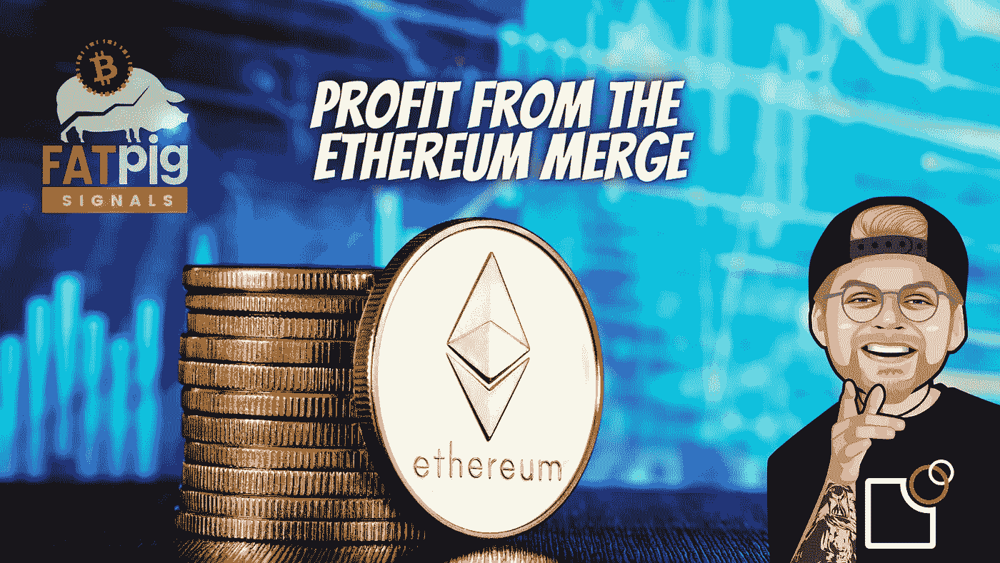

# 哪 3 个加密项目将从以太坊合并中受益最多？

> 原文：<https://medium.com/coinmonks/which-3-crypto-projects-will-benefit-the-most-from-the-ethereum-merge-15085ca02aac?source=collection_archive---------0----------------------->

在投资加密货币时，成功的关键往往是遵循当前的叙事。与之匹配的交易项目，大多是投资者最赚钱的策略。以太坊合并是 2022 年底加密领域最重要的叙事之一，所以今天， [**胖子信号**](http://fatpigisgnals.com) 和我介绍一些可以从以太坊中受益的项目…