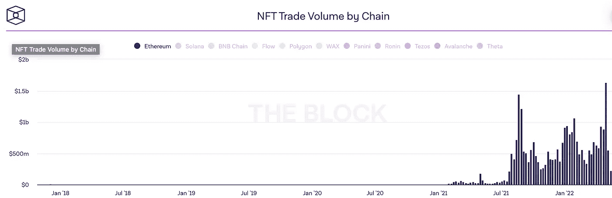
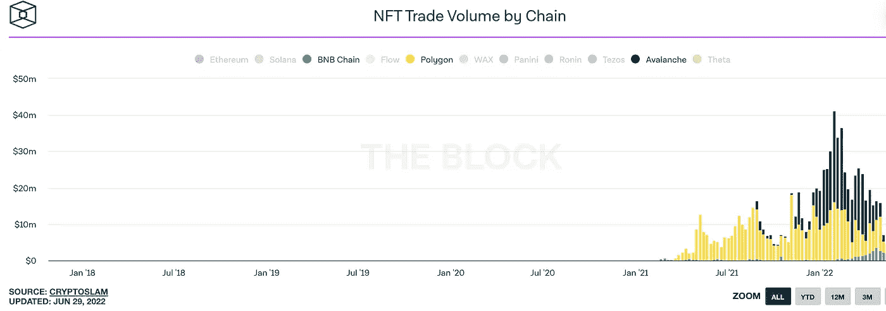
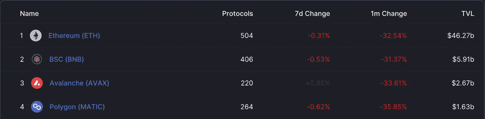

# 我的 Web3 项目应该选择哪个区块链

> 原文：<https://medium.com/coinmonks/which-blockchain-should-i-choose-for-my-web3-project-25b735617550?source=collection_archive---------22----------------------->

## 快速定性和定量比较。

当使用 Dappify 创建项目时，您可以选择想要选择的区块链。如果你从来没有在任何区块链上建立或启动过项目，这个决定可能是压倒性的。尤其是当你缺乏关于差异的信息时。通过阅读本文，您将了解区块链的属性以及每个链采用 NFT 的情况。

Photo by [William Warby](https://unsplash.com/@wwarby?utm_source=medium&utm_medium=referral) on [Unsplash](https://unsplash.com?utm_source=medium&utm_medium=referral)

# 技术差异

虽然技术信息非常重要，但当选择区块链来创建一个项目(例如 NFT 项目)时，它会缩小到交易成本、社区和采用。大多数用户只是希望有一个好的效益成本比，不太关心实现的细节。

区块链在各种技术属性上有所不同快速概述(不详尽):

*   交易速度(交易确认的速度)
*   交易成本(单笔交易支付多少汽油费)
*   共识机制(网络是否真正去中心化？它会影响交易速度，进而影响成本。)

# 以太坊

以太坊是 NFT、DAOs 和 DeFi 的区块链之王。这是最受欢迎的一种，我们将在后面的数据中看到。

它的重要性无疑来自于它是这个领域的第一名。以太坊负责从零开始建立核心技术，而其他区块链试图改善现有的实施。也就是说，以太坊与较新的区块链相比速度较慢，汽油费也较高。即使以太坊有它的缺点，以太坊 NFTs 的采用率仍然相当高，其他区块链没有达到。此外，值得一提的是，由于今年[ether eum 将从工作证明转变为利益证明，我们预计交易速度将会提高，而交易成本将会降低。](https://ethereum.org/en/upgrades/merge)

# 多边形

多边形是一个以太坊驱动的第二层区块链。第二层意味着它为现有的以太坊区块链提供侧链。

有三种不同类型的侧链，即

*   等离子链
*   ZK-汇总
*   乐观累计

与以太坊相比，这些多边形的组合允许更高的吞吐量和更低的交易成本。但是，Polygon 的优势伴随着一个警告，缺乏自主性，因为它是建立在以太坊之上的。如果以太坊平台经历了严重的破坏或者不复存在，那么多边形也会受到影响。

# 雪崩

它被认为是最快的区块链之一。它可以处理[4500 TPS](https://support.avax.network/en/articles/4136568-how-many-transactions-per-second-does-avalanche-support)(每秒事务数)。对于以太坊，这个数字是 14 TPS。一个有趣的事实是，Avalanche 由三个不同的链组成，C、P 和 x。智能合约、NFTs 和 DeFi 生活在 C 链上。

# BNB 链

BNB 连锁店有相当长的历史。币安在 2017 年推出了币安连锁店。这是一个只用于价值交易的区块链。不久之后，他们意识到他们需要启用智能合约来支持 NFTs 和更复杂的协议。所以他们推出了币安智能链。

> 交易新手？试试[密码交易机器人](/coinmonks/crypto-trading-bot-c2ffce8acb2a)或者[复制交易](/coinmonks/top-10-crypto-copy-trading-platforms-for-beginners-d0c37c7d698c)

2022 年初，币安宣布币安连锁和币安智能连锁将更名，成为 BNB 连锁的一部分。BNB 代表“建设和建设”。

概括来说，BNB 链包括:

1.  [BNB 灯塔链](https://docs.bnbchain.org/docs/learn/beaconIntro) *(原币安链)* — BNB 链治理(跑马圈地，投票)
2.  [BNB 智能链(BSC)](https://docs.bnbchain.org/docs/learn/intro) ( *前身为币安智能链)* —兼容 EVM、共识层，并通过集线器连接到多个链

这意味着 NFT 将在 BNB 智能链(BSC)内创建和转移。

# 分散

去中心化不是 Web3 内部的去中心化。几乎每个项目和生态系统都声称是分散的，但是分散有许多不同的层次。如果你想定量地比较它们，我们建议你看一下纳科莫托系数。

[https://nakaflow.io/](https://nakaflow.io/)

# 采用

我们将看三张不同的图表，让您对采用有所了解。

# NFT 数据

当我们检查数据(图 1 和图 2)时，我们可以清楚地看到以太坊是 NFT 交易量的赢家。它是 BNB 智能链的 100 多倍，大约是 Polygon 和 Avalanche 的 20-50 倍(参见左侧的比例)。同样，我们可以看到 Polygon 在相当长的一段时间内一直处于第二位，但自 2022 年初以来，Avalanche 的销量迅速增长，从 7 位数增长到 8 位数，迅速超过 Polygon。看看这种对雪崩的炒作能持续多久将会很有趣。此外，请注意，与以太坊、多边形和雪崩相比，BNB 智能链上的 NFT 市场非常微不足道。

Only Ethereum — NFT Trade Volume by Chain — [https://www.theblock.co/](https://www.theblock.co/)

NFT Trade Volume by Chain — [https://www.theblock.co/](https://www.theblock.co/)

# 以太坊拥有最高的 NFT 音量

毫不奇怪，以太坊上有一些非常大的 NFT 市场。著名的 NFT 市场有[稀有的](https://rarible.com/)、[开放的海洋](https://opensea.io/)、[超级稀有的](https://superrare.co/)和[分散的](https://decentraland.org/)，它们一起利用以太坊网络并推动采用。在以太坊上，很容易找到特定主题的 NFT。此外，高交易量表明存在潜在用户。许多人选择以太坊，因为创建 NFT 是由于流行的标准(ERC-721 和 ERC-1155)相当容易。雪崩和多边形也使用流行的标准。BNB 智能链使用其中的一个微小的变化。

# BNB 智能链——最小的玩家

BNB 智能连锁店在 NFT 最受欢迎的市场是[面包店](https://www.bakeryswap.org/#/home)、[战斗宠物](https://www.battlepets.finance/#/)和[煎饼店](https://pancakeswap.finance/)。当然，我们不能错过币安自己设计的 NFT 市场。但是这个生态系统肯定是在上升的。

# 锁定的总价值(TVL)

另一种评估不同的区块链的方法是去 [DeFi Lama](https://defillama.com/chains) 研究他们的图表。引起我个人注意的是，尽管 BNB 智能链的 NFT 空间比 Avalanche 或 Polygon 小得多(小 3-10 倍)，但 BNB 链内部的资金更多(是 Avalanche 的 2 倍，Polygon 的 3.5 倍)。因此，相对而言，多边形生态系统内的 NFT 比 BNB 智能链内的 NFT 花费更多。未来将会显示 BNB 连锁店是否会激励其用户也考虑非功能性食物。BNB 智能连锁的 NFT 市场将轻松超过雪崩和多边形。

TVL Top 4 Ecosystems — July 2022 — [https://defillama.com/](https://defillama.com/)

# 战略

有各种各样的方法来吸引付费顾客。尽量从以太坊交易量大的地方分一杯羹，在货源少的地方寻找利基。记住，Web3 中的每个人都有一个或多个他们喜欢的区块链。如果以太坊和多边形上有 NFT 项目，比如狗，而雪崩上没有，那么选择雪崩可能更有利。确保你的项目得到雪崩迷和爱狗人士的关注。希望他们会喜欢。

# 将来的

将来，信息将不会像今天这样局限于特定的区块链。随着跨链应用程序成为标准，关于您想使用哪个区块链的问题已经过时了。

# 摘要

您已经了解了区块链的不同技术属性，并了解了每种属性的优势和注意事项。此外，在看到显示网络价值和 NFT 交易活动的数字后，你有一种被采纳的感觉。我们希望您能在选择区块链的问题上做出更明智的决定，并且我们已经移除了一个阻止您完成一个 [Dappify](https://dappify.com/) 项目的障碍。

# 看看 Dappify

**碎碎念:**
https://twitter.com/DappifyWeb3

**领英:**
[https://www.linkedin.com/company/dappifyweb3/](https://www.linkedin.com/company/dappifyweb3/)

**作家:**
[https://twitter.com/boutellier_yves](https://twitter.com/boutellier_yves)
[https://medium.com/@yvesboutellier](/@yvesboutellier)

> 加入 Coinmonks [电报频道](https://t.me/coincodecap)和 [Youtube 频道](https://www.youtube.com/c/coinmonks/videos)了解加密交易和投资

# 另外，阅读

*   [CoinFLEX 评论](https://coincodecap.com/coinflex-review) | [AEX 交易所评论](https://coincodecap.com/aex-exchange-review) | [UPbit 评论](https://coincodecap.com/upbit-review)
*   [AscendEx 保证金交易](https://coincodecap.com/ascendex-margin-trading) | [Bitfinex 赌注](https://coincodecap.com/bitfinex-staking) | [bitFlyer 审核](https://coincodecap.com/bitflyer-review)
*   [Bitget 评论](https://coincodecap.com/bitget-review)|[Gemini vs block fi](https://coincodecap.com/gemini-vs-blockfi)cmd |[OKEx 期货交易](https://coincodecap.com/okex-futures-trading)
*   [AscendEx Staking](https://coincodecap.com/ascendex-staking)|[Bot Ocean Review](https://coincodecap.com/bot-ocean-review)|[最佳比特币钱包](https://coincodecap.com/bitcoin-wallets-india)
*   [霍比审核](https://coincodecap.com/huobi-review) | [OKEx 保证金交易](https://coincodecap.com/okex-margin-trading) | [期货交易](https://coincodecap.com/futures-trading)