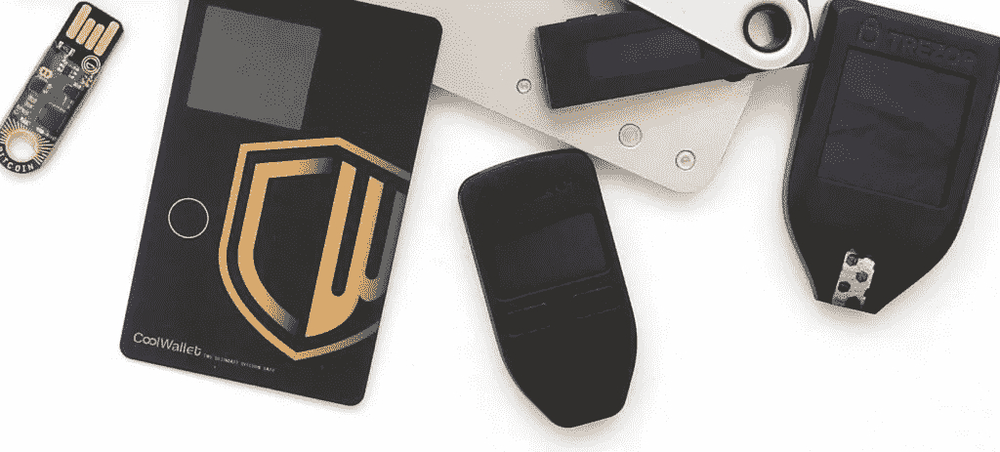

# 2022 年哪款 Crypto 硬件钱包最适合你？

> 原文：<https://medium.com/coinmonks/which-crypto-hardware-wallet-is-best-for-you-in-2022-85d00b588093?source=collection_archive---------3----------------------->

硬件钱包允许投资者在物理设备上存储比特币和其他加密资产。它们的特别之处在于，存储的形式与互联网没有接触点。

如果你想像你自己的银行一样作为加密货币的所有者，并有意识地决定自己存储获得的硬币，你需要一个钱包。有各种选项可供选择…