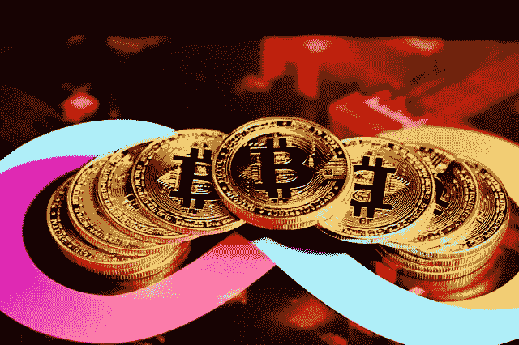

# 哪个密码有最好的未来预测？

> 原文：<https://medium.com/coinmonks/which-crypto-has-the-best-future-prediction-9075c8886995?source=collection_archive---------31----------------------->

不要忘记，投资者对加密货币非常感兴趣。虽然加密货币市场充满不确定性，但一些代币被过度销售。这表明它们相对于基本面被低估了。

然而，有了良好的投资经验，获取资本和为过去储蓄是可行的。在这篇[加密货币](https://cryptobatman.blogspot.com/2022/07/Which-crypto-has-the-best-future-prediction.html)综述中，我们期待 2022 年最好的加密货币以及投资哪种硬币能带来更多回报。

# 比特币(BTC)

毫无疑问，加密市场正在飞速发展，主要加密货币之一比特币的价格今年上涨了 70%以上。

这枚硬币于 1 月 3 日满 13 岁，总市值约为 9，000 亿美元，占加密货币交易所市值的约 40%。一年来，比特币经历了令人惊讶的涨跌。

1 月下旬约为 30，000 美元，然后到 4 月中旬为 63，000 美元，7 月份回升至 30，000 美元，最后在 11 月份创下 67，500 美元的历史新高。

根据北海巨妖首席执行官 Jesse Powell 的说法，比特币是一项为期五年的投资。高盛预测，一旦其经济份额上升至 50%，比特币价格将略高于 10 万美元。

# 柴犬·伊布(SHIB)

SHIB 令牌是第一个令牌，允许用户存储数十亿甚至数万亿令牌。这种被称为“Doge 杀手”的 ERC-20 代币仍然是一种廉价股票，其表现仍然优于 Dogecoin。

 [## 哪个密码有最好的未来预测？

### 但有了好的投资经验，获取资本，为过去储蓄是可行的。在这个…

cryptobatman.blogspot.com](https://cryptobatman.blogspot.com/2022/07/Which-crypto-has-the-best-future-prediction.html) 

> 交易新手？试试[密码交易机器人](/coinmonks/crypto-trading-bot-c2ffce8acb2a)或[复制交易](/coinmonks/top-10-crypto-copy-trading-platforms-for-beginners-d0c37c7d698c)