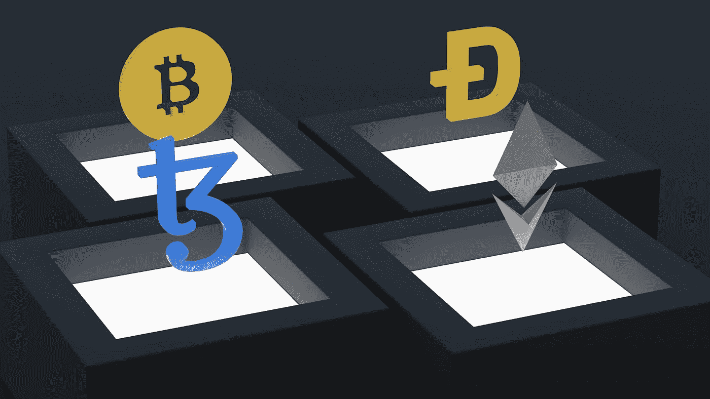

# 比特币和以太坊哪个加密货币更占优势或影响力更大？

> 原文：<https://medium.com/coinmonks/which-cryptocurrency-is-more-dominant-or-influential-bitcoin-or-ethereum-928d7bcec9a2?source=collection_archive---------29----------------------->

自各自诞生以来，比特币和以太坊的接受度和吸引力都有了显著提高。

以市值来衡量，这是一种加密货币的价值，比特币目前比以太坊大得多。截至 2022 年 12 月 27 日，比特币市值约为**9070 亿美元**，以太坊市值约为**1410 亿美元**。

> 从顶级交易者那里复制交易机器人。免费试用。

这意味着流通中的所有比特币的总价值明显高于流通中的所有以太坊的总价值。然而，需要注意的是，市值只是比较加密货币规模的一种方式，并不一定反映它们的相对采用或使用情况。

比特币和以太坊自各自推出以来都获得了显著的普及和采用，但它们服务于不同的目的，具有不同的功能，因此从绝对意义上说一个比另一个“更大”不一定准确。

但是，两者之间有一些重要的区别:

Photo by [Shubham Dhage](https://unsplash.com/@theshubhamdhage?utm_source=medium&utm_medium=referral) on [Unsplash](https://unsplash.com?utm_source=medium&utm_medium=referral)

1.  **目的:**比特币最初是作为一种点对点电子现金系统而创建的，而以太坊是作为一种平台而开发的，它使去中心化应用程序(dApps)能够在没有任何停机时间、欺诈或第三方干扰的情况下构建和运行。
2.  **交易:**比特币主要支持金融交易，而以太坊通过使用智能合约支持更广泛的交易。
3.  **货币:**比特币是一种数字货币，可以作为价值的储存手段和交换手段，而以太坊是一种数字货币，用于支付在以太坊平台上运行 dApps 所需的资源。
4.  **闭塞时间:**一个新闭塞被添加到区块链所需的时间称为闭塞时间。比特币的封锁时间在 10 分钟左右，而以太坊的封锁时间要快得多，在 15 秒左右。
5.  **供应量:**比特币供应量有限，共有 2100 万枚将被开采。以太坊没有固定的最大供应量，但预计以太(以太坊平台上使用的货币)的总数量最终会封顶在 1.2 亿左右。

总体而言，尽管比特币和以太坊都基于区块链技术，并有一些相似之处，但它们服务于不同的目的，具有不同的功能。

以下是比特币和以太坊平台上使用的加密货币以太的一些相似之处:

1.  **去中心化:**比特币和以太都是去中心化的加密货币，也就是说它们不受任何中央权威机构或组织的控制。
2.  **区块链技术:**比特币和以太都基于区块链技术，这是一种分布式账本技术，使用密码学来保护和验证交易。
3.  **开源:**比特币和以太都是开源的，这意味着它们的代码是公开的，任何人都可以查看和修改。
4.  **限量供应:**比特币和以太都是限量供应的，也就是说会生产出有限数量的硬币。
5.  **市值:**比特币和以太都有基于供求关系波动的市值。

> 此外，值得注意的是，加密货币市场在不断发展，不同加密货币的相对主导地位或影响力会随着时间的推移而变化。

如果你想投资比特币或以太网，有几种方法可以购买比特币和以太网，包括以下几种:

1.  **加密货币交易所:**购买比特币和以太坊最常见的方式之一是通过加密货币交易所。这些交易所允许您使用各种支付方式购买和出售加密货币，如银行转账、信用卡/借记卡，甚至在某些情况下使用现金。一些受欢迎的交易所包括 Bingx、币安和北海巨妖。
2.  **场外(OTC)经纪商:**场外经纪商提供了一种无需通过交易所就能买卖大量比特币和以太坊的方式。场外交易通常通过电话或网上进行，通常适合大型机构投资者或高净值个人。
3.  **比特币自动取款机:**一些城市有比特币自动取款机，允许你用现金或借记卡购买比特币。你可以使用 Coin ATM Radar 等网站找到你附近的比特币 ATM。
4.  **点对点(P2P)平台:** P2P 平台，如 LocalBitcoins 和 Paxful，允许你直接与其他个人买卖比特币和以太坊。如果你想用交易所不支持的支付方式(如现金或 PayPal)购买比特币或以太坊，这些平台可能是一个不错的选择。

在购买比特币或以太坊之前，重要的是研究和比较不同的选项，以找到最适合你的需求。一定要考虑你选择的平台的费用、安全性和声誉。熟悉加密货币投资的相关风险也是一个好主意，因为市场可能会波动，价格可能会大幅波动。

> 加入 Coinmonks [电报频道](https://t.me/coincodecap)和 [Youtube 频道](https://www.youtube.com/c/coinmonks/videos)了解加密交易和投资

# 另外，阅读

*   [交易信号是什么？](https://coincodecap.com/trading-signal) | [Bitstamp vs 比特币基地](https://coincodecap.com/bitstamp-coinbase) | [买索拉纳](https://coincodecap.com/buy-solana)
*   [加密交易机器人](/coinmonks/crypto-trading-bot-c2ffce8acb2a) | [维护审查](https://coincodecap.com/uphold-review)
*   [如何给 MetaMask 钱包添加 Arbitrum？](https://coincodecap.com/how-to-add-arbitrum-to-metamask-wallet)
*   [KuCoin vs 北海巨妖 vs BitYard](https://coincodecap.com/kucoin-vs-kraken-vs-bityard)
*   [加密交易的最佳 VPN](https://coincodecap.com/best-vpns-for-crypto-trading)