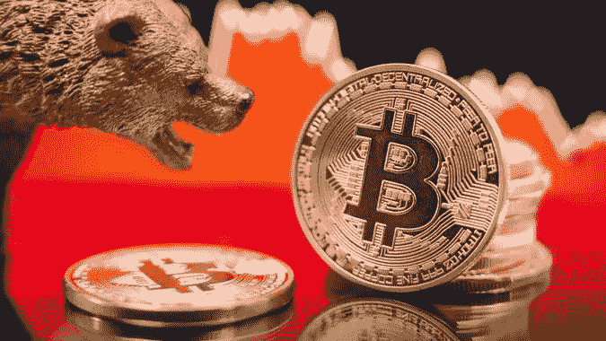

# 哪些项目会在加密熊市中崛起？过去几次熊市都发生了什么？Web 3.0 和真正的应用赛道值得关注！

> 原文：<https://medium.com/coinmonks/which-projects-will-rise-in-the-crypto-bear-market-2d692c05844f?source=collection_archive---------42----------------------->

不用说，加密货币已经进入熊市。但是危机也意味着一些更好的机会。我们先来看看前几次熊市都有哪些项目崩盘，然后又催生了哪些明星项目？哪些赛道或项目可能会在接下来的熊市中崭露头角？

**表格内容:**

1.  历史上的 6 次秘密熊市

2.这些项目将在未来的熊市中崛起

# **历史上 6 次秘密熊市**

## **2011 年熊市**

2011 年是第一次加密货币崩盘，整个加密货币市场市值损失了 90%，是有史以来最大的一次。原因是当时一个交易量极少的交易所出现了投机行为，数百名用户的账户被黑，损失了数百万美元。在当时，几百万美元对整个加密货币市场来说是一个巨大的冲击，所以导致了崩盘。

## **2012 年至 2013 年的熊市**

从 2012 年到 2013 年，加密货币市场暴跌 30%-50%。当时熊市的主要原因是 Mt.Gox。

当时 Mt.Gox 的 CEO 在没有得到用户许可的情况下，私自挪用了用户在交易所的资产，然后黑客黑了当时 Mt.Go 交易所数百个用户的账户。所以当时很多用户的比特币都丢了。

这次熊市让大家开始担心放在交易所的加密货币的安全性。于是冷冰冰的钱包行业诞生了。特雷佐和莱杰的冷钱包也是在那个时候开始出现的。

Mt.Go 交易所是当时世界上排名第一的交易所，其交易量应该是现在币安交易所的好几倍。当时，Mt.Go 交易所处理了全球 70%的比特币交易量。那么这么大的交易所倒下，肯定会有一些新的交易所开始吞噬市场份额。这包括美国和欧洲许多人使用的非常著名的比特币基地和北海巨妖交易所。

很多人认为世界上最大的交易所倒闭是一件非常不可思议的事情。也有很多人认为，如果币安交易所现在崩溃，整个货币圈可能就完了。但历史不止一次告诉我们，再大的交易所，随时都可能倒下。但是市场上会涌现出很多交易所，取代原来最大交易所的位置。

所以应该说，即使世界第一的交易所币安倒下了，也未必是整个加密货币的终结。充其量会有一次短期冲击，但很快就会有一场交易取而代之。所以大家其实要非常客观的看待这些交易所的更替。

## **2014–2015 熊市**

从 2014 年到 2015 年，整个加密货币市场的市值暴跌了 75%。当时这个熊市的原因是中国禁止比特币。

这一次熊市催生了去中心化的主题。也是从那个时候开始，以太坊，闪电网和道，又名去中心化自治组织。这些项目和这个概念刚刚开始进入聚光灯下，并变得越来越受欢迎。

## **2018 熊市**

可能很多人已经开始有印象了，因为比较接近我们现在的时间。当时市场下跌了 87%。这次熊市的原因其实很多，但最重要的是 ICO 的崩盘。所谓的 ICO，其实相当于传统股市的股票上市。

那时候很多人可以随便弄个硬币，上市赚钱。而且它是如此的夸张，你只需要一张 PPT 就可以轻松筹集到很多钱。当然，这样的混乱局面不会持续太久。很快许多 ICO 项目开始崩溃，引发政府监管。

但是在这个熊市中，诞生了很多到目前为止非常有名的项目或者生态系统，比如 Pokadot 和在 Defi 领域非常有名的 AAVE。甲骨文领域的领军人物 Chainlink 也是在那个时候诞生的。还有马可道，稳定币戴的发行人。

在此期间，nft 实际上已经开始诞生了。最著名的 NFT 交易平台 Opensea 也诞生于此。

## **2019–2020 熊市**

加密货币市场在 2019 年至 2020 年间下跌了 72%。主要原因是宏观经济下滑，而这恰好发生在疫情爆发之时。但非常具有讽刺意味的是，疫情的爆发导致美联储大量印钞。结果疫情其实救了当时的市场，然后开始了最近的牛市。

2019-2020 年期间，催生了很多二层的著名项目，如优化、Abitran 等。都是以太坊上面的二层网络。在第一层，也就是主链基础设施方面，有一个非常著名的 Solana，雪崩协议也是在那个时候诞生的。在此期间，诞生了许多 Defi 协议。

## **2021–2022 熊市**

2021-2022 年期间，如果从比特币最高值 6.8 万的市值计算，目前跌幅已达 70%。本轮势头的原因是宏观经济的恶化。这导致全球股市和加密货币市场的流动性枯竭。

大量资金被提取出来避险。另一个很重要的原因是，很多项目的杠杆率过高。所以在熊市中，很多著名的项目都倒闭了，比如露娜，最近的摄氏，3 箭资本。很多原本很出名的项目，相继倒闭。

# **未来哪些项目会在这次熊市中上涨？**

## **1。与现实结合——真实世界的应用**

从本质上来说，这些赛道的所有项目其实都有一个共同的特点，就是没有办法和现实结合。也就是说，它们在现实中的应用价值很低，甚至根本没有实用价值。所以我觉得未来最先能够兴起的项目，一定是一些能够和现实结合，能够真正对我们现实中的日常生活和经济生活产生实际作用的项目。

目前有这样的项目吗？其实有，但都是在创业初期。在 Polkadot 生态众筹项目中，我发现了 1 到 2 个这样的项目，有这种与现实的结合，但是他们在一个不合时宜的时间刚刚出来就遇到了这次熊市。但是我先不给大家介绍，也不知道这些项目能不能熬到下一次牛市。

但是，你可以关注一下，当我们到了熊市后期，即将迎来牛市的时候，我们可以去了解一下，这个市场中是否有一些项目是针对与现实结合的概念的。

## **2。合规金融协议—监管**

由于此前 Luna、Celsius 和三箭资本的爆炸事件，政府对加密货币市场的监管提出了担忧。未来会有一些金融协议更加合规，能够更好的保护用户的资产安全。这也是一条值得我们关注的赛道。

## **3。真正的 web3.0**

WEB3.0 的概念很大。WEB3.0 与 WEB2.0 最大的区别在于，网络或项目的主导权或所有权逐渐从中心化的公司组织转移到用户和使用者手中，从而实现真正的去中心化。

这种观念其实是一种历史趋势。但要实现它肯定需要非常长的时间。毫无疑问，在下一轮牛市到来的时候，WEB3.0 这个赛道一定会是市场和资本重点关注的赛道。

以上是我的一些看法，也欢迎大家在评论区积极讨论。写下你认为未来会崛起的项目或赛道。

> 交易新手？试试[加密交易机器人](/coinmonks/crypto-trading-bot-c2ffce8acb2a)或者[复制交易](/coinmonks/top-10-crypto-copy-trading-platforms-for-beginners-d0c37c7d698c)