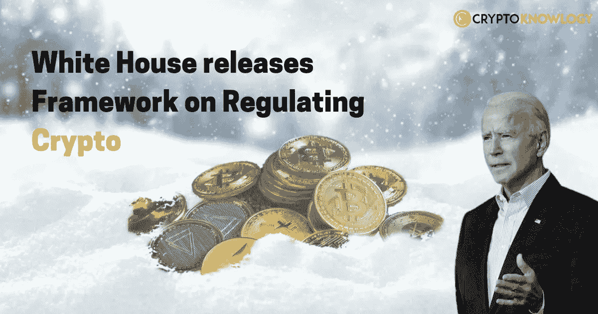
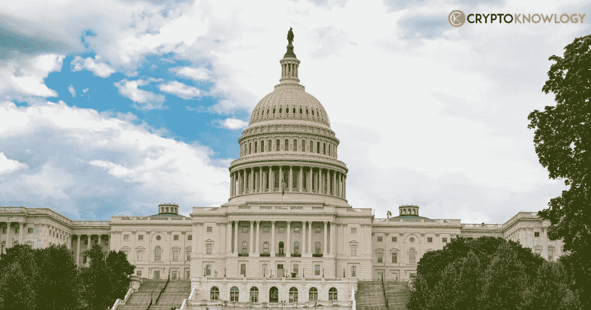

# 白宫发布监管密码的框架

> 原文：<https://medium.com/coinmonks/white-house-releases-framework-on-regulating-crypto-c0558a08e6aa?source=collection_archive---------22----------------------->

拜登[白宫](https://www.whitehouse.gov/briefing-room/statements-releases/2022/09/16/fact-sheet-white-house-releases-first-ever-comprehensive-framework-for-responsible-development-of-digital-assets/)刚刚在**美国**公布了有史以来第一个[加密](https://cryptoknowlogy.com/)监管框架，概述了金融服务部门应该如何发展以促进无国界交易以及如何阻止数字资产市场中的欺诈行为。

加密公司一直在焦急地期待着一些美国政府的报告，他们预计这些报告将明确拜登政府和监管机构打算对数字资产采取什么措施。大多数文件现已向公众公开，尽管具体情况尚不清楚。

**联邦政府**认识到与[加密货币](https://cryptoknowlogy.com/the-link-between-cryptocurrency-and-inflation/)相关的几个潜在问题，各个机构认为加强执法行动可能是至关重要的一步。

该框架出台之前，美国总统乔·拜登(Joe Biden)呼吁联邦机构调查加密货币的利弊，并在 3 月份发布的行政命令中公布他们的调查结果。

在过去的六个月里，政府机构一直在努力创建自己的**框架**和**政策**建议，以解决行政命令中列出的六个优先事项，包括金融包容性、负责任的创新、打击非法金融、促进金融稳定以及保护消费者和投资者。这些建议构成了行业监管的第一个**整体政府方法**。

国家安全顾问杰克·沙利文(Jake Sullivan)和国家经济委员会(National Economic Council)主席布莱恩·迪斯(Brian Deese)在一份联合声明中表示，新法规旨在将美国确立为国内外数字资产生态系统管理的领导者。

# 数字美元:

美国是否会推出由中央银行发行的**数字货币(**[**【CBDC】**](https://cryptoknowlogy.com/euro-cbdc-is-coming/)**)**)——联邦官员得出的结论是，除非确定符合“国家利益”，否则不应开发数字美元，尽管这些研究提议和建议美联储“继续其持续的 CBDC 研究、实验和审查”

谁决定什么是国家的最大利益？

这有点不清楚。由于美联储将负责管理它，美联储无疑在这方面有发言权。政府可能还需要颁布法令，国会也可能需要介入。司法部未来的法律指导可能会提供答案，预计司法部将指定美联储在发行数字美元之前需要的证书。

虽然美联储是独立的，但它将与立法者、政府和其他联邦机构合作，以确定符合国家利益的最佳行动方案。

# 打击非法融资:

白宫的新密码监管框架包括一个关于打击该领域非法活动的章节，建议的限制似乎有一些实际影响。

白宫的一份简报称，总统将考虑是否要求国会修改《银行保密法》、反泄密法和禁止未经许可的资金转移的法律，以明确适用于数字资产服务提供商，如数字资产交易所和非伪造令牌(NFT)平台。

总统还在考虑是否要求国会增加对未经授权的资金转移的罚款，以及是否修改一些联邦法律，使司法部能够在任何发现受害者的地方追查涉及数字资产的犯罪。

概况介绍指出，财政部将在 2023 年 2 月底之前完成对与分散融资相关的非法融资风险的评估，并在 2023 年 7 月底之前检查完所有不可替代的硬币。

数字资产市场上有很多犯罪行为。美国联邦贸易委员会的调查显示，自 2021 年初以来，超过 10 亿美元的加密货币因欺诈而损失。

美国证券交易委员会披露了 11 项针对欺诈性金字塔和庞氏骗局的指控，这些欺诈性金字塔和庞氏骗局从包括美国在内的全球数百万散户投资者那里筹集了超过 3 亿美元。与此同时，今年 2 月，在与 2016 年加密货币交易所 Bitfinex 的黑客攻击有关的情况下，美国官员进行了有史以来最大规模的加密货币扣押，扣押了价值 36 亿美元的比特币。

国家安全顾问杰克·沙利文(Jake Sullivan)和国家经济委员会主任布莱恩·迪斯(Brian Deese)在一份声明中表示，各种研究表达了对消费者保护和非法活动的担忧，并为政府解决这些问题提供了解决方案。

“我们正在共同为一个智能的全方位战略奠定基础，以降低与数字资产相关的严重风险，并在可能的情况下利用它们的优势。这个生态系统的未来将由我们与盟友、合作伙伴和更大的数字资产持有人群体的合作来塑造。”，声明称。

一名高级政府官员告诉记者，尽管这些机构独立于行政部门，但评估敦促监管机构“发布新的规则和建议”，以填补当前金融监管如何适用于加密货币的任何空白。

这位官员说，“建议是让这些机构评估、澄清和协调他们的政策，我相信这种观点只是说……他们有必要的权力……来对付不遵守规定的公司。”

# 其他建议:

高级政府官员表示，他们正在寻求对该行业进行“T0”倍于 T1”的调查和执法活动，以回应报告提出的下一步还有哪些实际措施的问题。在周五白宫发布的一份文件中，**证券交易委员会**和**商品期货交易委员会**被点名。

白宫补充说，消费者金融保护局(Consumer Financial Protection Bureau)和美国联邦贸易委员会是两个联邦监管机构，它们在加密领域不如早期的监管机构活跃，应该“加倍努力，监测消费者投诉，并对不公平、欺骗性或滥用行为采取执法行动”。

根据白宫备忘录，拜登将倡导对非银行支付公司的联邦许可或监管计划。财政部的一份文件对此进行了阐述，指出支付的法律框架将在帮助这些类型的企业的同时降低风险。

“非银行机构越来越多地提供支付服务，例如处理支付和发行有货币价值的债务。一方面，非银行支付公司的参与可以促进更高水平的竞争、包容性和创新。另一方面，如果这些企业得不到有效的监管和监督，可能会给客户、金融体系和整个经济带来危险。“根据财政部的报告。

然而，该报告没有描述这种结构的潜在设计。该行业长期以来一直在寻求联邦监管框架，该框架将允许加密交易所只需一个许可证就可以在全国范围内运营，而不是需要在他们希望开展业务的每个州申请资金转移许可证。

要了解更多信息，请访问[密码学](https://cryptoknowlogy.com/white-house-releases-framework-on-regulating-crypto/)。

> 交易新手？试试[密码交易机器人](/coinmonks/crypto-trading-bot-c2ffce8acb2a)或者[复制交易](/coinmonks/top-10-crypto-copy-trading-platforms-for-beginners-d0c37c7d698c)