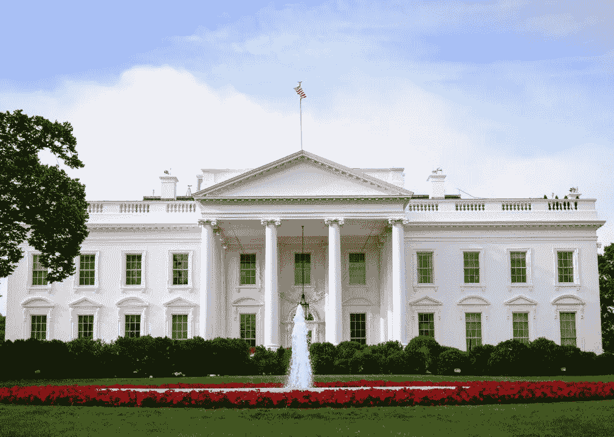

# 白宫对加密开采的立场

> 原文：<https://medium.com/coinmonks/white-houses-stance-on-crypto-mining-a7744107553c?source=collection_archive---------3----------------------->

The White House’s Official Report on Cryptocurrency Mining was released on 9/7/2022\. You can find it [**here**](https://www.whitehouse.gov/wp-content/uploads/2022/09/09-2022-Crypto-Assets-and-Climate-Report.pdf).

如果你是一个加密爱好者，并且从你点击这个标题的事实来判断，这种可能性非常大，那么你可能会受到误解的轰炸，认为美国政府一直在对加密货币进行政治攻击，特别是工作证明 **(PoW)** 区块链，其中包括比特币和以太坊之类的货币。