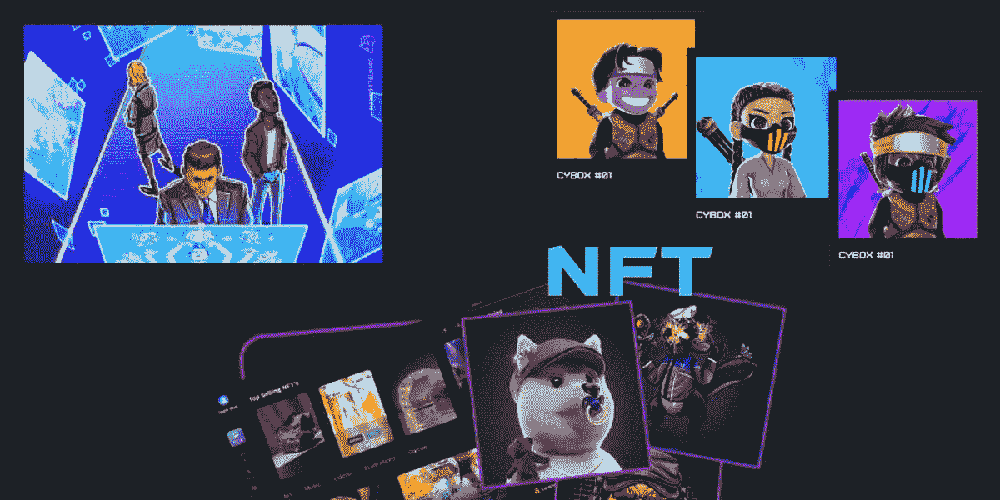
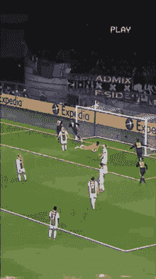

# 白标 NFT 市场:壮观的 web3 之旅和 2022–2023 年的标志性趋势

> 原文：<https://medium.com/coinmonks/white-label-nft-marketplace-a-spectacular-web3-journey-and-an-iconic-trend-of-2022-2023-7a26a692c1f4?source=collection_archive---------25----------------------->

从科技小公司到科技巨头，飙升的大量市场趋势有助于 NFT 收藏的每一个比例。这最终是一个事实，但不仅仅是新闻可以引导加密联盟！可能在想我在说什么。绝对是 NFT 市场和它的定制可以带来一个高贵的，功能丰富的，安全的，区块链实现的平台。通过我们信息丰富的指南来唤起加密企业家，你甚至可以通过启动你的 [**白标 NFT 市场**](https://www.appdupe.com/whitelabel-nft-marketplace?utm_source=google&utm_medium=medium&utm_campaign=monika) 成为一家成功的公司。

精明的区块链开发者是关键的中介，他们利用娴熟的技术来改变你的企业。您可以找到 NFT 平台的功能、发展和商业优势，以及一些对这一趋势的探索。你可以通过涉足 NFT 开发服务或与顶级品牌合作来领导这个 web3 世界。感谢这篇博客，找到关于热门目的地的关键提示和信息。

## 🎯白牌 NFT 市场综合指南

NFT 市场是一个虚拟的舞台，向用户展示或展示最近推出的大型著名 NFT 收藏品。市场的核心是灵活操作，进行交易和竞标。然而，这个交易平台只是作为保管人来完成交易。那么 NFT 市场的核心部分是什么？？？\

你可以发现区块链和智能合约是任何 NFT 市场的基石。所有的核心功能和技术操作都隐藏在这些分散的技术中。了解更多关于这个被称为区块链的公共账本真的很有趣！但是我将直接转向白色标签解决方案…

## 🎯那么什么是白牌 NFT 市场呢？

这里出现了术语“软件优化”或“白色标签”,这有助于小型到极端的配置在这个市场上占有一席之地。不清楚……一个白标解决方案使平台上的钻孔插件能够按照用户的要求运行。任何拥有领先解决方案的公司都可以做到这一点，或者像耐克或 BAYC 这样的科技巨头可以接近他们…

**Portuguese icon Cristiano Ronaldo and its NFT collection**

**在这里，我将揭开关于葡萄牙偶像克里斯蒂亚诺罗纳尔多及其 NFT 系列的轰动新闻！！！**

> 领先的足球运动员克里斯蒂亚诺·罗纳尔多现在加入了 NFT 和项目的世界。他在 NFT 设计的名为 CR7 的系列就是明证。其中包括七个动画雕像和所有难忘的时刻。在 2022 年 11 月中旬将他的收藏连根拔起，这为它扩大了庞大的观众群。

科技巨头币安接受了展示 c 罗收藏品的商业提议。因此，人们可以很容易地在币安的 NFT 市场找到这些收藏品。币安官方推出的 Ronaldo 收藏提高了许多 NFT 爱好者和极客的兴趣。现在，NFT 市场是汇集和交易顶级收藏品给粉丝的最佳场所，这是有道理的。因此，罗纳尔多给了他的粉丝和追随者最大的惊喜和聚会，提供了他令人难忘的收藏。

要在未来推出 NFT 系列，可以说是一家初创公司或科技巨头能够做到！但是，对涉足这个令人费解的 NFT 行业的狂热从未停止增长…..

## 🎯**NFT 市场的特点**

➡️Storefront

➡️Search 探险家

➡️Advanced 滤波器

➡️Digital 钱包

➡️Auctions 或出价

➡️NFT 简介

➡️Ranking 还是最爱

➡️Ratings 和评论

➡️Trade 图表

➡️Multi-payment 网关

## 🎯**开发白色标签 NFT 市场的商业利益**

不出所料，NFT 市场拥有更多与用户对等的特权。例如，跨链兼容性是该平台与其他区块链互操作的一个关键特性。这是一个巨大的优势，因为用户现在可以利用区块链的其他功能，其他一些优势如下:

➡️Permissionless

➡️No 中介的放纵

➡️Highly 四分五裂

➡️Blockchain 实施

➡️Security 模块

➡️Support 多元支付

➡️Enhanced 令牌盒

 [## 2022 年 NFT 营销机构 25 强

### 近年来不可替代代币的出现是一种定期发展的提升。的…

blog.cryptostars.is](https://blog.cryptostars.is/top-18-nft-marketing-agencies-in-2022-d2bb73b2bfc8) 

## 🎯**开发白牌 NFT 交易平台**

然而，一个白色标签的 NFT 市场将通过暴露在云服务器上进行定制。以下是利基平台或通用平台开发过程的关键步骤。

➡️Consultation 为 NFT 项目和选择利基

➡️Extensive 研究寻找目标用户和他们的需求

➡️Discuss 与区块链开发商的战略

区块链的➡️Select

➡️Design 和开发用户界面/用户体验设计

➡️Advanced 前端和后端设置

➡️Security 层

➡️Testing

➡️Deployment

## 🎯**结论**

最后，结束我的思考，我可以根据这个研究驱动的[**白标 NFT 市场**](https://www.appdupe.com/whitelabel-nft-marketplace?utm_source=google&utm_medium=medium&utm_campaign=monika) 来总结我的所有发现。区块链行业、企业科技巨头、初创公司和其他企业家推出安全交易平台的一记重拳。因此，如果你真的受到了这个 web3 概念的启发，那就打开你的欲望，进行一次稳健的冒险。

因此，找一家能提供可观额外津贴的顶级 NFT 市场开发公司。通过动态开发严格的协议和社区驱动的平台，让您的企业登上宝座。现在就用你的一站式商店向你的观众群推荐 NFT 系列，并建立你自己的社区！

> 交易新手？试试[加密交易机器人](/coinmonks/crypto-trading-bot-c2ffce8acb2a)或者[复制交易](/coinmonks/top-10-crypto-copy-trading-platforms-for-beginners-d0c37c7d698c)