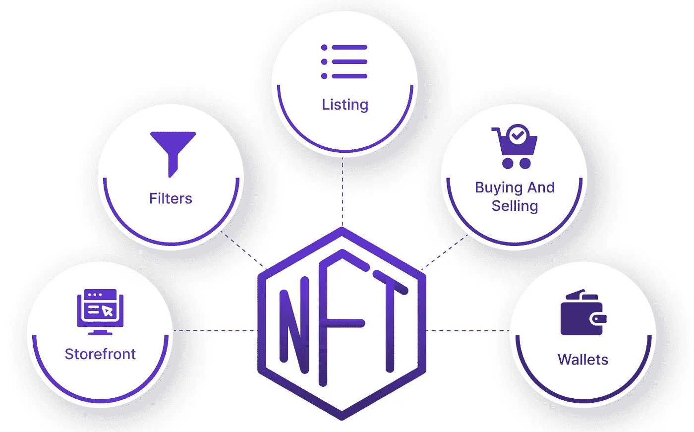

# 白标 NFT 市场发展——2023 年发展您的加密初创企业的步骤

> 原文：<https://medium.com/coinmonks/white-label-nft-marketplace-development-steps-to-develop-your-crypto-startup-in-2023-7c92c165d4ff?source=collection_archive---------24----------------------->

不可替代的代币是加密城的热门话题！是的。自从新的互联网重新定义了赚钱的方式，NFT 就成了密码交易员的唯一来源。到 2026 年底，NFT 市场的市值预计将增加到 800 亿美元。虽然这个数字看起来令人困惑，但鉴于这些加密资产的独特特征以及它们拥有用户所有权的罕见品质，这简直是小菜一碟！

在过去的几年里，技术方面有了很多发展，比如 web3、区块链、NFTs 和许多基于此的平台。这些 NFT 延伸到各个领域，甚至在物理世界，像艺术，音乐，元宇宙，房地产等。由于所有这些行业的 NFT 不断堆积，这为密码创业者和许多公司巨头如脸书、谷歌、微软等带来了数百万的机会。本博客讨论了 NFT 白牌市场的热门话题及其发展。

# **阐述这些白色标签的 NFT 市场解决方案是什么**

由于网上的许多文章都在谈论这些白标解决方案，让我先解释一下这些是什么，然后再进入博客！

白标解决方案是平台的现成源代码，已经在行业中获得成功，可以根据用户的要求进行调整。这些修改后的源被进一步开发为具有不同的特征，并以用户的品牌名称发布。

> 现在，让我们深入市场，好吗？

NFT 市场是托管这些数字资产的地方，供用户交易、出售、购买和拍卖。在这个丰富的平台上，加密爱好者对他们最喜爱的 NFT 收藏的渴望被浇灭了。下面给出的是 NFT 市场中的可标记资产。

*   门票和优惠券
*   音乐
*   录像
*   模因
*   不动产
*   数字收藏品
*   运动
*   比赛
*   艺术品等。

[**创造 2023 年的 NFT 市场**](/coinmonks/how-to-create-nft-marketplace-in-2023-types-revenue-model-and-development-a9a712654f94) 需要适应未来的技术和发明。此外，要创建这些 NFT，必须首先铸造它们，这一点我们将在后面的博客中看到。然而，在开发定制的 NFT 市场之前，用户需要知道一些事情。它们如下:

*   一款与区块链兼容的加密钱包，该钱包已被选定用于开发欲望市场。
*   加密货币在加密圈不可避免地会推动经济增长，因为它们对于购买、出售和交易 NFT 至关重要。
*   在 NFT 市场专门为用户创建的帐户，安全地记录在区块链的节点中。

# **白标 NFT 市场发展——引领你的创业**

NFT 市场开发与 maven 开发者和 [**白标 NFT 市场开发公司**](https://www.appdupe.com/nft-marketplace-development) 的未来目标带你走很长的路！冒险进入这种革命性的盈利模式需要付出努力，因为它们仍处于萌芽阶段。以下是你选择现成市场的原因。

*   一种高端安全协议，通过集成双因素身份验证(2FA)、防火墙、数据加密等得到增强。这些整合在 NFT 市场的软件帮助用户保护自己免受网络攻击、网络钓鱼、数据窃取和许多其他攻击。
*   成本效益，在定制平台的情况下，开发公司的开发人员产生的成本相对低于其他人。
*   定制是白标解决方案的主要特征，是您直观平台的附加优势。它们不亚于一种特权，因为它们允许您体验具有用户友好和独特界面的平台。这是因为白标解决方案是现成的解决方案，您只需对想要添加或删除的功能进行更改。
*   由白标开发公司提供的市场中的用户界面和用户体验开发是灵活的，用户可以很容易地访问。
*   加密钱包与 NFTs 等利润丰厚的资产的市场整合是必不可少的。这些加密钱包除了在交易过程中充当支付网关之外，还用于存储 NFTs。此外，它们有助于用户获得一些私钥，否则这些私钥会被锁定在区块链网络中。

# **白色标签 NFT 市场的特点**

## **店面**

店面是 NFT 市场开发中最重要的功能，因为用户可以在这里查看各种用于交易的数字资产。通过这个特性，用户可以很容易地访问预览、出价、所有者、价格历史和关于 NFTs 的各种其他信息。

## **高级搜索过滤器**

平台中集成的搜索过滤器有助于用户轻松获取资产信息。它们还帮助用户更容易地访问价格、畅销书、最喜欢的非功能性书籍等。

通过先进的搜索过滤器，NFT 被分类为诸如迷因、图像、艺术、音乐、游戏、体育等类别。

## **上市状态**

平台中包含的这一特定功能为用户提供了他们所需的所有 NFT。也就是说，利用市场中的这一特征，用户可以确认这些 NFT 的状态，并验证它们是否被出售、验证、可用性等。

## **多钱包支持**

平台集成多个钱包是有利的，这样用户可以在全球范围内购买具有不同加密货币的 NFT。MetaMask、TrustWallet 等白标解决方案支持一些开发。

## **智能合同集成**

平台中的智能合同集成使所有活动，包括 NFTs 的交易自动化。在平台中发起和完成的活动都以高度安全和高效的方式记录在区块链中。此外，该平台受到 DDOS、SSRF 等技术的保护。

## **整合 IPFS 存储**

用户应该能够存储堆积如山的独特数字资产，市场上最值得信赖的存储系统是 IPFS。星际文件系统支持在平台架构内支持的巨大的 NFTs。

# **开发定制白牌 NFT 市场发展的关键步骤**

有两种方法来开发你指定的利基市场 NFT 市场:从零开始开发和使用白标签 NFT 市场开发公司开发。

## **NFT 市场从无到有的发展**

这种开发需要终极的专业水平，因为用户应该建立地面。也就是从区块链网络到平台的推广。拥有一个高度安全、灵活、高存储支持的平台需要时间和大量资金。然而，其中一个好处是，用户有完全的权力以他希望的方式开发平台，没有任何限制。

## **白牌 NFT 市场开发**

*   当用户开发他的定制市场或选择获得 [**白标 NFT 市场解决方案**](https://www.appdupe.com/nft-marketplace-development) 时，首先要做的是选择合适的区块链网络，该网络将支持所有将在平台上创建和上市的非功能性交易。对你的项目比较有利的一些区块链网络有以太坊、卡尔达诺、币安、创等。
*   一旦区块链被开发出来，下一步就是满足于一个利基，在那里你最有可能获得利润，如果这个利基是你已经有知识的东西，那将会更有效。crypto 平台中广泛存在的一些领域是艺术、视频、体育、元宇宙、游戏、房地产等。
*   为了开发一个有利可图的市场，进行更深入的市场分析和研究是有帮助的。这样做将有助于开发人员理解您在平台中寻找的接口类型。用户界面是不可避免的，因为它将成为平台的外观，即与用户交互。
*   开发 UI/UX 就像给平台一对球体，用户可以在平台内轻松导航并访问所需的 NFT 等。对平台的开发应该是交互式和直观的，以提供最佳的交易体验。
*   前端开发和后端开发确保平台的流畅和功能。而前端确保与用户的直接通信，如搜索引擎、过滤器等。后端需要平台的逻辑操作，如支付网关、交易验证等。
*   一旦前面所说的所有步骤都完成了，你所选择的利基市场 NFT 应该被置于彻底的审查任何错误或缺陷。
*   在平台清除了任何错误或漏洞后，利基市场指定的 NFT 市场被上传到加密空间进行交易。
*   对于一个成功运行的平台来说，最后也是最重要的阶段是恰当地营销它们。获得白标 NFT 市场发展公司的指导，以促进和赚取数百万美元！
*   您还可以从 NFT 顶级市场开发公司**获得帮助，继续创建您的 NFT 平台。**

****关闭思想！****

**世界正在颠倒过来，以获得这些非功能性测试的实践。随着所有新功能和领域进入市场，NFT 市场的托管平台发展势头越来越大。再次回顾文章中的一些内容，平台必须检查的一些关键方面是交易的透明度、NFTs 的流动性、去中心化以及 NFTs 所有权和真实性的可追溯性。**

**在密码世界的许多蓬勃发展的市场中，NFT 市场日益受欢迎的步伐没有放慢，这是密码创业者参加比赛的正确时间。想和密码世界中最可行的企业之一和解吗？现在就和熟练的开发者签约吧！**

> **交易新手？尝试[加密交易机器人](/coinmonks/crypto-trading-bot-c2ffce8acb2a)或[复制交易](/coinmonks/top-10-crypto-copy-trading-platforms-for-beginners-d0c37c7d698c)**