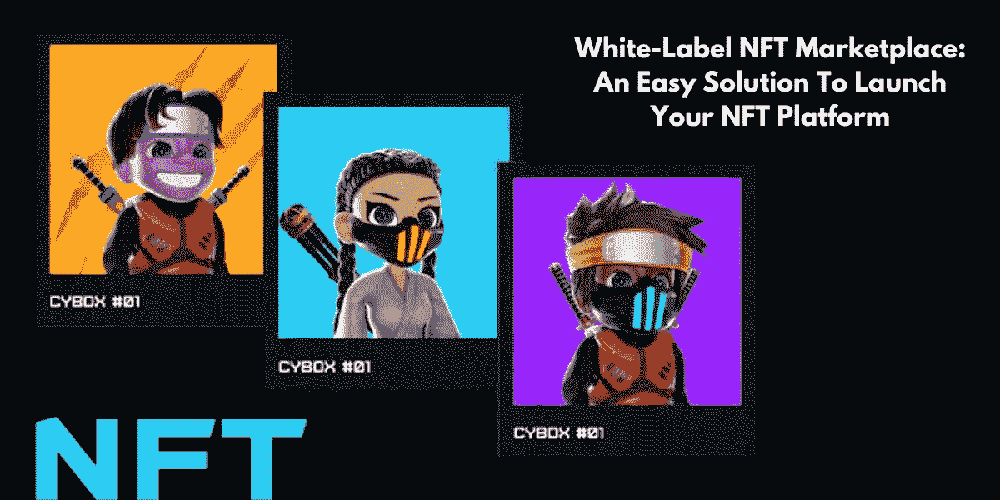

# 白标 NFT 市场:这个解决方案为加密创业者打开了新的门户吗？

> 原文：<https://medium.com/coinmonks/white-label-nft-marketplace-does-this-solution-opens-new-portals-for-the-cryptopreneurs-a9d4e074b?source=collection_archive---------39----------------------->

不可替代代币已成为当今世界的一种趋势。许多企业家通过各种 NFT 项目开发开始了他们在 NFT 世界的旅程。但 NFT 市场一直是 NFT 的主要项目之一，吸引了企业家和企业主的关注。因此，这个博客作为一个简单的钥匙，帮助 NFT 爱好者了解 [**白标 NFT 市场**](https://www.appdupe.com/whitelabel-nft-marketplace?utm_source=google&utm_medium=medium&utm_campaign=monika) 的发展过程及其对用户的基本好处。

Source:appdupe

# **白色标签 NFT 市场快速介绍**

NFT 市场是一个允许交易和铸造不可替代代币的交易平台。该平台可以从头开始构建，也可以使用白标解决方案。如今，各种开发公司提供白标解决方案，以促进商业头脑快速启动他们的风险投资。

白色标签是一种预制的解决方案，它提供了一种经济实惠、可定制且省时的解决方案。这些解决方案复制了受欢迎的 NFT 市场的特征和功能，可以根据个人的需要和要求进行定制。一些受欢迎的

# **NFT 市场的必要特征**

➡️Storefront

➡️Search 期权

➡️Filters

➡️Buying &期权

➡️Wallet 一体化

➡️Listing

➡️Rating 和评论

## **使用白标解决方案开发 NFT 市场的流程**

## 🔥**选择利基**

市场可以基于任何 NFT，如艺术、音乐、体育、视频剪辑、游戏等。选择市场利基有助于指定平台的特性、设计和功能。

## 🔥**选择合适的开发公司**

选择合适的开发公司，提供领先的**白标 NFT 市场平台**解决方案，有助于获得一个发展良好的市场。在开发 NFT 市场时，选择一家满足用户需求、要求和偏好的公司是至关重要的。几个因素允许用户选择一个合适的公司的基础上，该公司的客户，演示工作，以前的工作，评级，定价，评论等。

## 🔥**选择区块链网络**

一旦选择了公司，用户应该向开发公司提出他们想要创建的市场的细节。这包括决定平台的特性和功能以及平台的区块链网络。决定区块链网络用户想要建立他们的市场是很重要的，因为它规定了平台的功能。一些支持白标解决方案的区块链网络包括

➡️Ethereum

➡️Binance 智能连锁

➡️Polygon

➡️Solana

➡️Harmony

➡️Avalanche

## 🔥**平台开发**

在开发过程中，所选择的白标解决方案将根据用户的选择进行定制。定制包括平台的前端功能、后端功能和 UI/UX 设计。

## 🔥**测试&发射**

一旦创建了平台，就要对其进行多次测试以消除错误。这是 NFT 市场发展的一个重要阶段，因为这确保了为用户提供一个无障碍的平台。在确认无误后，用户可以随时在市场上部署它，并应定期更新。

Source:gettyimages

## 🔥**白色标签解决方案的优势**

➡️These 是可随时部署的解决方案，具有提供最佳体验的基本特性和功能。

➡️They 可以被定制来创建一个全新的 NFT 市场。

➡️As:这是一个预制的解决方案，创建时间更短，并且可以立即在市场上部署。

使用白标解决方案创建 NFT 市场所需的➡️The 成本被认为是可以承受的，并且比从头开始开发平台要少得多。

➡️These 解决方案帮助加密企业家创造新的收入来源，并作为进入 NFT 世界的一种方式。

## 🔥**结论**

[**白标 NFT 市场**](https://www.appdupe.com/whitelabel-nft-marketplace?utm_source=google&utm_medium=medium&utm_campaign=monika) 为密码创业者在这个数字空间推出自己的 NFT 平台提供了一个有利可图的解决方案。这些解决方案被认为具有成本效益和节省时间。此外，它们还支持定制，用户可以根据自己的需求和要求来创建平台。从最佳 NFT 市场开发中获得白标解决方案，可以获得可靠、可扩展和独特的解决方案。

> 交易新手？尝试[加密交易机器人](/coinmonks/crypto-trading-bot-c2ffce8acb2a)或[复制交易](/coinmonks/top-10-crypto-copy-trading-platforms-for-beginners-d0c37c7d698c)