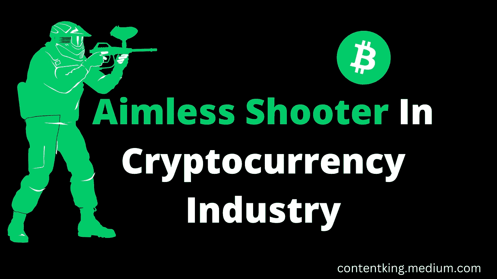
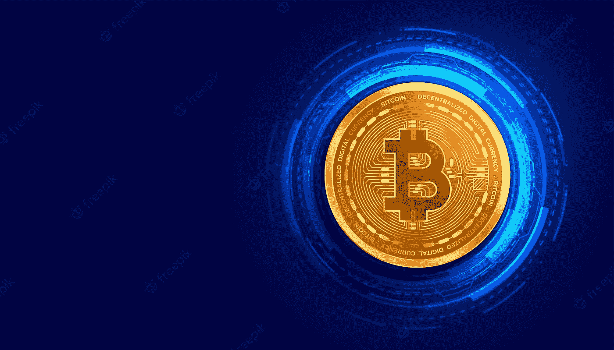

# 谁是密码行业的漫无目的的射手？

> 原文：<https://medium.com/coinmonks/who-are-aimless-shooters-in-crypto-industry-ca1343d13e9b?source=collection_archive---------37----------------------->

我有一个要点给你。

今天早上，当我还在床上的时候，我打开了我的互联网。

也许这是一个坏习惯，但我只是告诉你我做了什么。

**Designed by me:)**

令人惊讶的是，我看到 Chioma Eze 的帖子询问 Nairaland 如何广告，她想知道人们是否通过在论坛上运行付费广告来实现销售。

如果你是非洲人，我想你已经知道奈拉兰是非洲最大的论坛。也是世界上交通流量最大的城市之一。

因为之前在平台上跑过广告，所以赶着看了她的帖子。

我带着垫子去睡她的评论区:)

但我在这里不是为了谈论人们在她的帖子下分享的不同意见。

看到我分享给你的截图了吗；你注意到了什么？

有人自称是奈拉兰广告专家，但这位女士浏览了她的个人资料后，立即对他的能力产生了怀疑。

为什么？

他的社交媒体资料可不是这么说的。

# 如果你从事加密工作，那就从事加密工作

[**Source**](https://www.freepik.com/free-photos-vectors/crypto)

我以前也犯过这样的错误，在数字空间里，我是你能想到的一切。

但这在大约 4 年前发生了变化，当时我整合了我所有的数字技能，决定专注于加密货币和区块链行业。

你猜怎么着？这是值得的。

我并不是说你不能投资其他行业，比如农业、房地产等等。

为了你的未来，有一个重点。

你没有变年轻，停止零星射击。

你弹夹里的子弹数量是有限的…

不要成为网络上的一切。

如果你用谷歌搜索我的名字，你可能会注意到我更专注于加密货币。

搜索引擎能对你说同样的话吗？

我想还没有。

所以，你需要问自己一个很难的问题。

我想为自己在 Web 3.0 行业的机会定位吗？

为什么我害怕完全加入 crypto？

我想专注于加密的哪个方面？

你可以在评论框里和我分享你的答案。

你知道，尽管我很忙，我还是会尽快回复信息。

回到你的个人资料，继续努力。

让它反映出你想在网络上以什么出名。

从我的 [**推特简介**](http://twitter.com/ojeniyi_ayobami) 中获取灵感。

如果不能点击链接，在 Twitter 上搜索 ojeniyi_ayobami。

我在 Twitter 上分享了大量的加密技巧，你也应该在 Twitter 上关注我。

祝你这周过得愉快。

我希望你喜欢这条消息，给它 50 个掌声，并跟随我获得更多的密码指南😘。

NB: *我每周都会发这样的简讯作为 WhatsApp 广播，如果你想享受这样有价值的信息，* [***在这里加入广播列表***](https://wa.link/r7xbia) ***。***

# 关于作者

**Ojeniyi Ayobami Abimbola** 自 2015 年以来一直从事加密货币交易，他是区块链的内容创作者和 Cryptoniche 的加密教练。你可以在 https://t.me/cryptoniche_hangout[和他联系](https://t.me/cryptoniche_hangout)

**隐小生 YouTube 频道:**[https://youtube.com/c/CryptoNiche](https://youtube.com/c/CryptoNiche)

如果你注册了附属链接，我会从中获得一小笔佣金，这也是从经济上支持这个博客的一种方式。

**或者加入隐壁龛电报频道:**[https://t.me/cryptoniche_hangouts](https://t.me/cryptoniche_hangouts)

**在推特上和他连线:**[https://mobile.twitter.com/ojeniyi_ayobami](https://mobile.twitter.com/ojeniyi_ayobami)

要不要终身被动收入？在这里阅读他的最后一篇文章 [**！！！**](https://contentking.medium.com/this-undoubtly-the-best-way-to-earn-passive-income-through-cryptocurrency-7ce547cedbe)

我有一个免费的礼物给你:“如何在年底前成为密码百万富翁。” [**点击这里下载。**](https://ojeniyiayobami.crd.co/)

为你制作的几十个加密内容， [**现在就订阅**](https://www.youtube.com/c/CryptoNiche/videos)

> 交易新手？尝试[加密交易机器人](/coinmonks/crypto-trading-bot-c2ffce8acb2a)或[复制交易](/coinmonks/top-10-crypto-copy-trading-platforms-for-beginners-d0c37c7d698c)