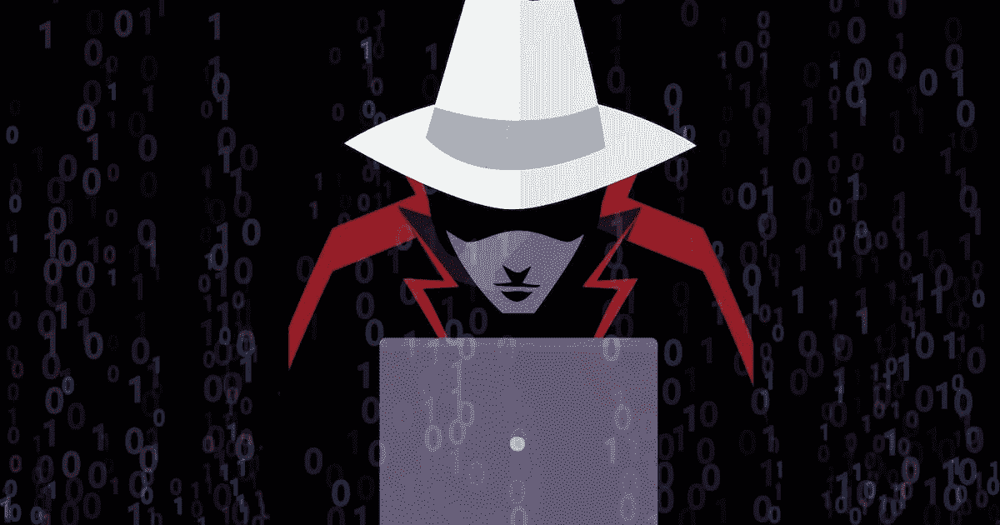

# 谁是白帽黑客？

> 原文：<https://medium.com/coinmonks/who-is-a-white-hat-hacker-df7ca38146ec?source=collection_archive---------26----------------------->

当你听到黑客或黑客时，你可能会想到有人试图闯入网站或公司数据并劫持运营的糟糕场景。嗯，我以前也是这么想的，直到我进入[编码](https://gloriaokeke.hashnode.dev/how-to-avoid-plagiarism-in-coding-for-developers)，在区块链和整个技术下研究和写作。我明白了‘并非所有的黑客都像我们想象的那样‘邪恶’

网络中有各种类型的黑客，包括黑帽、灰帽、白帽等等。黑帽子是非法黑客，他们闯入易受攻击的网络，获取私人信息，意图破坏系统。

灰色帽子采用了白色帽子和黑色帽子的概念。他们是黑客，可能不会为了自私的利益而从事黑客活动，但仍然能够有好的和有害的动机。

诚然，一些被称为“黑帽子”的黑客的目的是造成伤害，但白帽子黑客是一个不同的群体，他们的动机相反。

白帽黑客，也被称为“道德黑客或白帽”，是一个被授权闯入计算机网络以检测、报告和建议改善网络安全缺陷的方法的人。他们的动机是好的，并且经常被系统或网站所有者允许进行他们的活动。

# 白帽黑客的重要性

白帽黑客是大型企业保护其网站免受网络威胁和复杂问题的坚实支柱之一。以下是它们为什么重要的原因；

# 1.合法且动机良好

除非网络所有者允许，否则白帽黑客不会入侵他们的计算机网络。他们的动机不同于恶意黑客，因为他们的行为是为了保护公司或 IT 网络。

# 2.预先渗透测试

他们进行渗透测试，在任何有害的黑客之前找到目标系统的漏洞。这使得该公司的安全团队能够提前提供安全补丁，并消除可能允许网络攻击或[诈骗](https://gloriaokeke.hashnode.dev/9-deadly-web3-scams-and-how-to-protect-yourself)的漏洞。

# 3.公司安全

如今网络中的各种漏洞，如恶意软件、病毒和勒索软件，推动了对白帽黑客的需求。白帽黑客有助于防范当前技术领域常见的恶意行为。

# 4.提出改进的方法

在识别出漏洞之后，白帽黑客就所发现的问题编写一份报告，然后提出解决这些问题的方法以减少攻击的机会。

# 如何成为白帽黑客

# 程度

获得相关领域的学位，如:

*   编程；编排
*   计算机科学
*   信息技术
*   网络安全

# 证书

获得以下认证也很有帮助:

*   道德黑客认证
*   进攻性安全认证专家(OSCP)认证
*   注册信息系统安全专家(CISSP)
*   注册信息系统审计师(CISA)
*   授权渗透测试仪(LPT)主

# 技能

获得学位和证书很重要，但如果你真的想成为一名白帽黑客，你需要具备某些个性技能。它们包括:

*   敏捷
*   问题解决
*   批判性思维和逻辑
*   通讯技能
*   强烈的职业道德
*   承诺
*   在压力下工作的能力

请注意，雇主和企业在工作更新方面对道德黑客有不同的要求。有些雇主更喜欢有经验的人，而不是只有学位的人。因此，在你学习成为一名白帽黑客的同时也要练习。

# 结论

白帽黑客在当今的技术世界中扮演着不可低估的重要角色。当有道德的黑客控制时，恶意黑客通常很难渗透到网络中。

[封面-图片来源](https://www.backblaze.com/blog/how-hackers-can-help-backblaze-and-the-ethical-hackers-on-hackerone/)

*原发布于*[*https://gloriaokeke . hashnode . dev*](https://gloriaokeke.hashnode.dev/who-is-a-white-hat-hacker)*。*

> 交易新手？尝试[加密交易机器人](/coinmonks/crypto-trading-bot-c2ffce8acb2a)或[复制交易](/coinmonks/top-10-crypto-copy-trading-platforms-for-beginners-d0c37c7d698c)